# Surrogate Studio — Demo Gallery

Detailed descriptions, benchmark results, screenshots, and paper citations for all 16 demos. Each demo is a self-contained plugin folder with its own [README](demo/) — click through for architecture diagrams and step-by-step usage guides.

All demos run live on [GitHub Pages](https://cnatthaphon.github.io/surrogate-studio/).

---

## Fashion-MNIST Benchmark — 9 Architectures Compared

[Live Demo](https://cnatthaphon.github.io/surrogate-studio/demo/Fashion-MNIST-Benchmark/) | [README](demo/Fashion-MNIST-Benchmark/README.md)

A visual survey of 35 years of neural network research, all trained and evaluated on the same dataset.

| Model | Training | Test | Generation |
|:---:|:---:|:---:|:---:|
| 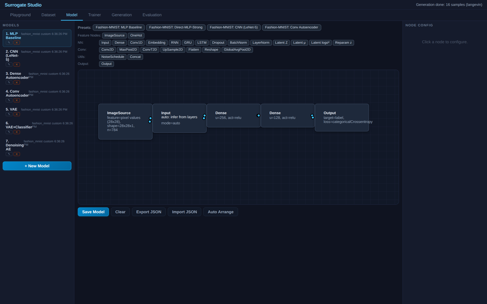 | 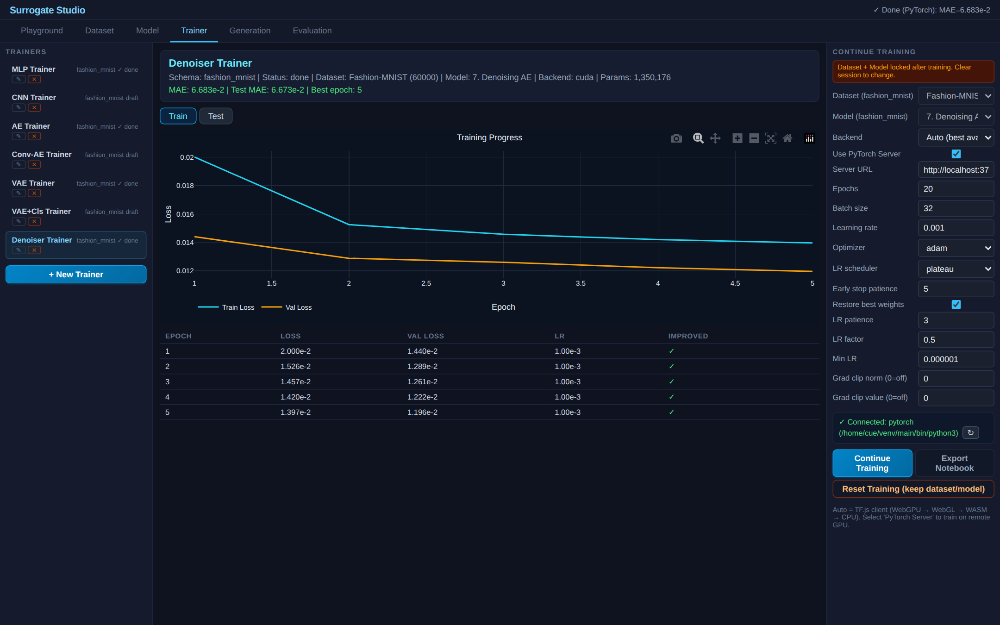 | 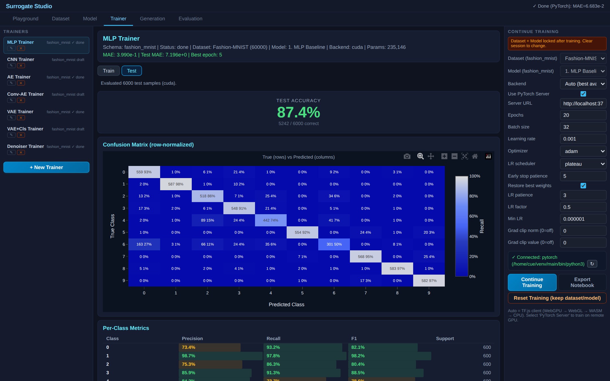 | 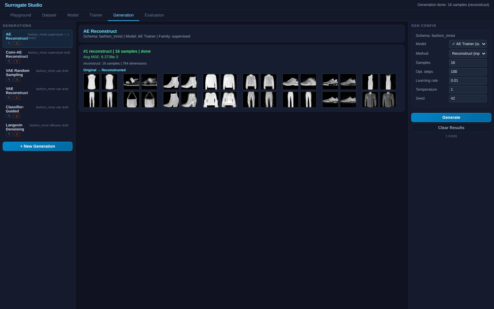 |

| # | Architecture | Params | Paper |
|---|---|---|---|
| 1 | MLP Baseline | ~235K | Rumelhart et al. 1986 |
| 2 | CNN (LeNet-5) | ~860K | LeCun et al. 1998 |
| 2b | CNN + Augmentation | ~860K | LeCun 1998 + paired hflip augmentation block |
| 3 | Dense Autoencoder | ~450K | Hinton & Salakhutdinov 2006 |
| 4 | Conv Autoencoder | ~85K | Masci et al. 2011 |
| 5 | VAE | ~414K | Kingma & Welling 2014 |
| 6 | VAE+Classifier | ~414K | Multi-task learning |
| 7 | Denoising AE | ~734K | Ho et al. 2020 |
| 8 | NCSN (score net) | ~1.36M | Song & Ermon 2019 |

---

## Fashion-MNIST GAN — 3 Adversarial Architectures

[Live Demo](https://cnatthaphon.github.io/surrogate-studio/demo/Fashion-MNIST-GAN/) | [README](demo/Fashion-MNIST-GAN/README.md)

Real adversarial training with no hardcoded GAN logic — everything from Drawflow graph blocks (ConcatBatch, PhaseSwitch, Constant, weight tags).

| MLP-GAN | DCGAN | WGAN |
|:---:|:---:|:---:|
| 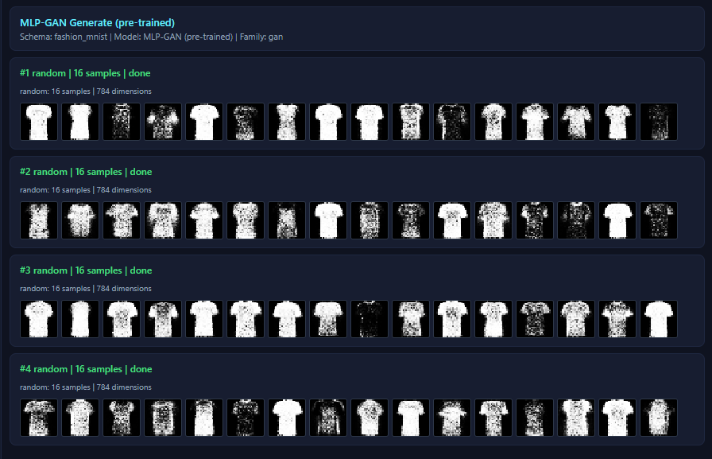 | 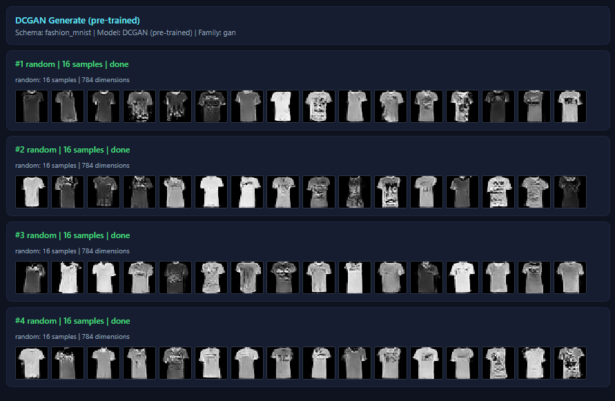 | 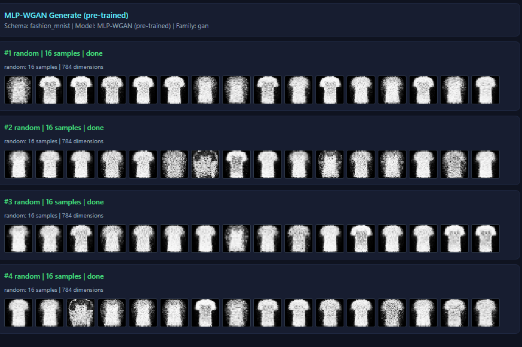 |

| # | Architecture | Loss | Paper |
|---|---|---|---|
| 1 | MLP-GAN (LayerNorm + Dropout) | BCE + label smoothing | Goodfellow 2014 |
| 2 | DCGAN (BatchNorm + LeakyReLU) | BCE (0/1 targets) | Radford 2016 |
| 3 | MLP-WGAN (linear critic, weight clipping) | Wasserstein | Arjovsky 2017 |

Pre-trained weights included for all 3 models — generate images immediately without training.

---

## Fashion-MNIST Diffusion — 4 Denoising Models

[Live Demo](https://cnatthaphon.github.io/surrogate-studio/demo/Fashion-MNIST-Diffusion/) | [README](demo/Fashion-MNIST-Diffusion/README.md)

Iterative denoising from noise to images. Standard supervised MSE training — no adversarial dynamics.

| # | Architecture | Method | Paper |
|---|---|---|---|
| 1 | MLP Denoiser (baseline) | Single-step denoise | — |
| 2 | MLP DDPM (timestep-conditioned) | Iterative DDPM | Ho 2020 |
| 3 | NCSN (deep score network) | Langevin dynamics | Song & Ermon 2019 |
| 4 | Score SDE (skip connections, cosine schedule) | SDE sampling | Song et al. 2021 |

---

## Fashion-MNIST Conditional Diffusion — Class-Conditioned Generation

[Live Demo](https://cnatthaphon.github.io/surrogate-studio/demo/Fashion-MNIST-Conditional-Diffusion/) | [README](demo/Fashion-MNIST-Conditional-Diffusion/README.md)

Generate specific Fashion-MNIST classes by conditioning the denoiser on a one-hot class label. Uses the ClassEmbed graph node — select T-shirt, Trouser, or Sneaker from a dropdown.

| # | Architecture | Conditioning | Paper |
|---|---|---|---|
| 1 | Conditional DDPM | image + time + class | Ho 2020 + class concat |
| 2 | Conditional Denoiser | image + class | Baseline + class concat |

---

## Fashion-MNIST UNet — Reconstruction with Skip Connections

[Live Demo](https://cnatthaphon.github.io/surrogate-studio/demo/Fashion-MNIST-UNet/) | [README](demo/Fashion-MNIST-UNet/README.md)

UNet-style skip connections are just graph wiring — Conv2D, MaxPool2D, UpSample2D, and Concat composed in the editor.

| # | Architecture | Purpose | Paper |
|---|---|---|---|
| 1 | UNet (skip connections) | Reconstruction with spatial skip paths | Ronneberger et al. 2015 |
| 2 | Conv AE (baseline) | Reconstruction without skip paths | Baseline |

---

## Vision Transformer — Classification without Convolutions

[Live Demo](https://cnatthaphon.github.io/surrogate-studio/demo/Fashion-MNIST-Transformer/) | [README](demo/Fashion-MNIST-Transformer/README.md)

Attention-based image classification using PatchEmbed, TransformerBlock, and GlobalAvgPool1D nodes. Pretrained on PyTorch CUDA, evaluated in TF.js browser.

| Dataset | Model | Test | Evaluation |
|:---:|:---:|:---:|:---:|
| 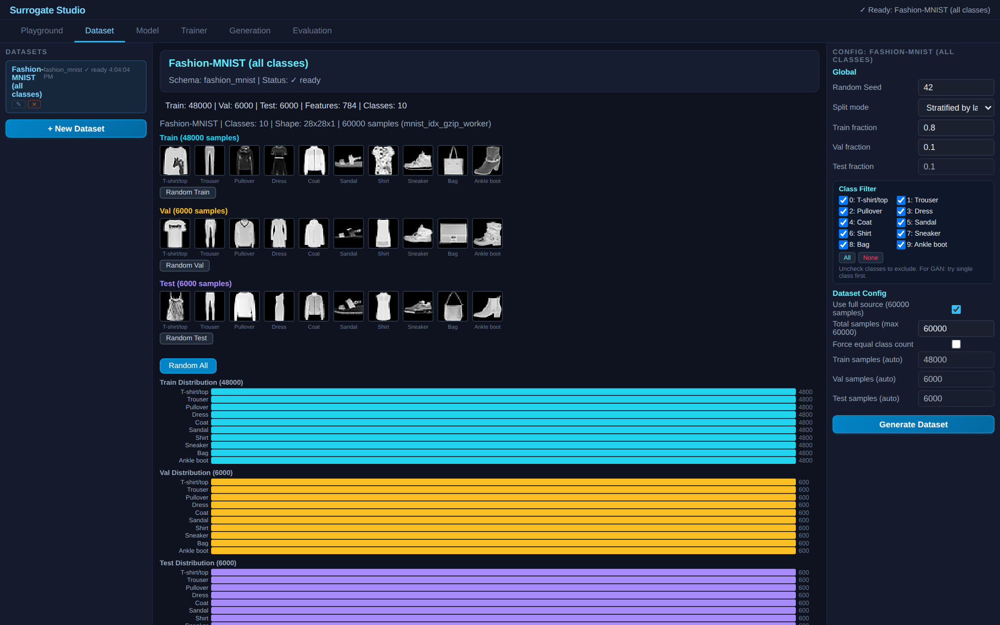 | 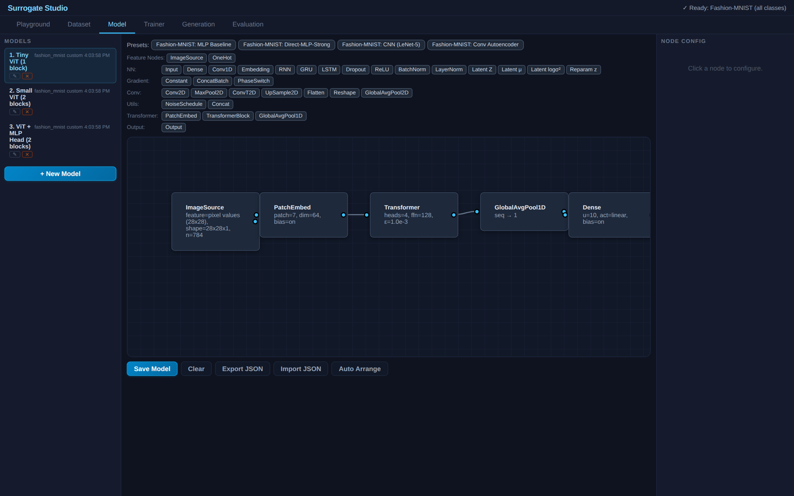 | 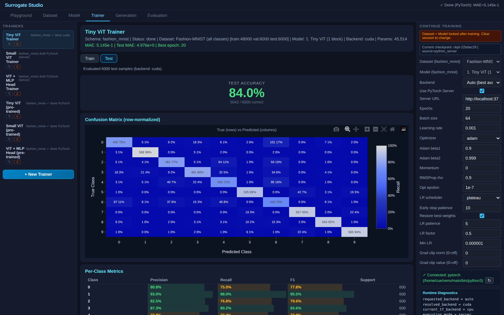 |  |

| Model | Params | Test Accuracy | Macro F1 |
|-------|:------:|:-------------:|:--------:|
| Tiny ViT (1 block) | 45,624 | 80.70% | 0.8058 |
| **Small ViT (2 blocks)** | 87,288 | **82.50%** | **0.8260** |
| ViT + MLP Head (2 blocks) | 96,248 | 81.30% | 0.8141 |

> Dosovitskiy et al., *"An Image is Worth 16x16 Words"*, ICLR 2021. [arXiv:2010.11929](https://arxiv.org/abs/2010.11929)

---

## TrAISformer — Maritime Trajectory Prediction

[Live Demo](https://cnatthaphon.github.io/surrogate-studio/demo/TrAISformer/) | [README](demo/TrAISformer/README.md)

Predict vessel positions in the Baltic Sea from AIS data. Interactive Leaflet map with satellite tiles, speed-colored trajectories, and course-heading markers.

| Dataset (Leaflet Map) | Model Graph | Evaluation |
|:---:|:---:|:---:|
| 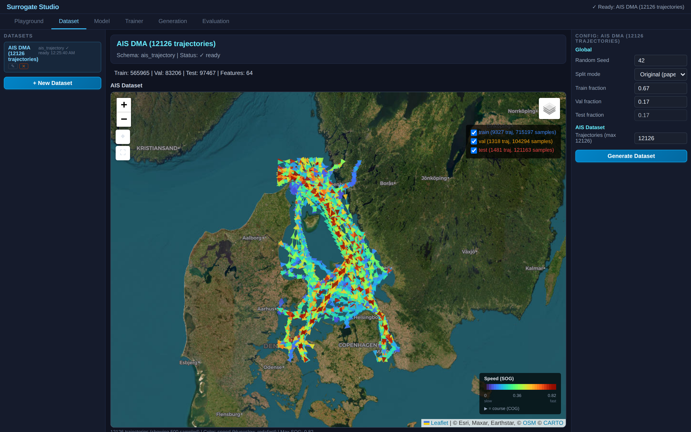 | 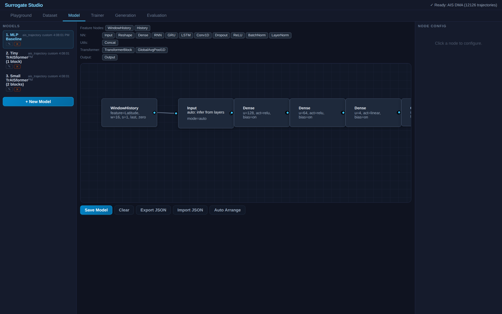 | 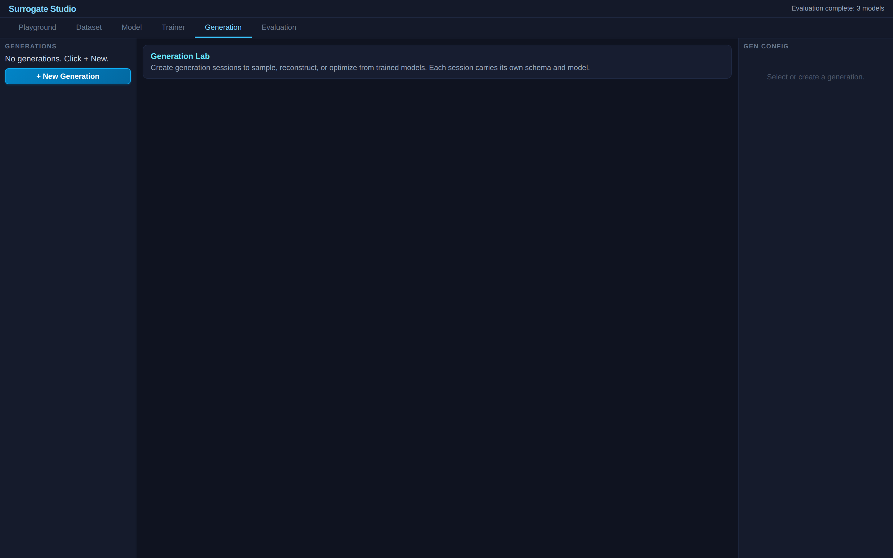 |

| Model | Params | Test MAE | Test R² |
|-------|:------:|:--------:|:-------:|
| **MLP Baseline** | 16,836 | **0.0225** | **0.924** |
| Tiny TrAISformer (1 block) | 10,884 | 0.0382 | 0.891 |
| Small TrAISformer (2 blocks) | 21,476 | 0.0400 | 0.889 |

> Nguyen et al., *"TrAISformer"*, 2021. [arXiv:2109.03958](https://arxiv.org/abs/2109.03958)

---

## LSTM-VAE — Dominant Motion Extraction

[Live Demo](https://cnatthaphon.github.io/surrogate-studio/demo/LSTM-VAE-for-dominant-motion-extraction/) | [README](demo/LSTM-VAE-for-dominant-motion-extraction/README.md)

Reproduces the LSTM-VAE from Jadhav & Barati Farimani (2022) for ant trajectory reconstruction.

| Training | Generation |
|:---:|:---:|
| 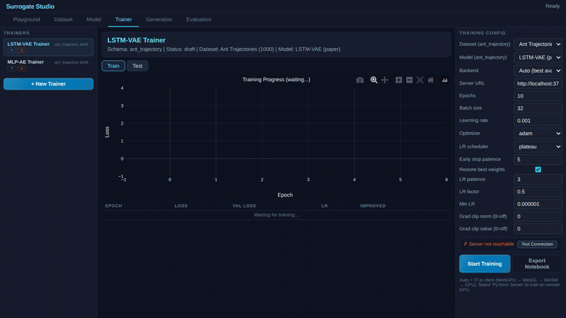 | 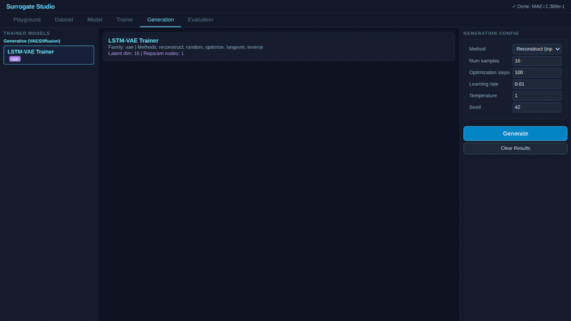 |

| Model | Params | Test MAE | Test MSE |
|-------|:------:|:-------:|:---------:|
| LSTM-VAE | 77,100 | **0.0165** | 4.48e-4 |
| MLP-AE (baseline) | 19,312 | 0.0319 | 1.74e-3 |

*Pretrained weights shipped (PyTorch CUDA, 50 epochs). MAE on MinMax-normalized [0,1] ant trajectories.*

> Jadhav & Barati Farimani, *"LSTM-VAE for dominant motion extraction"*, 2022. [arXiv:2104.12722](https://arxiv.org/abs/2104.12722)

---

## Oscillator Surrogate — Physics-Based Regression

[Live Demo](https://cnatthaphon.github.io/surrogate-studio/demo/Oscillator-Surrogate/) | [README](demo/Oscillator-Surrogate/README.md)

5 model architectures on RK4-simulated physics trajectories (spring, pendulum, bouncing ball). Full platform showcase: training, generation (reconstruct, random, classifier-guided, Langevin), and evaluation.

| Model | Params | Test MAE | Test R² |
|-------|:------:|:--------:|:-------:|
| Direct-MLP | 4,962 | 0.0282 | 0.963 |
| AR-GRU | 22,882 | 0.0277 | 0.966 |
| VAE (8-dim latent) | 2,362 | 0.0278 | 0.949 |
| **VAE+Classifier** | 8,605 | **0.0251** | **0.970** |
| Denoising AE | 7,138 | 0.0420 | 0.944 |

---

## Cell Nuclei Segmentation — Real Biomedical UNet

[Live Demo](https://cnatthaphon.github.io/surrogate-studio/demo/Cell-Nuclei-Segmentation/) | [README](demo/Cell-Nuclei-Segmentation/README.md)

Binary segmentation of cell nuclei from real microscopy images (2018 Data Science Bowl). 300 samples, 32x32 grayscale, evaluated with IoU/Dice.

Three models trained side-by-side: **Nucleus UNet** baseline, **Nucleus UNet + Augmentation** (paired image+mask hflip+vflip via shared `seedLink`), and MLP baseline. The current augmented pretrained artifact improves best val_loss by ~6.5% on the 210-image training set; an earlier hflip-only retrain reached ~10.5%, which the demo README records as a useful transform-intensity comparison.

| Dataset | Model Graph | Trainer |
|:---:|:---:|:---:|
| 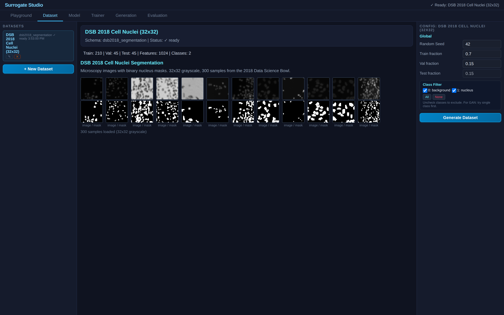 | 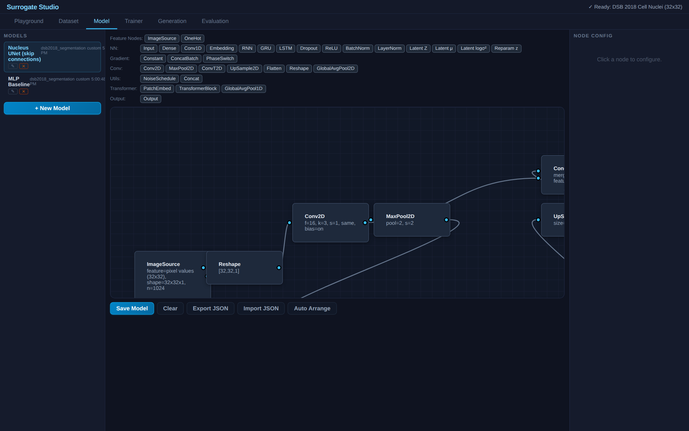 | 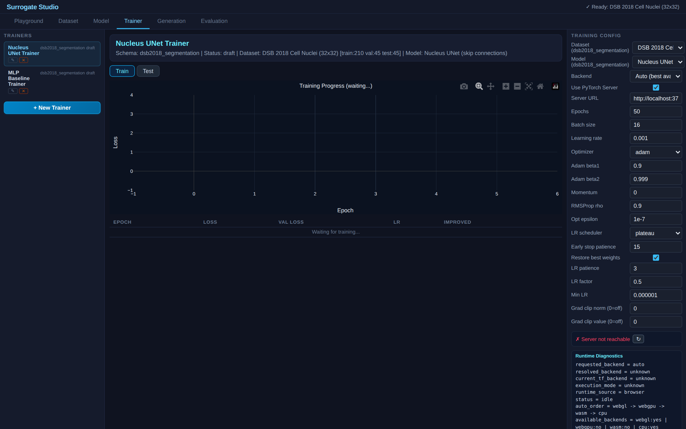 |

> Ronneberger et al., *"U-Net: Convolutional Networks for Biomedical Image Segmentation"*, MICCAI 2015. [arXiv:1505.04597](https://arxiv.org/abs/1505.04597)

---

## Synthetic Segmentation — Binary Mask Prediction

[Live Demo](https://cnatthaphon.github.io/surrogate-studio/demo/Synthetic-Segmentation/) | [README](demo/Synthetic-Segmentation/README.md)

Pixel-wise segmentation on synthetic shapes. **Seg-UNet** with skip connections, **Seg-UNet + Augmentation** (paired image+mask hflip+vflip), and MLP baseline. Both UNet variants converge near the BCE floor on this clean synthetic task; the demo exercises the augmentation pipeline cross-runtime (TF.js + PyTorch + notebook export) without making aug a headline metric.

---

## Synthetic Detection — Single-Object Bounding Box

[Live Demo](https://cnatthaphon.github.io/surrogate-studio/demo/Synthetic-Detection/) | [README](demo/Synthetic-Detection/README.md)

Multi-head CNN: bbox regression + class classification from a shared backbone on synthetic 32x32 images. Two variants: **Single-Box Detector** baseline and **+Augmentation** with paired hflip on the image and the bbox (`format="x0y0x1y1"`, `seedLink="synthdet_aug"`). Aug reduces best val_loss by ~9% — small but consistent on the regression head.

---

## SAR Ship Detection — Radar Satellite Imagery

[Live Demo](https://cnatthaphon.github.io/surrogate-studio/demo/SAR-Ship-Detection/) | [README](demo/SAR-Ship-Detection/README.md)

Ship detection on real SAR images from the HRSID dataset (Gaofen-3, Sentinel-1). Bounding box regression on 64x64 radar patches.

Three model variants: **CNN Ship Detector**, **CNN + Augmentation** (paired image+bbox hflip with `format="xywh"`), and an MLP baseline. The aug variant is the canonical example for the platform's augmentation contract: image flows through `augment_image` while the bbox label flows through `target_source → augment_bbox` with a shared `seedLink` so both flip together. The build chapter behind this demo includes the cross-runtime layout bug (server reshape silently permutes NHWC → NCHW) and the loss-routing fix (`graphLabelOutputIdx` → `_custom_labels`) — see the demo README's "Bug found while building this demo" section.

| Dataset | Model Graph | Trainer |
|:---:|:---:|:---:|
| 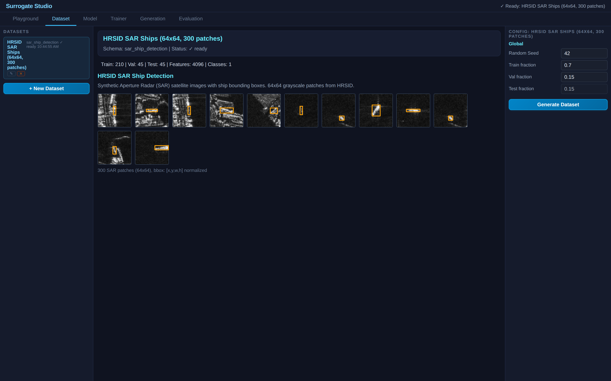 | 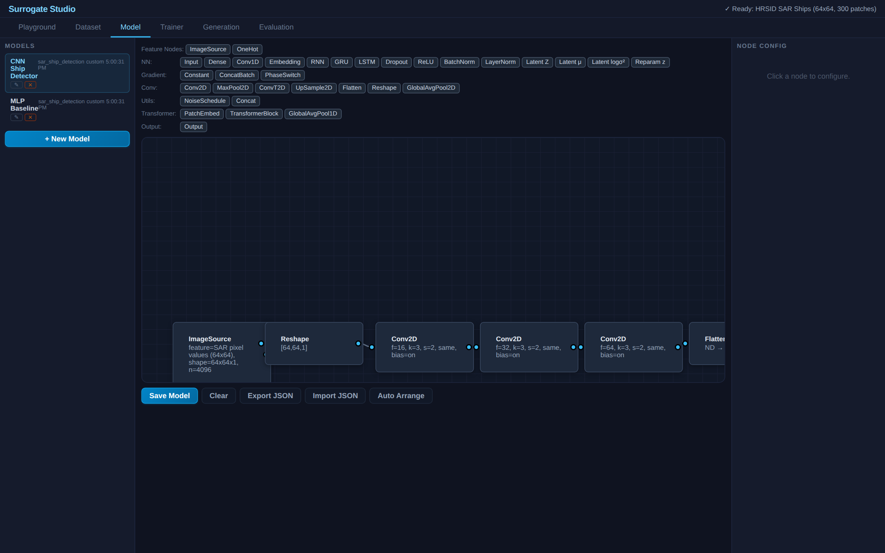 | 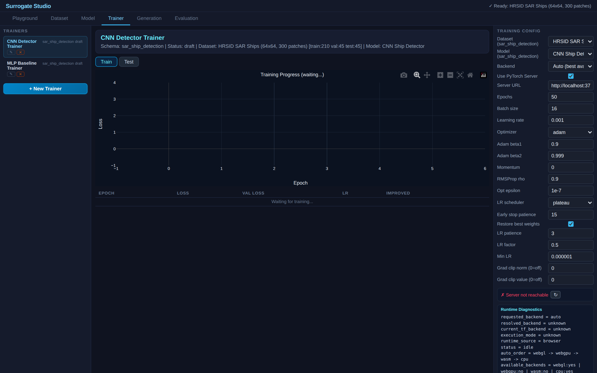 |

> Wei et al., *"HRSID: A High-Resolution SAR Images Dataset"*, IEEE Access, 2020.

---

## Text Sentiment Transformer — NLP Classification

[Live Demo](https://cnatthaphon.github.io/surrogate-studio/demo/Text-Sentiment-Transformer/) | [README](demo/Text-Sentiment-Transformer/README.md)

Transformer-based text classification: tokenize, embed, self-attention, pool, classify. Compares Transformer vs LSTM vs MLP.

| Dataset | Model Graph | Trainer |
|:---:|:---:|:---:|
| 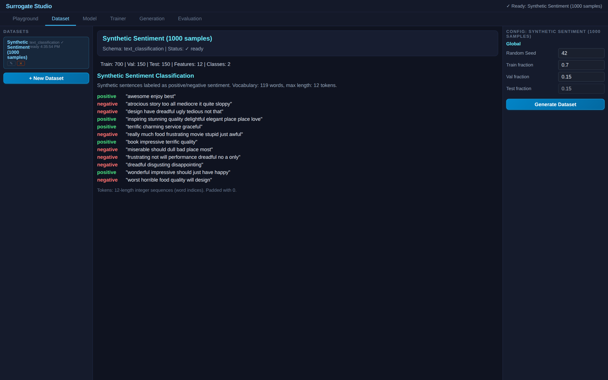 | 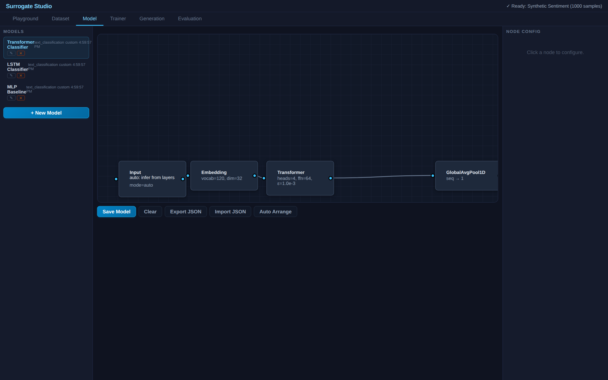 | 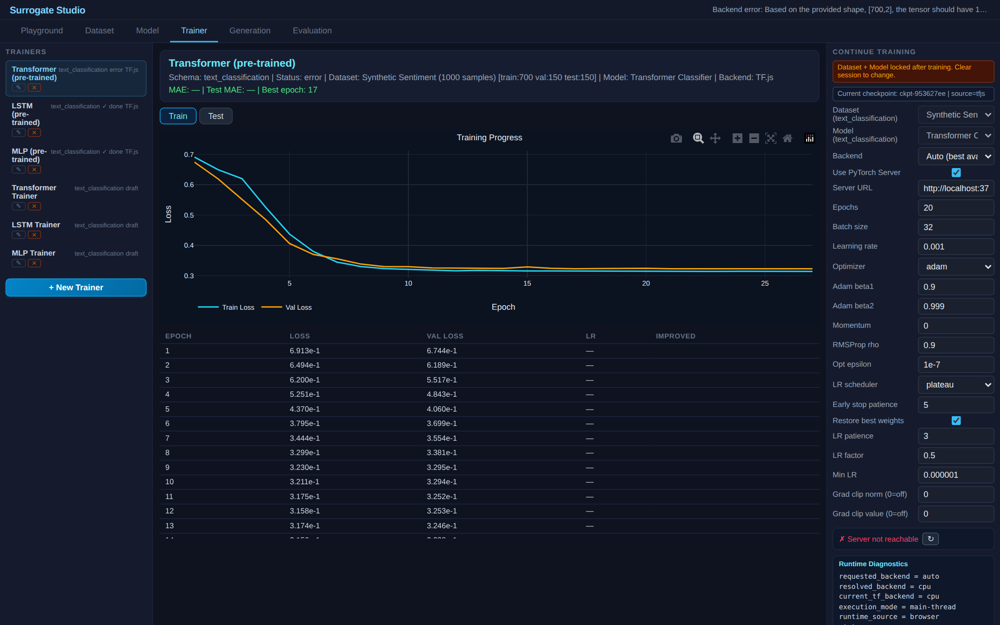 |

> Vaswani et al., *"Attention Is All You Need"*, NeurIPS 2017. [arXiv:1706.03762](https://arxiv.org/abs/1706.03762)

---

## Siamese Shape Verification — Metric Learning

[Live Demo](https://cnatthaphon.github.io/surrogate-studio/demo/Siamese-Shape-Verification/) | [README](demo/Siamese-Shape-Verification/README.md)

Pair-based similarity classification. Learns to compare image pairs as same or different — the approach behind facial recognition and one-shot learning.

| Dataset | Model Graph | Trainer |
|:---:|:---:|:---:|
| 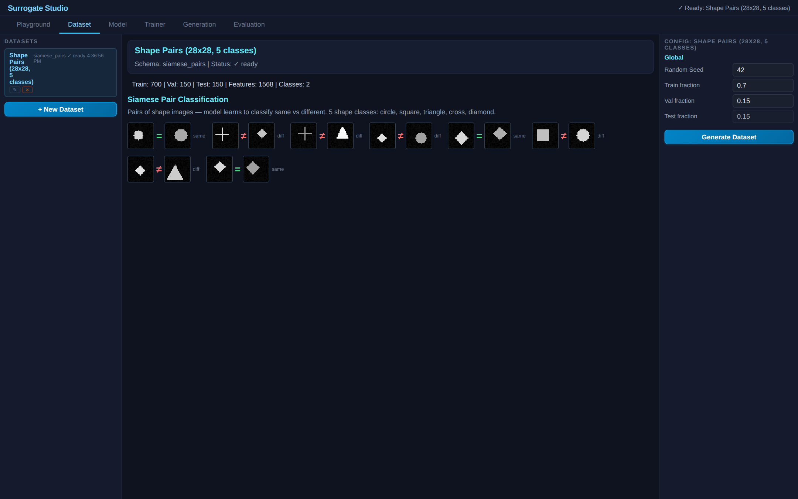 | 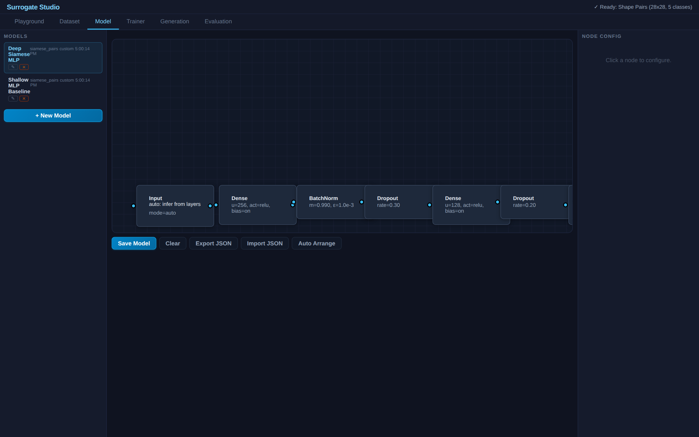 | 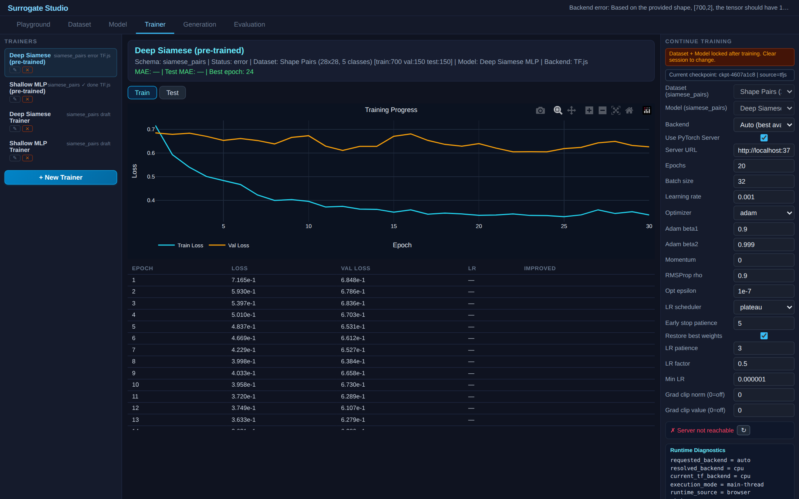 |

> Bromley et al., *"Signature Verification using a Siamese Time Delay Neural Network"*, NeurIPS 1993.

---

## Custom CSV Tutorial — Bring Your Own Data

[Live Demo](https://cnatthaphon.github.io/surrogate-studio/demo/Custom-CSV-Tutorial/) | [README](demo/Custom-CSV-Tutorial/README.md)

Tutorial showing how to use Surrogate Studio with your own tabular data. Ships with a built-in Iris-like sample (150 samples, 4 features, 3 classes). Upload your own CSV or configure a server local path.

Demonstrates:
- CSV format: `split, f0, f1, ..., t0, t1, ...`
- Auto-detection of classification vs regression from target values
- Browser file upload via FileReader
- Server local path via `sourceDescriptor`
- How to define custom schemas for any domain

> Fisher, R.A. *"The Use of Multiple Measurements in Taxonomic Problems."* Annals of Eugenics, 1936. — Iris dataset used as built-in sample.

---

## Architecture

```
index.html
  |-- src/schema_registry.js          -- schema definitions + palette + headType
  |-- src/dataset_modules.js          -- module registry + build contract
  |-- src/model_builder_core.js       -- graph -> TF.js model (MLP, CNN, VAE, GAN, etc.)
  |-- src/model_graph_core.js         -- Drawflow node factories + preset renderer
  |-- src/training_engine_core.js     -- train loop (multi-head, phased, headType-driven)
  |-- src/generation_engine_core.js   -- reconstruct, random, classifier-guided, Langevin, DDPM
  |-- src/weight_converter.js         -- per-node-type PyTorch <-> TF.js weight mapping
  |-- src/notebook_bundle_core.js     -- ZIP export (dataset + graph + notebook)
  |-- src/workspace_store.js          -- in-memory store (datasets, models, trainers)
  |-- src/dataset_source_registry.js  -- zero-copy source management (60K images, no duplication)
  |-- src/server_runtime_adapter.js   -- gzip streaming to PyTorch server
  |-- src/surrogate_studio.js         -- orchestrator: init -> layout -> tabs -> wiring
  +-- src/tabs/*.js                   -- tab controllers (dataset, model, trainer, generation, evaluation)

server/
  |-- training_server.js              -- Node.js HTTP server, SSE epoch streaming
  |-- train_subprocess.py             -- PyTorch training (graph -> model, phased, headType)
  |-- generate_subprocess.py          -- PyTorch generation (reconstruct, random, Langevin, DDPM)
  +-- predict_subprocess.py           -- PyTorch batch prediction

demo/<paper>/
  |-- preset.js                       -- pre-configured store
  |-- index.html                      -- loads bundle + preset
  |-- README.md                       -- paper citation, architecture, results
  +-- images/                         -- screenshots
```

## Supported Schemas

| Schema | Type | Features | Dataset Module |
|--------|------|----------|---------------|
| `oscillator` | Trajectory | RK4 physics (spring, pendulum, bouncing ball) | Built-in |
| `mnist` | Image | 28x28 grayscale, 10 classes | Lazy-fetch from CDN |
| `fashion_mnist` | Image | 28x28 grayscale, 10 classes | Lazy-fetch from CDN |
| `cifar10` | Image | 32x32 RGB, 10 classes | Lazy-fetch from CDN |
| `synthetic_detection` | Image | 32x32 grayscale, bbox + class label | Built-in |
| `synthetic_segmentation` | Image | 32x32 grayscale, binary pixel mask | Built-in |
| `dsb2018_segmentation` | Image | 32x32 microscopy, nucleus binary mask | Embedded (800KB) |
| `text_classification` | Text | 12-token sentiment sequences | Built-in |
| `siamese_pairs` | Pair | 28x28 shape pairs, same/different | Built-in |
| `sar_ship_detection` | Image | 64x64 SAR radar, ship bounding box | Embedded (1.6MB) |
| `ais_trajectory` | Trajectory | (lat, lon, sog, cog) vessel windows | Built-in |
| `ant_trajectory` | Trajectory | 20 ants x (x,y), 40 features | Demo plugin |
| `custom_csv` | Tabular | User CSV with f*/t* columns, auto-detect task | Built-in + file upload |

## Node Types (45+)

| Category | Nodes |
|----------|-------|
| **MLP** | Input, Dense, Dropout, BatchNorm, LayerNorm, Output |
| **CNN** | Conv2D, Conv2DTranspose, MaxPool2D, UpSample2D, Flatten, Reshape, GlobalAvgPool2D |
| **Transformer** | PatchEmbed, TransformerBlock, GlobalAvgPool1D |
| **RNN** | SimpleRNN, GRU, LSTM, Conv1D, Concat |
| **VAE** | Latent mu, Latent logvar, Reparameterize |
| **GAN** | SampleZ, Detach |
| **Diffusion** | AddNoise, NoiseSchedule, TimeEmbed, ClassEmbed |
| **Augment** | AugmentImage, AugmentBbox, AugmentMask, AugmentLabel, TargetSource |
| **NLP** | Embedding |
| **Feature** | ImageSource, History, WindowHistory, Params, OneHot |

The **Augment** category lets you wire input-level augmentation directly into the graph: paired image + label flips coordinated via a shared `seedLink` string, with build-time validation for shape (Layer 1), type lineage (Layer 2), and paired-config sync (Layer 3). One block supports multiple transforms via per-transform probability (`hflipProb`, `vflipProb`); 0 disables, >0 enables independently. See SAR-Ship-Detection and Cell-Nuclei-Segmentation for the canonical paired-augment patterns.

## Papers Cited

| Paper | Year | Demo |
|-------|------|------|
| Rumelhart, Hinton, Williams — "Learning representations by back-propagating errors" | 1986 | Benchmark |
| LeCun, Bottou, Bengio, Haffner — "Gradient-Based Learning Applied to Document Recognition" | 1998 | Benchmark |
| Hinton & Salakhutdinov — "Reducing the Dimensionality of Data with Neural Networks" | 2006 | Benchmark |
| Masci et al. — "Stacked Convolutional Auto-Encoders" | 2011 | Benchmark |
| Kingma & Welling — "Auto-Encoding Variational Bayes" | 2014 | Benchmark, Oscillator |
| Goodfellow et al. — "Generative Adversarial Nets" | 2014 | GAN |
| Ronneberger et al. — "U-Net: Convolutional Networks for Biomedical Image Segmentation" | 2015 | UNet, Cell Nuclei, Segmentation |
| Radford, Metz, Chintala — "Unsupervised Representation Learning with DCGANs" | 2015 | GAN |
| Redmon et al. — "You Only Look Once" | 2016 | Detection |
| Arjovsky, Chintala, Bottou — "Wasserstein GAN" | 2017 | GAN |
| Vaswani et al. — "Attention Is All You Need" | 2017 | Text Transformer |
| Song & Ermon — "Generative Modeling by Estimating Gradients of the Data Distribution" | 2019 | Diffusion |
| Ho, Jain, Abbeel — "Denoising Diffusion Probabilistic Models" | 2020 | Benchmark, Diffusion |
| Wei et al. — "HRSID: A High-Resolution SAR Images Dataset" | 2020 | SAR Ship |
| Dosovitskiy et al. — "An Image is Worth 16x16 Words" | 2021 | Transformer |
| Nguyen et al. — "TrAISformer" | 2021 | TrAISformer |
| Song et al. — "Score-Based Generative Modeling through SDEs" | 2021 | Diffusion |
| Jadhav & Barati Farimani — "LSTM-VAE for dominant motion extraction" | 2022 | LSTM-VAE |

## Adding a New Demo

1. Create `demo/<name>/`
2. Write `preset.js` with pre-configured store entries
3. Create `index.html` — loads bundle + preset:
   ```html
   <script src="../../dist/surrogate-studio.js"></script>
   <script src="./preset.js"></script>
   ```
4. Write `README.md` with paper citation, architecture, benchmark results
5. Run `npm run build` to regenerate the bundle
6. Capture screenshots: `node scripts/capture_demo_assets.js demo/<name> 5`

No core files need to change. All demos are plugins.

## Known Limitations & Future Extensions

These are deliberate scope decisions, not undiscovered bugs. They're documented here so contributors and reviewers can find them without reading the code.

- **Augmentation currently covers paired horizontal/vertical flip only.** The graph supports input-level augmentation as first-class nodes (`augment_image`, `augment_bbox`, `augment_mask`, `augment_label`, `target_source`) with per-transform probability, paired-flip sync via `seedLink`, and build-time validation across three layers (shape / type lineage / config sync). What's shipped is `hflipProb` and `vflipProb` per block. Random crop, rotation, color jitter, and elastic deformation aren't in the contract yet — they were scoped out because rotation needs bilinear interpolation + non-axis-aligned bbox math, random crop changes output shape (breaks the platform's shape-preserving invariant), and color jitter is grayscale-no-op for most current demos. The extension point is the per-block transform loop in `_applyTransform` (JS) and the matching dispatch in `train_subprocess.py` — adding a new transform is one keyed entry per runtime plus tests.
- **Image-shape inference fallback.** `getSchemaImageSourceDefs` in `src/app.js` falls back to a 28×28 / 784-feature shape when an image schema doesn't declare `metadata.featureNodes.imageSource`. Today every shipped image schema declares it, so the fallback is unreached, but the cleaner contract would be to require the declaration or derive from the dataset's declared shape and refuse to guess.
- **Notebook export feature-dimension lookup.** The exported notebook reconstructs feature-block dimensions in `_feature_dim()` (in `src/notebook_bundle_core.js`) by string-matching block names like `time_sec_block` / `params_block` / `hist_block`. The contract-clean version is to embed each block's actual feature dimension into the notebook's config object at export time so the cell never has to look up by name.
- **Generation modes not at full parity.** DDPM and Langevin generation are browser-only (`generate_subprocess.py` implements `random` and `reconstruct`). This is acceptable specialization — those modes are exploratory/interactive and the pretrained demos don't depend on the server path for them.
