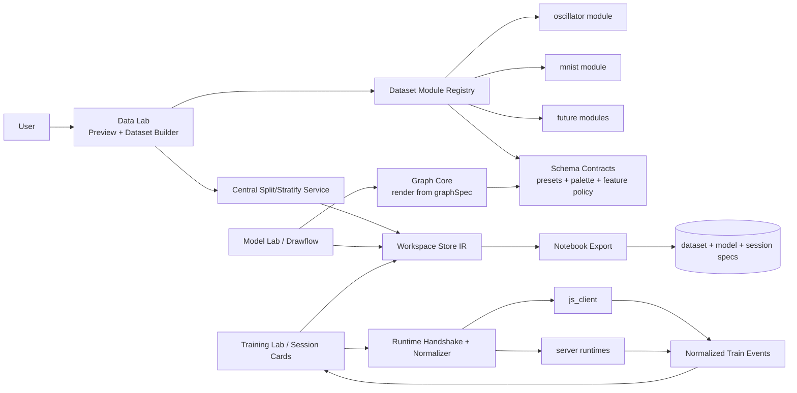
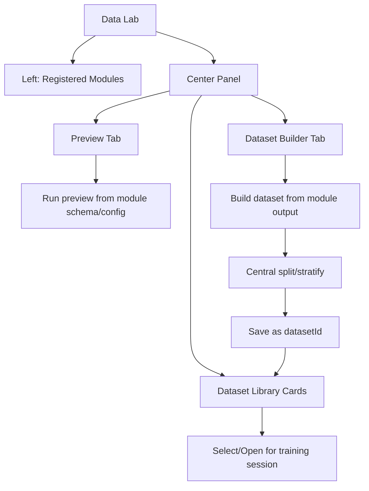

# Surrogate Studio

A schema-driven ML experimentation platform.

Surrogate Studio is a modular ML lab where datasets, model graphs, runtimes, and notebook export all follow the same contract.

In 30 seconds:
- `Data Lab`: create and manage datasets from registered schema/modules such as `oscillator`, `mnist`, and `fashion_mnist`
- `Model Lab`: build schema-compatible networks from declarative graph presets and node palette contracts
- `Training Lab`: run sessions against runtime families (`tfjs` in browser/client, optional `tf-node` adapter on server, `pytorch` as the server/notebook baseline)
- `Notebook Export`: package dataset + model graph + trainer config into a portable rerun bundle

Why this is not a normal demo:
- `oscillator` is only one schema/module in the platform
- the same architecture is designed to scale to image datasets, AE/VAE, diffusion, and future FDM/FEM-style datasets
- UI, store, worker, and runtime layers are being refactored around explicit contracts instead of tab-specific hardcode

Architecture diagram matters here because the project value is not just “train one model”.
It is the system design: schema-driven modules, shared render engines, worker-backed execution, runtime-family separation, and portable notebook export.

Execution plan:
- See `ARCHITECTURE_PLAN.md` for current architecture baseline, gaps, and phased roadmap.
- Architecture spec baseline: `ARCHITECTURE_SPEC_V0_1.md`
- Refactor status map: `REFACTOR_GAP_MAP.md`
- Visual architecture draft: `design.drawio`
- IR v1 schema drafts: `schemas/README.md`
- Repo split path (in-place now -> new repo before release): `REPO_SPLIT_PLAN.md`
- Pre-release staging helper: `bash scripts/stage_platform_repo.sh`

## Architecture Diagrams

### 1) Platform Architecture (Current)

### 2) Data Lab UI Structure

## What It Does

- Runs as a schema-first platform with registered dataset modules:
  - `oscillator`
  - `mnist`
  - `fashion_mnist`
- Uses declarative schema contracts for:
  - model presets (`metadata.graphSpec`)
  - node palette sections/items/default config
  - feature-node policy and display metadata
- Simulates oscillator dynamics with RK4/hybrid physics:
  - Damped spring
  - Damped pendulum
  - Bouncing ball (rigid impact or compliant ground)
- Generates datasets from module builders (RK4 trajectory + image classification schemas)
- Lets users build model graphs in Drawflow:
  - Dense / Dropout
  - SimpleRNN / GRU / LSTM
  - Derived physics ratio features in `Params` node config: `k/m`, `c/m`, `g/L`
- Renders schema-scoped node palette from contract instead of hardcoded tab buttons
- Trains TF.js models from Training sessions and compares prediction vs RK4 ground truth (oscillator path)
- Output node controls training target and loss behavior:
  - target: `x`, `v`, or `x+v`
  - target also supports `params` for parameter-regression head
  - loss: use global (`MSE/MAE/Huber`) or override per-output node
  - for `x+v`: set `w_x`, `w_v` to weight channel losses
- Latent node (`Latent Z`) controls latent dimension and consistency group:
  - `units`: latent dimension
  - `group`: latent consistency group id (e.g., `z_shared`)
  - `matchWeight`: weight for latent consistency loss
- Supports graph portability:
  - Export/Import Drawflow graph JSON
  - Export run-pack JSON (graph + core training/data settings)

## Core Equations

- Spring:
  - `m x'' + c x' + k x = 0`
- Pendulum:
  - `theta'' + (c/m) theta' + (g/L) sin(theta) = 0`
- Bouncing (rigid):
  - `y'' = -g - (c/m) y' - (c/m) |y'| y'`
  - impact: `v+ = -e v-`
- Bouncing (compliant):
  - `F_c = k_g delta + c_g delta_dot`, `delta = max(0, -y)`
  - add `+ F_c/m` to acceleration

## Workflow

1. Open `Data Lab` and choose a registered dataset module.
2. Use `Preview` sub-tab to test module behavior with schema-driven inputs.
3. Use `Dataset Builder` sub-tab to create and save datasets (central split/stratify).
4. Manage datasets from `Dataset Library Cards` (open / rename / delete).
5. In `Model` tab, create graph and manage model library (`New`, `Save`, `Load`, `Delete`).
6. Model presets and node palette come from the selected schema contract; app code renders them without schema-specific branches.
7. In `Training` tab, queue training card(s): choose dataset + model + runtime (`js_client` primary), edit per-card training config, collapse/expand, run/remove.
8. Train/evaluate from selected runtime.
9. Compare:
   - `NN vs RK4 (After Training)`
   - `Random Dataset vs NN`
10. Generate (if model supports generation):
   - `Generation -> Generate + Compare (Single)` for one condition/reference
   - `Generation -> Run Batch Generation` for many perturbed samples
   - ratio sweeps via `Ratio feature + Ratio scale` (`k/m`, `c/m`, `g/L`)
   - export generation metrics (`CSV` / `JSON`)
   - sort and jump to `best/worst/recent` generated sample for re-plot
11. In `Training` tab, create session queue (`dataset + model + runtime`), select session(s), then export notebook bundle ZIP directly from client (no-server) for external rerun.

Current limitation:
- run queue execution is fully enabled for `oscillator`; image-schema trainer execution is still being completed.

Quick test for session-based export:
1. Generate dataset once.
2. Go to `Model` tab and prepare graph.
3. Go to `Training` tab -> `Save Current Graph As Model`.
4. Add one or more sessions in queue.
5. Tick selected session rows and click `Export Notebook ZIP (Selected Sessions)`.

## Inference Methodology

Model/evaluation mode is inferred from graph structure:

- Graph-inferred mode:
  - `Autoregressive (AR)`: graph uses `WindowHistX/WindowHistV` or `HistX/HistV`
  - `Direct`: graph uses direct feature nodes (`Params`, `TimeSec/TimeNorm`, `SinNorm/CosNorm`, `Scenario`)
- Evaluation uses architecture-aligned defaults:
  - `Direct -> direct_only`
  - `AR -> ar_rk4_warmup`

Experiment presets available:
- Quick test:
  - `Direct-MLP-Strong`
  - `AR-GRU-Strong`
  - `AR-LSTM-Strong`
  - ratio variants (`*-Ratio`)
- Experiment:
  - `EXP: AR-GRU ZeroPad`
  - `EXP: AR-GRU RK4 Warmup`
- `EXP: Dual Encoder Z-Match (Direct)`
- `EXP: AR-GRU + Z-Match`

Notes:
- Dataset generation builds both AR and Direct views from the same trajectories.
- Train/val/test split is trajectory-level (no window leakage across splits).
- Mode switching is node-driven, not manually selected in Evaluation.
- Dual-model `Hybrid (Direct bootstrap -> AR rollout)` is intentionally left as a next step (requires managing two trained graphs in one run).
- Loss is graph-driven at Output node; top-level Loss selector is fallback/default.
- Model construction is graph-driven from Drawflow connections (DAG), with support for multiple Output heads.
- Presets are optional templates only; runtime logic reads node connections/configs.

## Current Vision Status

Implemented now (web app):
- Schema-first module architecture (`oscillator`, `mnist`, `fashion_mnist`) with shared Data/Model/Training Labs.
- Declarative schema definitions for built-ins:
  - presets are plain object literals with `metadata.graphSpec`
  - palette sections/items/default config are declared in schema
- Forward surrogate workflows (Direct + AR) with node-driven architecture on oscillator path.
- Ratio feature engineering in `Params` node config (`k/m`, `c/m`, `g/L`).
- Reproducible graph/run export-import for sharing and re-training elsewhere.
- Graph preset rendering is driven by `model_graph_core.js`.
- `app.js` is being reduced toward renderer/orchestrator responsibilities rather than holding schema-specific preset/palette knowledge.
- Dedicated `Generation` tab:
  - single and batch generation/compare against RK4 references
  - scenario filtering, parameter perturbation, and ratio-control UI

In progress:
- non-oscillator client trainer adapters in Training queue.
- server runtime adapters with the same runtime event contract.
- fuller module-owned render overrides on top of shared render engine.
- continued refactor of remaining legacy `app.js` paths into shared core modules.

Planned next:
- Trajectory autoencoder branch (`trajectory -> z -> trajectory`).
- Multi-head inverse tasks from latent (`scenario classification + parameter/ratio regression`).
- Condition encoder (`params -> z`) with latent consistency to trajectory encoder.

Research path now includes both diffusion families:
- DDPM-style denoising surrogate
- Score-based diffusion surrogate
with side-by-side comparison on quality, controllability, and reverse-step efficiency.

## Research-First Notebook Roadmap

To keep execution deterministic and reduce state conflicts, studies should be split by notebook:

- `00_setup_data.ipynb`
- `10_direct_ar_baselines.ipynb`
- `20_ae_study.ipynb`
- `30_vae_study.ipynb`
- `40_diffusion_ddpm.ipynb` (train/eval/loss/trajectory-quality flow)
- `50_diffusion_score_based.ipynb` (train/eval/loss/trajectory-quality flow)
- `90_final_comparison.ipynb`

All studies follow the same contract:
- model-file driven (`.model.json` from web export)
- dataset-file driven (CSV from web export)
- shared training/eval module: `oscillator_surrogate_pipeline.py`
- checkpoint-first rerun policy
- fixed split/seed protocol for fair comparison

## Runtime Strategy (No-Server First)

Primary:
- `js_client` runtime in browser (no-server path).
- client-side export of runnable notebook bundle ZIP.

Optional:
- `python_server` and `node_server` runtimes for remote/background jobs.
- server path keeps the same IR + metrics schema as client/notebook.
- note: server adapters are scaffolded and not yet full parity in current release.

Cross-runtime requirement (mandatory):
- same IR and artifacts across web/notebook/server:
  - dataset CSV
  - split manifest JSON (trajectory split map)
  - model graph JSON
  - train/eval/session spec JSON
  - shared metrics schema

Current orchestration scaffold:
- `server/node_python_orchestrator.mjs`
- `server/python_train_worker.py`
- `server/export_notebook_bundle.py`
- `server/README.md`

## Experiment Mapping

What is runnable now (Drawflow + current trainer):

1. `params + time -> trajectory(t)`:
   - use direct presets (`Direct-MLP-*`, `EXP: Params+Time -> ...`)
   - output target can be `x`, `v`, or `x+v`

2. `window -> recurrent -> trajectory(t)`:
   - use AR presets (`AR-GRU-*`, `AR-LSTM-*`, `EXP: Window -> ...`)
  - evaluate with `ar_zero_pad`, `ar_edge_pad`, or `ar_rk4_warmup`

3. Multi-head output training in one graph:
   - trajectory head(s): `x`, `v`, `x+v`
   - parameter head: `params`
   - compile/train uses per-output loss config from each Output node

4. Latent consistency from graph structure:
   - create two or more `Latent Z` nodes with same `group`
   - trainer auto-adds auxiliary `latent_diff` loss by matching those latent outputs
   - no hardcoded preset logic is required at runtime (presets are templates only)

5. Image dataset creation path:
   - `mnist` and `fashion_mnist` datasets are buildable from registered modules
   - source loading is lazy + cached on client

Research vision (not yet implemented in trainer graph semantics):

3. `trajectory -> encoder -> z -> decoder -> trajectory` (autoencoder)
4. `params -> encoder -> z` aligned with trajectory latent `z`
5. inverse heads (`trajectory/window -> params`)

These now partially exist (multi-output heads are supported), but latent-consistency objectives still need dedicated latent nodes and custom loss-expression wiring.

## Dataset Param Schema

`Params` node and dataset export use a shared fixed-length parameter vector across scenarios.

- `k_slg` means:
  - spring: `k` (stiffness)
  - pendulum: `L` (length)
  - bouncing: `g` (gravity)
- `k_slg_role` column is exported in dataset table/CSV to disambiguate `k_slg`.
- `g_global` is always exported as the global gravity value used by the simulator.
- Use `scenario` (and optionally Scenario one-hot feature) together with `k_slg_role` when interpreting model inputs.

## Acceptance Checklist

Run this before pushing updates:

1. Generate dataset twice and confirm dataset names differ by timestamp.
2. After each generate, verify dataset chart and table both update together.
3. Change `Saved Datasets` and verify:
   - chart changes,
   - `Table Dataset` label changes,
   - table values change.
4. Delete one saved dataset and verify chart/table stay in sync.
5. Delete all saved datasets and verify chart/table clear to empty state.
6. In Dataset tab, set `Dataset Compare Scenario` and confirm compare chart respects filter.
7. In table, set `Scenario Filter` and confirm trajectory index options are filtered.
8. Use `Draw Trajectory` and confirm plotted trajectory matches selected table index.
9. Toggle `Dataset Compare Mode` to `Select 3` and verify `Selected idx (csv)` is enabled only then.
10. Reload page and confirm:
   - tfjs-vis is hidden by default,
   - app loads without console runtime errors.

## Important UI Areas

- Top chart: RK4 analysis utilities (preview/quick compare/dataset compare/sweep)
- Bottom chart (below Drawflow): NN vs RK4 comparison only
- Real Data tab: inspect trajectory table (`t, x, v`)

## Metrics

- MAE
- RMSE
- Bias (mean `NN - RK4`)
- Absolute error trace `|NN-RK4|`
- Evaluation tab now includes:
  - scenario-wise benchmark bar summary (latest `Exp ID`)
  - worst-case trajectory table for current benchmark run
  - notebook/web reproducibility checklist block

## Benchmark Template

Use this table in your README after experiments:

| Model Graph | Features | Scenario | MAE | RMSE | Notes |
|---|---|---|---:|---:|---|
| MLP (Dense-64-32) | x + params | Bouncing (rigid) | - | - | baseline |
| GRU (64) | x + params | Bouncing (rigid) | - | - | better on transients |
| LSTM (64) | x+v + params | Pendulum | - | - | compare generalization |

## Benchmark Note

The old notebook benchmark walkthrough from the original `oscillator-surrogate` workspace is intentionally not part of this staging repo.

Current validation paths in `Surrogate Studio` are:
- browser flow checks across `Playground`, `Data Lab`, `Model Lab`, and `Training Lab`
- contract tests via `node scripts/test_contract_all.js`
- exported notebook bundle reruns from the active notebook export flow

## Notebook Generation Validation (Current)

The walkthrough notebook now validates generation with three anchors:

1. **Ratio anchor**:
   - target ratio from condition input
   - nearest RK4 reference ratio (same scenario, nearest L2 in normalized ratio space)
2. **Trajectory anchor**:
   - generated trajectory vs selected RK4 reference trajectory (MAE/RMSE/Bias)
3. **Inverse anchor**:
   - train inverse model `trajectory -> scenario + ratio + shared params`
   - run on generated samples to confirm scenario/ratio/parameter consistency

## Recommended Main Models (Latest Notebook Run)

Use these as your primary portfolio narrative:

1. `dual_vae`:
   - best raw generation MAE in the latest run (`~1.47e-1`)
2. `dual_vae_optz_practical`:
   - nearly same generation quality (`~1.48e-1`)
   - best condition consistency in inverse check:
     - `scenario_ok = 1.00`
     - lowest ratio/parameter alignment error among generated variants
3. `diffusion_cond`:
   - improved significantly after stabilization (Conv1D + EMA + best-of-K),
   - but still higher MAE than VAE/AE (`~3.64e-1` in latest run),
   - keep as exploratory/research branch in portfolio writeup.

This is a strong practical framing: VAE/Opt as production-oriented surrogate generation, diffusion as ongoing experimentation.

## GitHub Pages

This project is fully client-side, so visitors can interact directly via GitHub Pages:

- `https://<username>.github.io/surrogate-studio/`

## Suggested Portfolio Artifacts

- 3–5 screenshots (UI + comparison chart)
- 1 short GIF/video walkthrough (60–90 sec)
- 1 benchmark summary section with conclusions
- 1 failure-case section (where model deviates)

## Acknowledgement (Template)

If you want to explicitly disclose AI help, you can use this line in your repo/profile:

> Parts of this project were developed with AI coding assistance (iteration, refactoring, and diagnostics), while technical direction, validation criteria, and final decisions were made by the project author.
