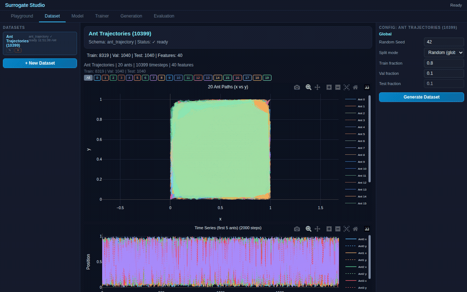
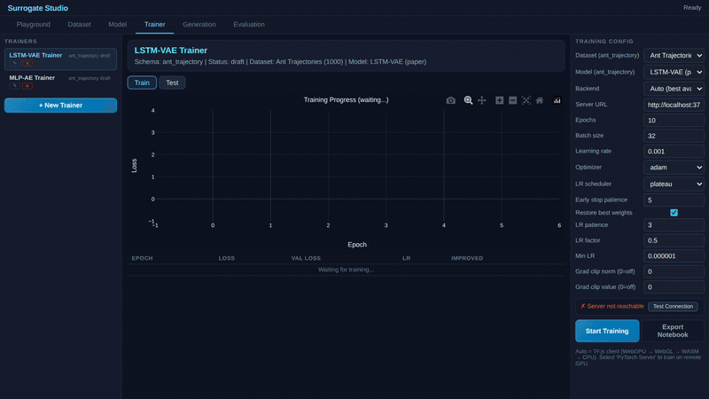
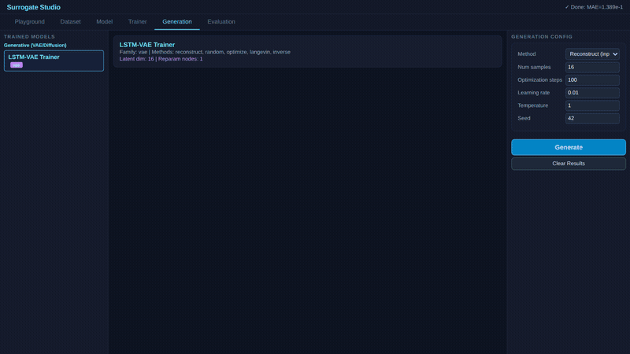

# Surrogate Studio

**A schema-driven ML experimentation platform that runs entirely in the browser.**

Build datasets, design neural network architectures visually, train models, and analyze results — all from a single page. No Python install, no GPU server, no Docker. Just open the HTML file.



---

## Key Features

- **Visual Model Builder** — drag-and-drop neural network design with [Drawflow](https://github.com/jerosoler/Drawflow). 30+ node types: Dense, LSTM, GRU, RNN, Conv1D, BatchNorm, LayerNorm, Dropout, VAE (mu/logvar/reparam), diffusion blocks, and more.
- **Schema-Driven** — everything reads from schema and config. Zero hardcoded `if (schemaId === "...")` in core paths. New dataset types are plugins, not code changes.
- **Dual Runtime** — train with TF.js in the browser (WebGPU/WebGL/WASM/CPU auto-negotiated) or with PyTorch via the optional Node.js server. Same result contract, same visualization.
- **Cross-Runtime Weights** — per-node-type weight mapping between TF.js and PyTorch (Dense transpose, LSTM gate swap, GRU gate reorder, Conv dimension shuffle, BatchNorm running stats). 24/24 architectures verified.
- **Notebook Export** — one-click ZIP bundle with `dataset.csv` + `model.graph.json` + `run.ipynb` for reproducible PyTorch training outside the browser.
- **Paper Reproductions** — self-contained demo folders that reproduce published research, with benchmarks and screenshots. No core modifications needed.

---

## Tabs

| Tab | Purpose |
|-----|---------|
| **Playground** | Browse schemas, preview dataset modules (trajectory plots, image grids) |
| **Dataset** | Generate and manage datasets from registered modules |
| **Model** | Visual graph editor with schema-driven palette and presets |
| **Trainer** | Train models, monitor loss curves, view test metrics (R², scatter, residuals) |
| **Generation** | Reconstruct, sample, or optimize from trained generative models |
| **Evaluation** | Compare multiple trained models on the same test data |

---

## Supported Schemas

| Schema | Type | Features | Dataset Module |
|--------|------|----------|---------------|
| `oscillator` | Trajectory | RK4 physics (spring, pendulum, bouncing ball) | Built-in |
| `mnist` | Image | 28×28 grayscale, 10 classes | Lazy-fetch from source |
| `fashion_mnist` | Image | 28×28 grayscale, 10 classes | Lazy-fetch from source |
| `cifar10` | Image | 32×32 RGB, 10 classes | Lazy-fetch from source |
| `ant_trajectory` | Trajectory | 20 ants × (x,y), 40 features | Demo plugin |

---

## Demos

Self-contained paper reproductions. Each demo is a folder under `demo/` with its own data, schema, module, preset, and README — **zero core file modifications**.

### [LSTM-VAE for Dominant Motion Extraction](demo/LSTM-VAE-for-dominant-motion-extraction/)

Reproduces the LSTM-VAE from Jadhav & Barati Farimani (2022) for ant trajectory reconstruction.

| Training | Generation |
|:---:|:---:|
|  |  |

**Benchmark (50 epochs, TF.js CPU):**

| Model | Params | Test R² | Test RMSE |
|-------|:------:|:-------:|:---------:|
| LSTM-VAE | 77,100 | **0.9970** | 0.0164 |
| MLP-AE (baseline) | 19,312 | 0.9882 | 0.0325 |

> Paper: *"Dominant motion identification of multi-particle system using deep learning from video"*
> — Jadhav & Barati Farimani, Neural Computing and Applications, 2022
> [arXiv:2104.12722](https://arxiv.org/abs/2104.12722)

See [full demo README](demo/LSTM-VAE-for-dominant-motion-extraction/README.md) for architecture comparison, design decisions, and citation.

---

## Quick Start

### Browser (no install)

```
Open index.html in Chrome/Edge (works on file://)
```

Or serve locally:

```bash
npx serve .
# → http://localhost:3000
```

### Demo

```
Open demo/LSTM-VAE-for-dominant-motion-extraction/index.html
```

Dataset is pre-built at load. Select a trainer, click **Start Training**, watch the loss curve.

### PyTorch Server (optional)

```bash
cd server
npm install
node training_server.js
```

Then switch trainer backend to "PyTorch Server" before training.

---

## Architecture

```
index.html
  ├── src/schema_registry.js          — schema definitions + palette
  ├── src/dataset_modules.js          — module registry + build contract
  ├── src/model_builder_core.js       — graph → TF.js model (VAE, LSTM, Conv, etc.)
  ├── src/model_graph_core.js         — Drawflow node factories + preset renderer
  ├── src/training_engine_core.js     — train loop (multi-head, xv loss, test metrics)
  ├── src/generation_engine_core.js   — reconstruct, random, optimize, Langevin, DDPM
  ├── src/weight_converter.js         — per-node-type PyTorch ↔ TF.js weight mapping
  ├── src/notebook_bundle_core.js     — ZIP export (dataset + graph + notebook)
  ├── src/workspace_store.js          — in-memory store (datasets, models, trainers)
  ├── src/layout_renderer_core.js     — dynamic UI (all HTML generated, no hardcode)
  ├── src/surrogate_studio.js         — orchestrator: init → layout → tabs → wiring
  └── src/tabs/*.js                   — tab controllers (dataset, model, trainer, etc.)

demo/<paper>/
  ├── data.js                         — embedded dataset
  ├── schema.js                       — registers schema at runtime
  ├── module.js                       — dataset module (build, render, generation viz)
  ├── preset.js                       — pre-configured store (dataset + models + trainers)
  └── index.html                      — loads core from ../../src/ + demo modules
```

### Core Principles

1. **Zero hardcode** — everything from schema/config, no `if (schemaId === "oscillator")`
2. **Module reuse** — compose existing modules, don't rewrite
3. **Plugin demos** — paper reproductions need zero core changes
4. **No build step** — UMD/IIFE modules, script load order = dependencies
5. **Same contract everywhere** — TF.js Worker, main-thread, PyTorch Server all return identical result format

---

## Node Types (30+)

**MLP**: Input, Dense, Dropout, BatchNorm, LayerNorm, Output
**CNN**: Conv1D, Concat
**RNN**: SimpleRNN, GRU, LSTM, WindowHistory
**VAE**: Latent μ, Latent logσ², Reparameterize
**Diffusion**: NoiseSchedule, SinNorm, CosNorm, TimeNorm, TimeSec
**Features**: ImageSource, History, Params, OneHot

---

## Scripts

```bash
# Run all contract tests
node scripts/test_contract_all.js

# Cross-runtime weight verification (24 architectures)
node scripts/test_cross_runtime_weights.js

# Benchmark LSTM-VAE demo
node scripts/benchmark_ant_vae.js

# Capture demo screenshots via Puppeteer
node scripts/capture_demo_screenshots.js
```

---

## GitHub Pages

This project is fully client-side — deploy directly via GitHub Pages:

```
https://<username>.github.io/surrogate-studio/
```

---

## Adding a New Demo

1. Create `demo/<paper-name>/`
2. Add embedded data file (no fetch needed for `file://` support)
3. Write schema registration (`OSCSchemaRegistry.registerSchema()`)
4. Write dataset module with `build()`, `playgroundApi.renderPlayground()`, `playgroundApi.renderGeneratedSamples()`
5. Write preset with pre-configured store entries
6. Create `index.html` that loads core from `../../src/` + your modules
7. Write `README.md` with paper citation, architecture comparison, benchmark results
8. Capture screenshots: `node scripts/capture_demo_screenshots.js`

No core files need to change.

---

## Citation

If you use Surrogate Studio in your work:

> Parts of this project were developed with AI coding assistance (iteration, refactoring, and diagnostics), while technical direction, validation criteria, and final decisions were made by the project author.

---

## License

See repository for license details.
