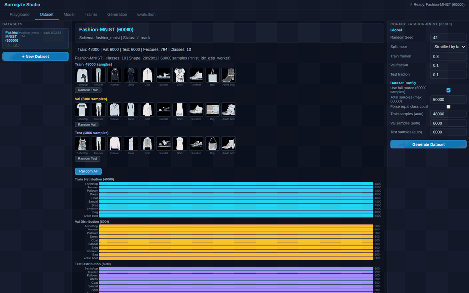
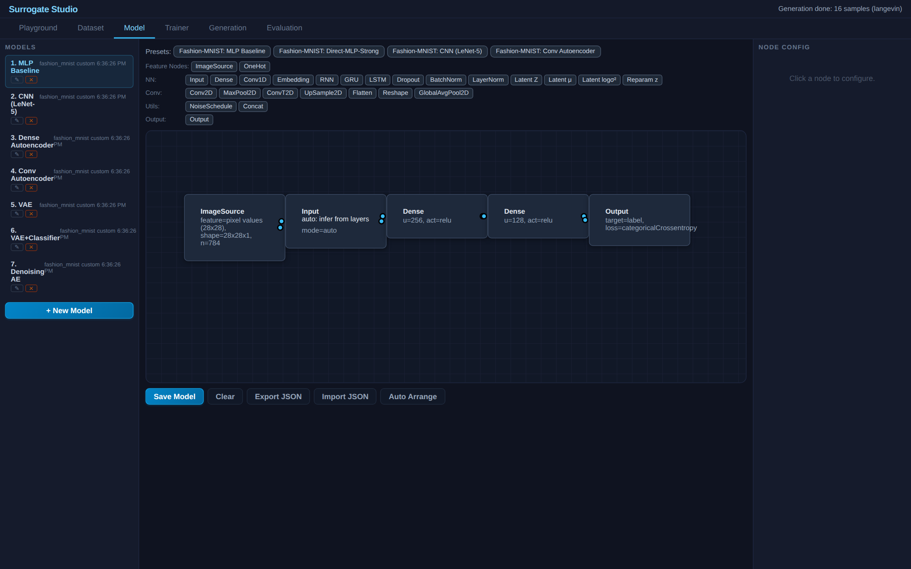
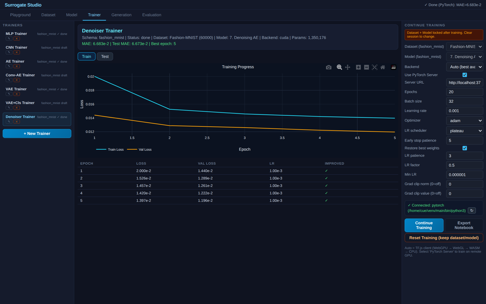
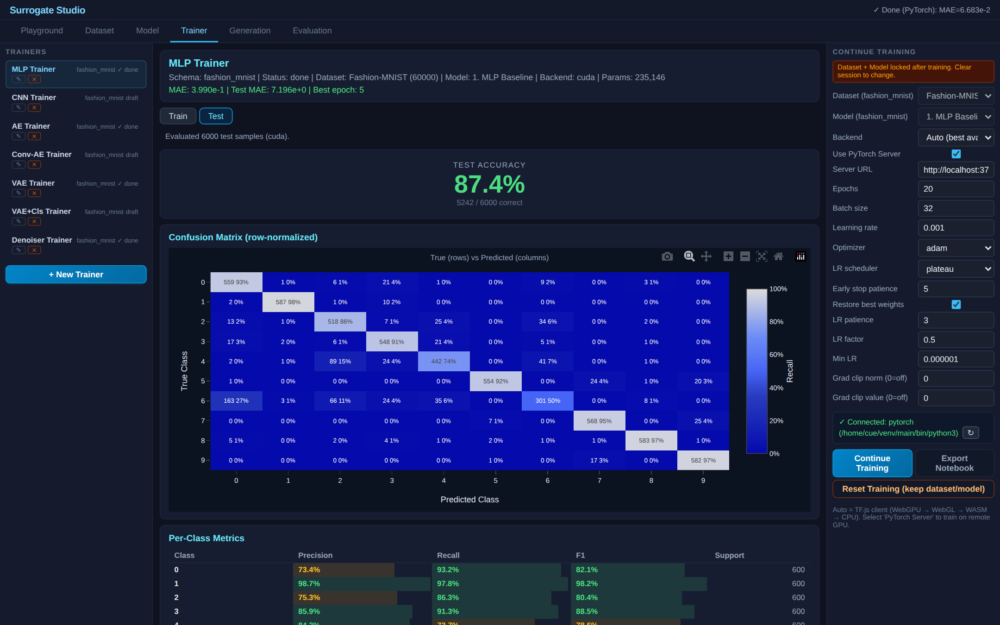
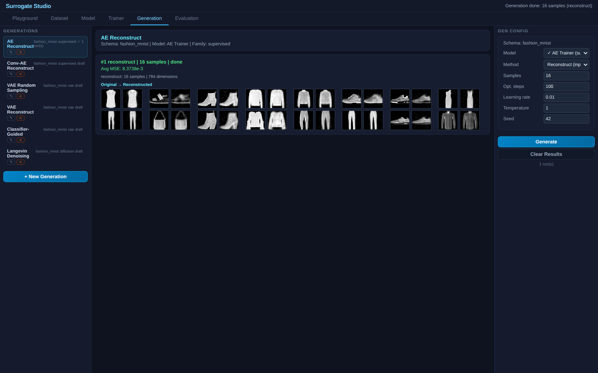

# Surrogate Studio

  

**A schema-driven ML experimentation platform that runs entirely in the browser.**

**[Live Demo](https://cnatthaphon.github.io/surrogate-studio/)** | [Fashion-MNIST Benchmark](https://cnatthaphon.github.io/surrogate-studio/demo/Fashion-MNIST-Benchmark/) | [GAN](https://cnatthaphon.github.io/surrogate-studio/demo/Fashion-MNIST-GAN/) | [Diffusion](https://cnatthaphon.github.io/surrogate-studio/demo/Fashion-MNIST-Diffusion/) | [LSTM-VAE](https://cnatthaphon.github.io/surrogate-studio/demo/LSTM-VAE-for-dominant-motion-extraction/) | [Oscillator](https://cnatthaphon.github.io/surrogate-studio/demo/Oscillator-Surrogate/)

Build datasets, design neural network architectures visually, train models, generate samples, and benchmark results — all from a single page. No Python install, no GPU server, no Docker.



---

## Key Features

- **Visual Model Builder** — drag-and-drop neural network design with [Drawflow](https://github.com/jerosoler/Drawflow). 35+ node types across MLP, CNN, RNN, VAE, GAN, and Diffusion architectures.
- **Schema-Driven** — everything reads from schema and config. Zero hardcoded target names in core paths. New dataset types are plugins, not code changes. Each output node carries explicit `headType` (classification/regression/reconstruction) from schema metadata.
- **Dual Runtime** — train with TF.js in the browser (WebGPU/WebGL/WASM/CPU auto-negotiated) or with PyTorch via the optional Node.js server. Same result contract, same visualization.
- **Cross-Runtime Weights** — per-node-type weight mapping between TF.js and PyTorch (Dense transpose, LSTM gate swap, GRU gate reorder, Conv dimension shuffle, BatchNorm running stats).
- **Notebook Export** — one-click ZIP bundle with `dataset.csv` + `model.graph.json` + `run.ipynb` for reproducible PyTorch training outside the browser.
- **Paper Reproductions** — self-contained demo folders that reproduce published research, with benchmarks and screenshots. No core modifications needed.

---

## Demos

### [Fashion-MNIST Benchmark](demo/Fashion-MNIST-Benchmark/) — 7 Architectures Compared

A visual survey of 35 years of neural network research, trained and evaluated on the same dataset.

| Model | Training | Test | Generation |
|:---:|:---:|:---:|:---:|
|  |  |  |  |

| # | Architecture | Params | Paper |
|---|---|---|---|
| 1 | MLP Baseline | ~235K | Rumelhart et al. 1986 |
| 2 | CNN (LeNet-5) | ~860K | LeCun et al. 1998 |
| 3 | Dense Autoencoder | ~450K | Hinton & Salakhutdinov 2006 |
| 4 | Conv Autoencoder | ~85K | Masci et al. 2011 |
| 5 | VAE | ~414K | Kingma & Welling 2014 |
| 6 | VAE+Classifier | ~414K | Multi-task learning |
| 7 | Denoising AE | ~734K | Ho et al. 2020 |

### [Fashion-MNIST GAN](demo/Fashion-MNIST-GAN/) — 3 Adversarial Architectures

Real adversarial training with no hardcoded GAN logic — everything from Drawflow graph blocks (ConcatBatch, PhaseSwitch, Constant, weight tags).

| # | Architecture | Loss | Paper |
|---|---|---|---|
| 1 | MLP-GAN (LayerNorm + Dropout) | BCE + label smoothing | Goodfellow 2014 |
| 2 | DCGAN (BatchNorm + LeakyReLU) | BCE + label smoothing | Radford 2016 |
| 3 | MLP-WGAN (linear critic) | Wasserstein | Arjovsky 2017 |

Pre-trained MLP-GAN included — generate T-shirt images immediately.

### [Fashion-MNIST Diffusion](demo/Fashion-MNIST-Diffusion/) — 4 Denoising Models

Iterative denoising from noise to images. Standard supervised MSE training — no adversarial dynamics.

| # | Architecture | Method | Paper |
|---|---|---|---|
| 1 | MLP Denoiser (baseline) | Single-step denoise | — |
| 2 | MLP DDPM (timestep-conditioned) | Iterative DDPM | Ho 2020 |
| 3 | NCSN (deep score network) | Langevin dynamics | Song & Ermon 2019 |
| 4 | Score SDE (skip connections, cosine schedule) | SDE sampling | Song et al. 2021 |

### [LSTM-VAE for Dominant Motion Extraction](demo/LSTM-VAE-for-dominant-motion-extraction/)

Reproduces the LSTM-VAE from Jadhav & Barati Farimani (2022) for ant trajectory reconstruction.

| Training | Generation |
|:---:|:---:|
|  |  |

| Model | Params | Test R² | Test RMSE |
|-------|:------:|:-------:|:---------:|
| LSTM-VAE | 77,100 | **0.9970** | 0.0164 |
| MLP-AE (baseline) | 19,312 | 0.9882 | 0.0325 |

> Paper: *"Dominant motion identification of multi-particle system using deep learning from video"* — Jadhav & Barati Farimani, 2022. [arXiv:2104.12722](https://arxiv.org/abs/2104.12722)

### [Oscillator Surrogate](demo/Oscillator-Surrogate/)

5 model architectures on physics-based trajectory data (spring, pendulum, bouncing ball). Demonstrates every feature of the platform: Direct-MLP, AR-GRU, VAE, VAE+Classifier, Denoising AE.

---

## Tabs

| Tab | Purpose |
|-----|---------|
| **Playground** | Browse schemas, preview dataset modules (trajectory plots, image grids) |
| **Dataset** | Generate and manage datasets from registered modules |
| **Model** | Visual graph editor with schema-driven palette and presets |
| **Trainer** | Train models, monitor loss curves, view test metrics (accuracy, R², confusion matrix, scatter plots) |
| **Generation** | Reconstruct, random sample, classifier-guided, Langevin dynamics, DDPM |
| **Evaluation** | Compare multiple trained models on the same test data (benchmark) |

---

## Supported Schemas

| Schema | Type | Features | Dataset Module |
|--------|------|----------|---------------|
| `oscillator` | Trajectory | RK4 physics (spring, pendulum, bouncing ball) | Built-in |
| `mnist` | Image | 28x28 grayscale, 10 classes | Lazy-fetch from CDN |
| `fashion_mnist` | Image | 28x28 grayscale, 10 classes | Lazy-fetch from CDN |
| `cifar10` | Image | 32x32 RGB, 10 classes | Lazy-fetch from CDN |
| `ant_trajectory` | Trajectory | 20 ants x (x,y), 40 features | Demo plugin |

---

## Node Types (35+)

| Category | Nodes |
|----------|-------|
| **MLP** | Input, Dense, Dropout, BatchNorm, LayerNorm, Output |
| **CNN** | Conv2D, Conv2DTranspose, MaxPool2D, UpSample2D, Flatten, Reshape, GlobalAvgPool2D |
| **RNN** | SimpleRNN, GRU, LSTM, Conv1D, Concat |
| **VAE** | Latent mu, Latent logvar, Reparameterize |
| **GAN** | SampleZ, Detach |
| **Diffusion** | AddNoise (GaussianNoise), NoiseSchedule, TimeEmbed |
| **NLP** | Embedding |
| **Feature** | ImageSource, History, WindowHistory, Params, OneHot |
| **Utility** | SinNorm, CosNorm, TimeNorm, TimeSec |

---

## Quick Start

### Browser (no install)

```
Open index.html in Chrome/Edge (works on file://)
```

Or serve locally:

```bash
npx serve .
# -> http://localhost:3000
```

### Demo

```
Open demo/Fashion-MNIST-Benchmark/index.html
```

Dataset loads from CDN. Select a trainer, click **Start Training**, watch the loss curve.

### PyTorch Server (optional, faster)

```bash
cd server
npm install
node training_server.js
```

Check "Use PyTorch Server" in the Trainer config before training. CUDA will be used if available.

---

## Architecture

```
index.html
  |-- src/schema_registry.js          -- schema definitions + palette + headType
  |-- src/dataset_modules.js          -- module registry + build contract
  |-- src/model_builder_core.js       -- graph -> TF.js model (MLP, CNN, VAE, GAN, etc.)
  |-- src/model_graph_core.js         -- Drawflow node factories + preset renderer
  |-- src/training_engine_core.js     -- train loop (multi-head, phased, headType-driven)
  |-- src/generation_engine_core.js   -- reconstruct, random, classifier-guided, Langevin, DDPM
  |-- src/weight_converter.js         -- per-node-type PyTorch <-> TF.js weight mapping
  |-- src/notebook_bundle_core.js     -- ZIP export (dataset + graph + notebook)
  |-- src/workspace_store.js          -- in-memory store (datasets, models, trainers)
  |-- src/dataset_source_registry.js  -- zero-copy source management (60K images, no duplication)
  |-- src/server_runtime_adapter.js   -- gzip streaming to PyTorch server
  |-- src/surrogate_studio.js         -- orchestrator: init -> layout -> tabs -> wiring
  +-- src/tabs/*.js                   -- tab controllers (dataset, model, trainer, generation, evaluation)

server/
  |-- training_server.js              -- Node.js HTTP server, SSE epoch streaming
  |-- train_subprocess.py             -- PyTorch training (graph -> model, phased, headType)
  |-- generate_subprocess.py          -- PyTorch generation (reconstruct, random, Langevin, DDPM)
  +-- predict_subprocess.py           -- PyTorch batch prediction

demo/<paper>/
  |-- preset.js                       -- pre-configured store (dataset + models + trainers + generations + evaluations)
  |-- index.html                      -- loads core from ../../src/ + preset
  |-- README.md                       -- paper citation, architecture, benchmark results
  +-- images/                         -- screenshots + GIF (captured via Puppeteer)
```

### Core Principles

1. **Zero hardcode** — everything from schema/config. Classification detected via `headType`, not target name strings.
2. **Module reuse** — compose existing modules, don't rewrite
3. **Plugin demos** — paper reproductions need zero core changes
4. **No build step** — UMD/IIFE modules, script load order = dependencies
5. **Same contract everywhere** — TF.js browser, PyTorch server, and exported notebook all return identical result format

---

## Scripts

```bash
# Run all contract tests
node scripts/test_contract_all.js

# Full E2E test (requires PyTorch server running)
node scripts/test_benchmark_full.js

# Capture demo screenshots + GIF
node scripts/capture_demo_assets.js demo/Fashion-MNIST-Benchmark 5

# Cross-runtime weight verification
node scripts/test_cross_runtime_weights.js
```

---

## Papers Cited

| Paper | Year | Demo |
|-------|------|------|
| Rumelhart, Hinton, Williams — "Learning representations by back-propagating errors" | 1986 | Benchmark |
| LeCun, Bottou, Bengio, Haffner — "Gradient-Based Learning Applied to Document Recognition" | 1998 | Benchmark |
| Hinton & Salakhutdinov — "Reducing the Dimensionality of Data with Neural Networks" | 2006 | Benchmark |
| Masci et al. — "Stacked Convolutional Auto-Encoders" | 2011 | Benchmark |
| Kingma & Welling — "Auto-Encoding Variational Bayes" | 2013 | Benchmark |
| Goodfellow et al. — "Generative Adversarial Nets" | 2014 | GAN |
| Radford, Metz, Chintala — "Unsupervised Representation Learning with DCGANs" | 2015 | GAN |
| Ho, Jain, Abbeel — "Denoising Diffusion Probabilistic Models" | 2020 | Benchmark |
| Jadhav & Barati Farimani — "LSTM-VAE for dominant motion extraction" | 2022 | LSTM-VAE |

---

## GitHub Pages

This project is fully client-side — deploy directly via GitHub Pages:

```
https://<username>.github.io/surrogate-studio/
```

---

## Adding a New Demo

1. Create `demo/<paper-name>/`
2. Write `preset.js` with pre-configured store entries (dataset, models, trainers, generations, evaluations)
3. Create `index.html` that loads core from `../../src/` + your preset
4. Write `README.md` with paper citation, architecture, benchmark results
5. Capture screenshots: `node scripts/capture_demo_assets.js demo/<paper-name> 5`

No core files need to change. All demos are plugins.

---

## License

See repository for license details.
