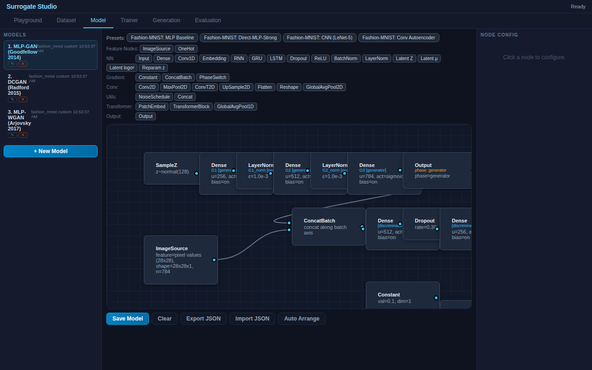
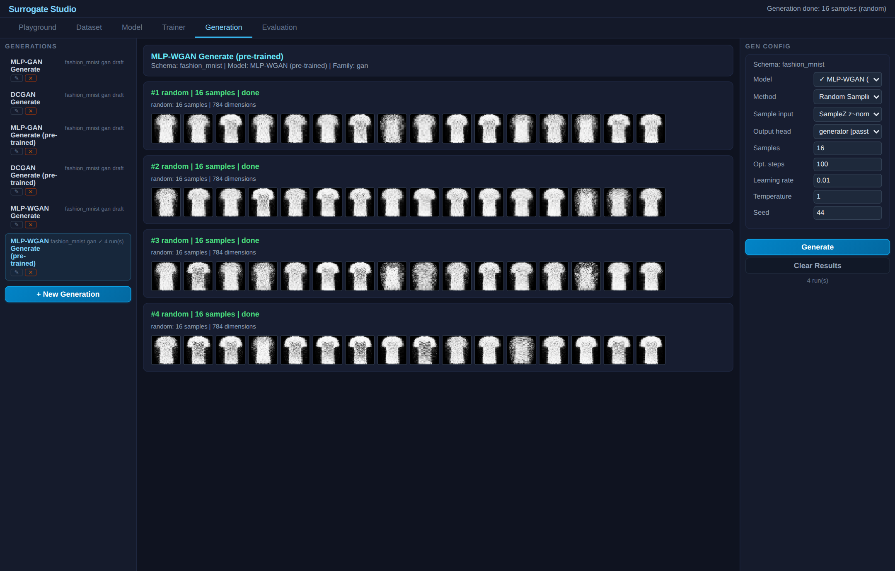
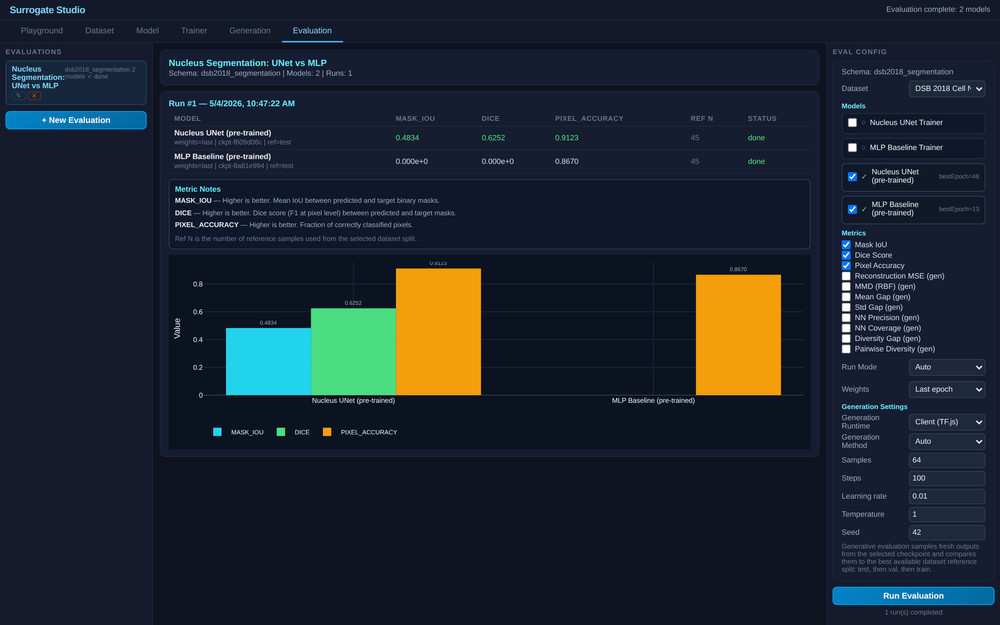

# Surrogate Studio

[](https://github.com/cnatthaphon/surrogate-studio/actions/workflows/ci.yml)     [](LICENSE)

**A visual ML platform with 16 demos across published papers and custom data — trainable in the browser with no install.**

### [Start here: Fashion-MNIST GAN demo](https://cnatthaphon.github.io/surrogate-studio/demo/Fashion-MNIST-GAN/) — pretrained models, instant results


---

## Why This Exists

Reproducing ML papers means rebuilding the same pipeline over and over: load data, define a model, train, evaluate, compare. Each paper uses different frameworks, different conventions, different evaluation code. Surrogate Studio replaces that cycle with a single visual platform where the graph IS the model — build it once, train it in the browser or on a PyTorch server, compare results side by side.

The goal is not to advance state-of-the-art on any benchmark. It is to show that 16 different architectures — from MLPs to GANs to Diffusion to Transformers — can run through the same schema-driven pipeline, with the same training engine, the same evaluation, and the same weight format. Like Papers With Code, but the code actually runs live in your browser.

---

## Key Features

| | Feature | What it means |
|---|---------|--------------|
| **1** | **Visual graph editor** | Design neural networks by dragging nodes — no model code needed. 35+ node types: MLP, CNN, RNN, VAE, GAN, Diffusion, Transformer, NLP. |
| **2** | **3 runtimes, 1 graph** | Same visual graph trains in TF.js (browser), PyTorch (server with CUDA), or the built-in notebook runner (Pyodide / server kernel). Train anywhere, compare everywhere. |
| **3** | **Cross-runtime weight transfer** | Weights trained in PyTorch load into TF.js and vice versa. Handles Dense transpose, LSTM gate reorder, Conv NCHW/NHWC shuffle, BatchNorm stats — per layer type. |
| **4** | **Built-in + exported notebooks** | Run the generated notebook inside Surrogate Studio, or export `.ipynb` + `dataset.csv` + `model.graph.json` as a reproducible PyTorch training bundle for JupyterLab, Colab, or any PyTorch environment. Weights transfer back to the browser. |
| **5** | **Pretrained instant results** | Most demos ship with trained weights. Open the page, see loss curves and metrics immediately. Retrain or modify if you want. |
| **6** | **Plugin architecture** | Each demo is self-contained. Adding a new paper reproduction = zero core code changes. |
| **7** | **Custom data support** | Bring your own CSV — the platform auto-detects features, targets, and task type. Or define a full custom schema for any domain. |

---

## Platform Walkthrough

### Design models visually
Drag-and-drop architecture design. The graph IS the model — no separate code.

| Graph Editor (Transformer) | Graph Editor (GAN) |
|:---:|:---:|
|  |  |

### Train and evaluate
Real-time loss curves, epoch tables, test metrics. Client (TF.js) or server (PyTorch).

| Training (NLP Transformer) | Training (Siamese Verification) |
|:---:|:---:|
|  |  |

### Generate and explore
Reconstruct images, sample from latent space, run DDPM/Langevin generation.

| GAN Generation (3 architectures) | Maritime Trajectory (Leaflet map) |
|:---:|:---:|
|  |  |

### Real-world data
Not just toy datasets — real SAR radar imagery, real microscopy cells, real vessel trajectories.

| SAR Ship Detection (HRSID) | Cell Nuclei (DSB 2018) | Evaluation Metrics |
|:---:|:---:|:---:|
|  |  |  |

---

## 16 Demos

Every demo runs live on [GitHub Pages](https://cnatthaphon.github.io/surrogate-studio/) — click to try.

| Demo | Domain | Paper | Live |
|------|--------|-------|:----:|
| **Fashion-MNIST Benchmark** | Classification | Rumelhart '86 — Ho '20 (7 models) | [Open](https://cnatthaphon.github.io/surrogate-studio/demo/Fashion-MNIST-Benchmark/) |
| **Fashion-MNIST GAN** | Generation | Goodfellow '14, Radford '16, Arjovsky '17 | [Open](https://cnatthaphon.github.io/surrogate-studio/demo/Fashion-MNIST-GAN/) |
| **Fashion-MNIST Diffusion** | Generation | Ho '20, Song '19, Song '21 | [Open](https://cnatthaphon.github.io/surrogate-studio/demo/Fashion-MNIST-Diffusion/) |
| **Conditional Diffusion** | Generation | Ho '20 + Dhariwal '21 | [Open](https://cnatthaphon.github.io/surrogate-studio/demo/Fashion-MNIST-Conditional-Diffusion/) |
| **Fashion-MNIST UNet** | Reconstruction | Ronneberger '15 | [Open](https://cnatthaphon.github.io/surrogate-studio/demo/Fashion-MNIST-UNet/) |
| **Vision Transformer** | Classification | Dosovitskiy '21 (ViT) | [Open](https://cnatthaphon.github.io/surrogate-studio/demo/Fashion-MNIST-Transformer/) |
| **TrAISformer** | Trajectory | Nguyen '21 (AIS maritime) | [Open](https://cnatthaphon.github.io/surrogate-studio/demo/TrAISformer/) |
| **LSTM-VAE** | Reconstruction | Jadhav '22 (ant trajectory) | [Open](https://cnatthaphon.github.io/surrogate-studio/demo/LSTM-VAE-for-dominant-motion-extraction/) |
| **Oscillator Surrogate** | Regression | Physics surrogates (5 models) | [Open](https://cnatthaphon.github.io/surrogate-studio/demo/Oscillator-Surrogate/) |
| **Cell Nuclei Segmentation** | Segmentation | Ronneberger '15 (DSB 2018) | [Open](https://cnatthaphon.github.io/surrogate-studio/demo/Cell-Nuclei-Segmentation/) |
| **Synthetic Segmentation** | Segmentation | Ronneberger '15 | [Open](https://cnatthaphon.github.io/surrogate-studio/demo/Synthetic-Segmentation/) |
| **Synthetic Detection** | Detection | Redmon '16 | [Open](https://cnatthaphon.github.io/surrogate-studio/demo/Synthetic-Detection/) |
| **SAR Ship Detection** | Detection | Wei '20 (HRSID radar) | [Open](https://cnatthaphon.github.io/surrogate-studio/demo/SAR-Ship-Detection/) |
| **Text Sentiment** | NLP | Vaswani '17 (Transformer) | [Open](https://cnatthaphon.github.io/surrogate-studio/demo/Text-Sentiment-Transformer/) |
| **Siamese Verification** | Metric Learning | Bromley '93 | [Open](https://cnatthaphon.github.io/surrogate-studio/demo/Siamese-Shape-Verification/) |
| **Custom CSV Tutorial** | Tabular | Bring your own data (Iris sample) | [Open](https://cnatthaphon.github.io/surrogate-studio/demo/Custom-CSV-Tutorial/) |

Each demo has its own README with architecture diagrams, benchmark results, and step-by-step usage guide.

**Detailed breakdown**: [DEMOS.md](DEMOS.md) | **Architecture & schemas**: [DEMOS.md — Architecture](DEMOS.md#architecture) | **All 18 papers cited**: [DEMOS.md — Papers](DEMOS.md#papers-cited)

---

## Architecture Overview

```
Browser (TF.js)                    Server (PyTorch)
┌──────────────────────┐          ┌─────────────────────┐
│  Visual Graph Editor │          │  training_server.js  │
│  (Drawflow, 35+ nodes)│  ──────>│  train_subprocess.py │
│  Training Engine     │  SSE     │  generate_subprocess │
│  Generation Engine   │  <────── │  predict_subprocess  │
│  Evaluation / Export │          │  CUDA auto-detected  │
└──────────────────────┘          └─────────────────────┘
         │                                  │
         └──── weight_converter.js ────────┘
              (cross-runtime mapping)
```

**Zero hardcode**: everything from schema/config. **Plugin demos**: no core changes per paper. **Same contract**: TF.js, PyTorch, and exported notebook all produce identical results.

Full architecture details, file map, supported schemas (13), and node types (35+) in [DEMOS.md](DEMOS.md#architecture).

---

## Quick Start

**Browser** — open any demo on GitHub Pages, no install:
```
https://cnatthaphon.github.io/surrogate-studio/demo/Fashion-MNIST-Benchmark/
```

**Local server** — full platform with PyTorch training:
```bash
npm install && npm start    # http://localhost:3777
```

**Docker** — everything in one container (Node.js + PyTorch):
```bash
docker build -t surrogate-studio . && docker run -p 3777:3777 surrogate-studio
```

---

## Testing

| Suite | Coverage |
|-------|----------|
| Contract tests | 31 scripts |
| Multi-schema pipeline | 11 schemas (5 full train+eval, 6 module-verified) |
| GitHub Pages E2E | 297 checks across all 16 demos |
| CI | Every push/PR via GitHub Actions |

---

## How This Was Built

Surrogate Studio was architected and designed by a human (the schema-driven pipeline, plugin demo pattern, cross-runtime weight contract, and 3-runtime notebook export were all deliberate architectural decisions). Implementation was done with AI coding agents (Claude Code + Codex) acting as pair programmers — the human set the design constraints, the agents wrote the code, and a multi-round review cycle caught 10 bugs before launch. The value of this project is in the architecture, not in any single line of code.

---

## License

[MIT](LICENSE)
