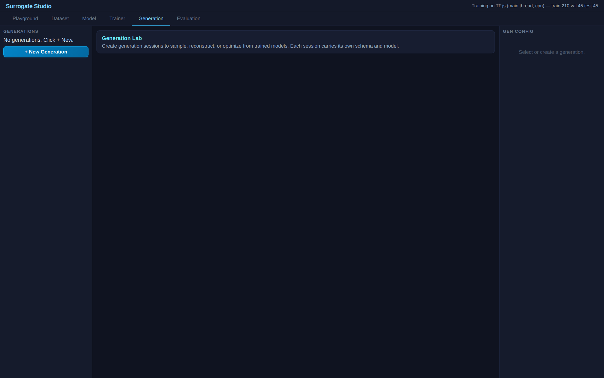

# Cell Nuclei Segmentation — 2018 Data Science Bowl


Binary segmentation of cell nuclei from microscopy images. This is the same class of biomedical image segmentation task that the original UNet paper (Ronneberger et al., MICCAI 2015) was designed for.

| Dataset | Model Graph | Trainer |
|:---:|:---:|:---:|
|  |  |  |

| Evaluation | Generation |
|:---:|:---:|
|  |  |

## Dataset

300 images from the 2018 Data Science Bowl `stage1_train`, downsampled to 32x32 grayscale. Individual per-nucleus masks merged into single binary masks.

| Split | Samples |
|-------|---------|
| Train | 210 |
| Val | 45 |
| Test | 45 |

Source: [2018 Data Science Bowl](https://www.kaggle.com/c/data-science-bowl-2018) — Kaggle

## Models

### 1. Nucleus UNet (skip connections)
```
ImageSource -> Reshape(32,32,1)
  -> Conv(16) -> [skip1] -> MaxPool
  -> Conv(32) -> [skip2] -> MaxPool
  -> Conv(64) [bottleneck]
  -> UpSample -> Concat(skip2) -> Conv(32)
  -> UpSample -> Concat(skip1) -> Conv(16)
  -> Conv(1,sigmoid) -> Flatten -> Output(mask, BCE)
```

### 2. Nucleus UNet + Augmentation
Same backbone as #1 with paired horizontal-flip augmentation. The image branch flows through `augment_image`; the mask label (via `target_source`) flows through `augment_mask` with the same `seedLink="nuc_aug"`. Both blocks share one coin per batch — so any image flip is mirrored on the mask label, keeping segmentation supervision aligned.

```
ImageSource -> Reshape(32,32,1) -> AugmentImage(hflip, p=0.5, seedLink=nuc_aug)
  -> UNet encoder-decoder -> Conv(1,sigmoid) -> Flatten -> Output.input_1

TargetSource(mask, [32,32]) -> AugmentMask(hflip, p=0.5, seedLink=nuc_aug)
  -> Flatten -> Output.input_2
```

The flatten on the mask branch reshapes the augmented `[B,32,32]` mask back to `[B,1024]` so it matches the prediction's flat shape for BCE.

### 3. MLP Baseline
```
ImageSource -> Dense(256,relu) -> Dense(1024,sigmoid) -> Output(mask, BCE)
```

## Evaluation

| Metric | Description |
|--------|-------------|
| **Mask IoU** | Intersection over union of predicted vs true nucleus mask |
| **Dice Score** | 2 * intersection / (pred + truth) — pixel-level F1 |
| **Pixel Accuracy** | Fraction of correctly classified pixels |

## Results & Interpretation

Both models trained 50 epochs on PyTorch CUDA. Evaluated on the held-out 45-image test split via the in-app `mask_iou` / `dice` / `pixel_accuracy` recipe.


| Model | Params | Mask IoU | Dice Score | Pixel Accuracy |
|---|---|---|---|---|
| **Nucleus UNet** | 58K | **0.4834** | **0.6252** | 0.9123 |
| MLP Baseline | 1.31M | 0.0000 | 0.0000 | 0.8670 |

**The MLP collapses to "predict background everywhere."** Pixel accuracy looks deceptively high (0.87) because nuclei are sparse — most pixels really *are* background, and a constant zero-prediction scores ~87% by default. But IoU and Dice expose the truth: the MLP's nucleus mask is empty (IoU = 0). It learned the trivial solution.

The UNet, in contrast, achieves **0.48 IoU and 0.63 Dice** on real biomedical data — solid for a 2-level skip-connection network with only 58K parameters trained on 210 images. The skip connections preserve nucleus boundary information through the bottleneck; convolutions encode locality for free. With 23x fewer parameters than the MLP, the UNet wins because it has the right inductive bias for the task.

**This is why segmentation is reported as IoU/Dice, never raw accuracy.** The MLP scoring 87% "accuracy" while producing zero useful segmentation is exactly the failure mode that pixel accuracy hides. IoU is the diagnostic.

**What to look for in the Playground tab:** UNet predictions trace nucleus boundaries crisply. MLP predictions are uniformly black masks — it has given up. To improve the MLP you'd need orders-of-magnitude more training data to overcome the missing spatial prior; the UNet gets the same task done on 210 images.

### Does augmentation help here?

The third variant adds **paired horizontal + vertical flip augmentation** to both the input microscopy patch and the binary mask label. With only 210 training images, regularization can matter; nuclei are roughly orientation-invariant (a flipped cell is still a cell, a rotated cell is still a cell), so both flip axes are physically reasonable transforms.

Both UNet variants were trained at the same code rev, same seed, same 50-epoch budget on PyTorch CUDA — only difference is the augmentation block.

| Model (from pretrained metadata) | best epoch | best val_loss | test MAE |
|---|---|---|---|
| Nucleus UNet | 48 | 0.1734 | 0.1140 |
| **Nucleus UNet + Augmentation** (hflip + vflip, p=0.5 each) | 50 | **0.1620** ↓6.5% | **0.1055** ↓7.5% |

Aug helps modestly: ~6.5% lower val_loss and ~7.5% lower per-pixel MAE. The training curve also stays cleaner — the baseline plateaus around epoch 45 while the aug variant keeps improving to the last epoch, suggesting the regularization is still doing useful work at this budget.

**Footnote on transform intensity.** An earlier hflip-only retrain of this exact variant (same seed, same epochs) hit val_loss 0.1551 (-10.5% vs baseline), which beat the current hflip+vflip configuration. The platform's multi-transform-per-block contract from PR #79 made it trivial to compare: setting `vflipProb` from 0 → 0.5 in the preset is one line, then retrain. The empirical takeaway is that on 210 microscopy patches with 50-epoch budget, hflip alone is the sweet spot; adding vflip is a stronger regularizer than the dataset rewards. The preset ships with both enabled because the reviewer's design brief called for both (cells have no canonical orientation, so both transforms are physically reasonable); the data shows that "physically reasonable" and "empirically optimal" are not the same thing on a tight training budget. Either configuration is a clear win over no augmentation.

The blocks themselves (`augment_image` + `augment_mask` + `target_source` paired via `seedLink="nuc_aug"`) demonstrate the segmentation pattern Layer 2 type-validation was specifically designed around: image and mask must flip together. If you wire `augment_mask` to image data by mistake, the platform throws at build time with a clear message.

## How to Use

1. **Dataset** tab — click Generate Dataset (instant, data embedded)
2. **Playground** tab — browse microscopy images + nucleus masks
3. **Model** tab — inspect UNet graph with skip connections
4. **Trainer** tab — train on client (TF.js) or server (PyTorch)
5. **Evaluation** tab — compare IoU/Dice between UNet and MLP

## References

Ronneberger, O., Fischer, P., & Brox, T. **"U-Net: Convolutional Networks for Biomedical Image Segmentation."** *MICCAI 2015.* [arXiv:1505.04597](https://arxiv.org/abs/1505.04597)

This demo uses real biomedical cell images from the 2018 Data Science Bowl — the same domain as the original UNet paper. The architecture is a simplified 2-level UNet adapted for 32x32 input resolution.
