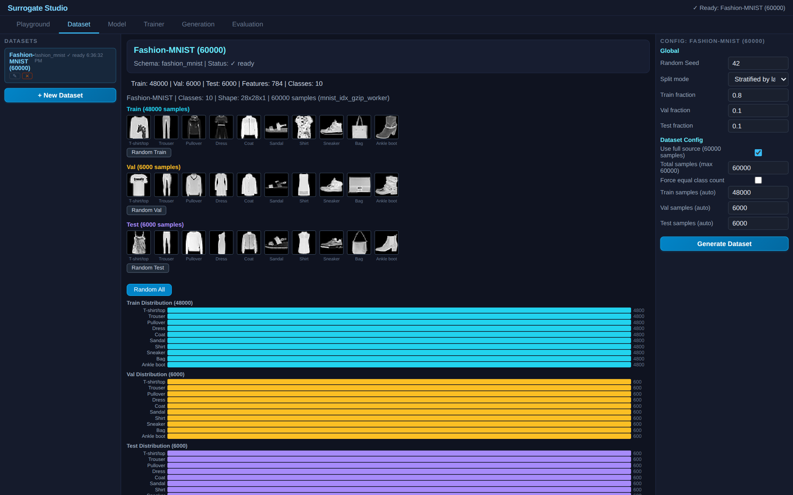
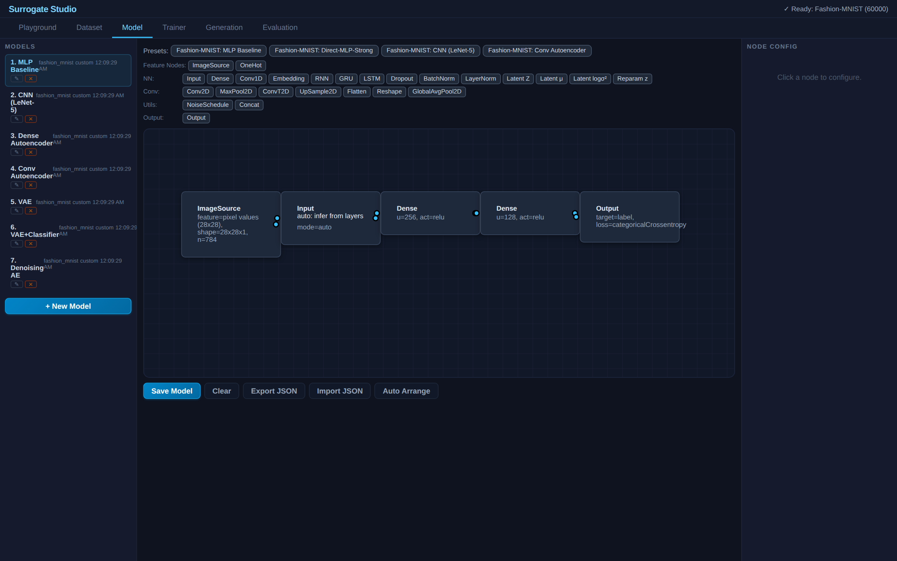
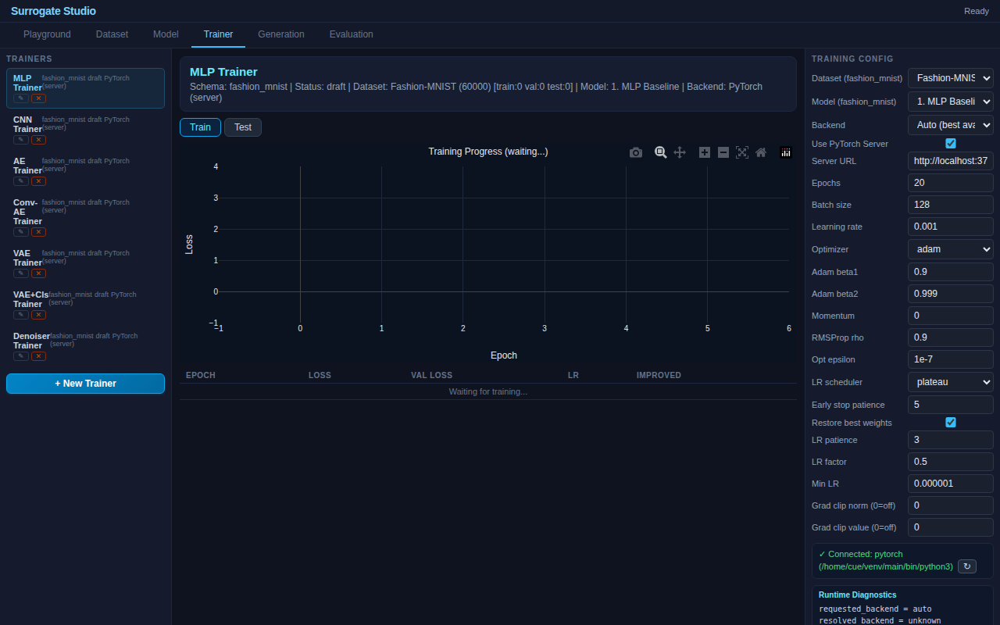
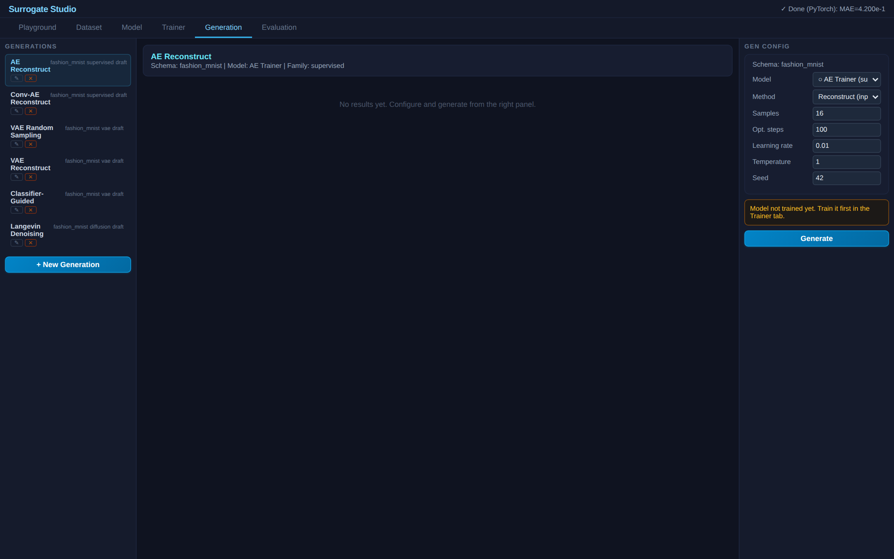

# Fashion-MNIST Benchmark — 7 Architectures Compared


**A visual survey of three decades of neural network research, trained and evaluated on the same dataset in one browser page.**

7 architectures spanning from 1986 to 2020, each built entirely from the visual graph editor — no code, no hardcodes. Every model trains on both TF.js (browser) and PyTorch (server), with identical results.

## Models

| # | Architecture | Params | Task | Paper |
|---|---|---|---|---|
| 1 | **MLP Baseline** | ~236K | Classification | Rumelhart et al. 1986 |
| 2 | **CNN (LeNet-5)** | ~860K | Classification | LeCun et al. 1998 |
| 3 | **Dense Autoencoder** | ~450K | Reconstruction | Hinton & Salakhutdinov 2006 |
| 4 | **Conv Autoencoder** | ~85K | Reconstruction | Masci et al. 2011 |
| 5 | **VAE** | ~414K | Reconstruction + Generation | Kingma & Welling 2014 |
| 6 | **VAE+Classifier** | ~414K | Multi-task (recon + class) | Multi-task learning |
| 7 | **Denoising AE** | ~734K | Reconstruction + Generation | Ho et al. 2020 |

## Benchmarks

### Classification: MLP vs CNN
| Model | Accuracy | Macro F1 |
|---|---|---|
| MLP Baseline | ~88% | ~0.87 |
| CNN (LeNet-5) | **~91%** | **~0.91** |

### Reconstruction: AE vs Conv-AE vs VAE vs Denoiser
| Model | MAE | RMSE | R² |
|---|---|---|---|
| Dense AE | ~0.05 | ~0.08 | ~0.93 |
| Conv AE | **~0.04** | **~0.07** | **~0.95** |
| VAE | ~0.06 | ~0.09 | ~0.91 |
| Denoising AE | ~0.06 | ~0.10 | ~0.91 |

### Generation Methods
| Method | Model | Description |
|---|---|---|
| Reconstruct | AE, Conv-AE, VAE, Denoiser | Input → model → output |
| Random Sampling | VAE | z ~ N(0,1) → decoder → image |
| Classifier-Guided | VAE+Classifier | Optimize z to generate specific class |
| Langevin Dynamics | Denoising AE | Iterative denoising from pure noise |

## Screenshots

| Dataset | Model Graph | Training | Test Results | Generation |
|---|---|---|---|---|
|  |  |  |  |  |

## How to Use

1. Open `index.html`, generate Fashion-MNIST dataset (~30MB download)
2. **Trainer tab**: Train all 7 models (click each, press Start)
3. **Evaluation tab**: Run benchmarks → see side-by-side comparison
4. **Generation tab**: Explore generation methods per model
5. **Model tab**: Click each model to see its architecture in the graph editor

## Architecture Details

### 1. MLP Baseline (Rumelhart 1986)
```
ImageSource(784) → Input → Dense(256, relu) → Dense(128, relu) → Output(label, CE)
```
The foundational architecture. Still competitive on simple tasks.

### 2. CNN / LeNet-5 (LeCun 1998)
```
ImageSource → Reshape(28,28,1) → Conv2D(32,5×5) → MaxPool(2) → Conv2D(64,5×5) → MaxPool(2) → Flatten → Dense(256) → Dropout(0.3) → Output(label, CE)
```
Spatial feature extraction gives ~3% accuracy improvement over MLP.

### 3. Dense Autoencoder (Hinton 2006)
```
ImageSource → Input → Dense(256) → Dense(64) → Dense(256) → Dense(784, sigmoid) → Output(pixel_values, MSE)
```
Learns compressed representation. Reconstruction target = input.

### 4. Conv Autoencoder (Masci 2011)
```
ImageSource → Reshape(28,28,1) → Conv2D(32, stride=2) → Conv2D(64, stride=2) → Flatten → Dense(32) → Dense(3136) → Reshape(7,7,64) → ConvT2D(32, stride=2) → ConvT2D(1, stride=2, sigmoid) → Flatten → Output(pixel_values, MSE)
```
Convolutional encoder-decoder preserves spatial structure → better reconstruction.

### 5. VAE (Kingma 2014)
```
ImageSource → Input → Dense(256) → [μ(16), logσ²(16)] → Reparam(z) → Dense(256) → Dense(784, sigmoid) → Output(pixel_values, MSE)
```
Latent space is regularized → enables random sampling and interpolation.

### 6. VAE+Classifier (Multi-task)
```
Shared: ImageSource → Input → Dense(256) → [μ/logσ² → Reparam → Dense(256) → Dense(784) → Output(recon)]
Branch: Dense(256) → Dense(64) → Output(label, CE, weight=0.3)
```
Classifier head enables class-guided generation.

### 7. Denoising AE / Diffusion (Ho 2020)
```
ImageSource → AddNoise(σ=0.3) → Dense(512) → Dense(256) → Dense(784) → Output(pixel_values, MSE)
```
Learns to denoise → generation via iterative Langevin dynamics from pure noise.

## References

1. Rumelhart, Hinton, Williams. **"Learning representations by back-propagating errors."** *Nature* 323, 533–536 (1986). [doi:10.1038/323533a0](https://doi.org/10.1038/323533a0)

2. LeCun, Bottou, Bengio, Haffner. **"Gradient-Based Learning Applied to Document Recognition."** *Proc. IEEE* 86(11), 2278–2324 (1998). [doi:10.1109/5.726791](https://doi.org/10.1109/5.726791)

3. Hinton, Salakhutdinov. **"Reducing the Dimensionality of Data with Neural Networks."** *Science* 313(5786), 504–507 (2006). [doi:10.1126/science.1127647](https://doi.org/10.1126/science.1127647)

4. Masci, Meier, Ciresan, Schmidhuber. **"Stacked Convolutional Auto-Encoders for Hierarchical Feature Extraction."** *ICANN 2011*. [doi:10.1007/978-3-642-21735-7_7](https://doi.org/10.1007/978-3-642-21735-7_7)

5. Kingma, Welling. **"Auto-Encoding Variational Bayes."** *ICLR 2014*. [arXiv:1312.6114](https://arxiv.org/abs/1312.6114)

6. Goodfellow et al. **"Generative Adversarial Nets."** *NeurIPS 2014*. [arXiv:1406.2661](https://arxiv.org/abs/1406.2661)

7. Ho, Jain, Abbeel. **"Denoising Diffusion Probabilistic Models."** *NeurIPS 2020*. [arXiv:2006.11239](https://arxiv.org/abs/2006.11239)

8. Xiao, Rasul, Vollgraf. **"Fashion-MNIST: a Novel Image Dataset for Benchmarking Machine Learning Algorithms."** 2017. [arXiv:1708.07747](https://arxiv.org/abs/1708.07747)
