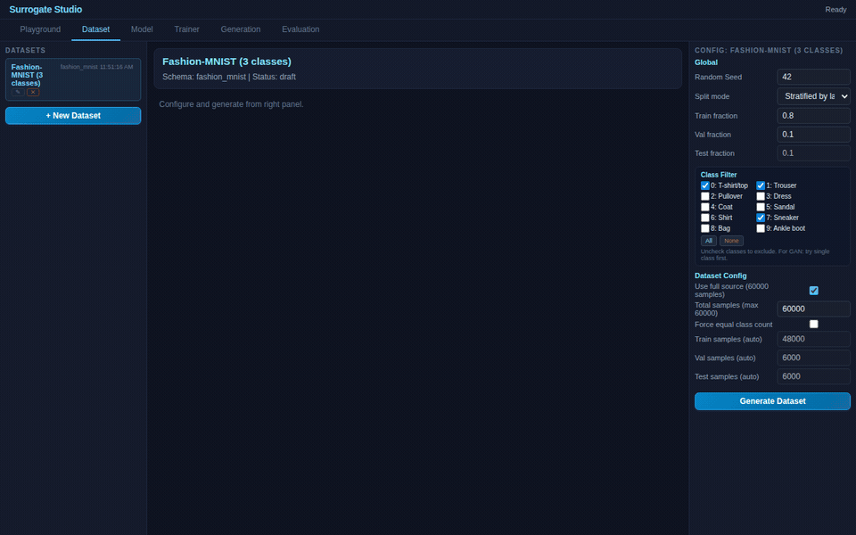

# Fashion-MNIST Conditional Diffusion Demo

Class-conditioned denoising: the model receives a one-hot class label alongside the noisy image, enabling targeted generation of specific Fashion-MNIST classes.

**3 classes**: T-shirt/top (0), Trouser (1), Sneaker (7)

## Models

### 1. Conditional DDPM

Timestep + class conditioning. Three inputs: noisy image (784), sinusoidal time embedding (64), one-hot class (3). Concatenated and passed through Dense(512) + LayerNorm + Dense(256) + LayerNorm + Dense(512) + Dense(784, sigmoid).

- **Inputs**: image_source + noise_injection + time_embed + class_embed
- **Training**: MSE loss, reconstruction target = clean image
- **Generation**: DDPM reverse process (x0-prediction), 50 steps

### 2. Conditional Denoiser

Class conditioning only (no timestep). Two inputs: noisy image (784), one-hot class (3). Simpler architecture for baseline comparison.

- **Inputs**: image_source + noise_injection + class_embed
- **Training**: MSE loss, constant noise scale 0.3
- **Generation**: DDPM reverse process or single-pass reconstruction

## How to Use

1. **Open** `index.html` in Chrome/Edge
2. **Dataset tab**: Click Generate to load Fashion-MNIST (3 classes, ~18K images)
3. **Generation tab**: Select a pretrained generation config from the left panel
   - *DDPM -> T-shirt/Trouser/Sneaker*: generates specific class via DDPM reverse process
   - *DDPM -> Random*: each sample gets a random class
   - Change the **Target class** dropdown on the right to switch classes
4. **Evaluation tab**: Run Generation Quality or Reconstruction Quality benchmarks

## Pretrained Weights

Both models are pretrained on 18K real Fashion-MNIST images (T-shirt + Trouser + Sneaker) for 30 epochs. Weights are embedded as base64 JS files and loaded automatically.

| Model | Params | Val Loss | File |
|-------|--------|----------|------|
| Conditional DDPM | 1.10M | 0.0072 | `cond_ddpm_pretrained.js` |
| Conditional Denoiser | 1.07M | 0.0064 | `cond_denoiser_pretrained.js` |

## Key Concept: ClassEmbed Node

The `ClassEmbed` node is a new graph block that provides a one-hot class vector as model input. During training, the engine reads class labels from the dataset. During generation, the user selects a target class from a dropdown (with class names resolved from the schema).

This node works across all three runtimes:
- **Client (TF.js)**: one-hot tensor from `dataset.labelsTrain`
- **Server (PyTorch)**: 3rd DataLoader tensor, set as `model._class_labels`
- **Notebook**: same as server, auto-detected from graph

## Evaluations

| Evaluation | Metrics | Description |
|-----------|---------|-------------|
| Generation Quality | MMD, Mean Gap, Std Gap, NN Precision/Coverage, Diversity | Compare generated vs real distribution |
| Reconstruction Quality | MSE | How well the model denoises |
| Per-Class Generation | MMD, Mean Gap, Diversity | Quality per target class |

## Results & Interpretation

Both models trained 30 epochs on PyTorch CUDA, on 18K real Fashion-MNIST images from 3 classes (T-shirt, Trouser, Sneaker). The in-app Generation Quality evaluation samples 75 generations per model and compares against the held-out reference set.

| Model | Best Val Loss (MSE) | MMD | NN Coverage | NN Precision | Diversity |
|---|---|---|---|---|---|
| Conditional DDPM | 0.0072 | 0.3801 | 0.2017 | 0.1106 | 0.0741 |
| Conditional Denoiser | **0.0064** | **0.3715** | **0.2862** | **0.1271** | 0.0552 |

**The denoiser has lower training loss but the DDPM produces better generations.** This is the central pedagogical point of the demo: **training loss is not generation quality** for diffusion-style models. The denoiser only learns one noise level (σ=0.3) so its loss target is easier to hit. The DDPM learns to invert the full noise schedule from σ=1 down to ~0, which is harder per-step but produces a model that can sample from pure noise into clean images via the reverse process.

**Read the metrics, not the loss.** MMD and NN Coverage measure how close the *generated distribution* matches the real one. The two models score within noise of each other on these (~0.37 MMD, ~0.20-0.29 NN Coverage), which is the honest result on a small 3-class synthetic generation budget — both methods produce in-distribution samples; neither dominates. This matches what you'd expect from theory: for in-distribution sampling on a simple low-dimensional manifold, a denoiser at one noise level and a full DDPM both work; DDPM's advantage shows up on harder distributions and out-of-distribution conditioning.

**Class targeting works because conditioning is in-graph, not bolted on.** The `ClassEmbed` node adds a one-hot class vector as an additional model input. The model learns to use that signal during training (the loss penalizes class-mismatched reconstructions). At generation time, you select target class = "Sneaker" from the dropdown and the DDPM's reverse sampling chain stays in the sneaker-shaped region of pixel space.

**What to look for in the Generation tab:**
- *DDPM → T-shirt/Trouser/Sneaker*: starts from pure Gaussian noise, runs 50 reverse steps, produces a recognizable garment of the target class. The generation is iterative — each step refines the image.
- *DDPM → Random*: each sample picks a random target class, so you get a mix of all three classes per batch. Useful for verifying the model isn't collapsing to one mode.
- *Denoiser*: single-pass denoising of σ=0.3 noisy inputs. Sharper reconstructions of partial images, but less coherent when sampling from pure noise (it was never trained at that noise level).

The Per-Class Generation evaluation will report MMD against the real distribution per class — DDPM should score consistently across all three target classes; denoiser is more variable.

## References

- Ho, J., Jain, A., & Abbeel, P. **"Denoising Diffusion Probabilistic Models."** *NeurIPS 2020.* [arXiv:2006.11239](https://arxiv.org/abs/2006.11239) — Foundation for the DDPM reverse process.
- Dhariwal, P., & Nichol, A. **"Diffusion Models Beat GANs on Image Synthesis."** *NeurIPS 2021.* [arXiv:2105.05233](https://arxiv.org/abs/2105.05233) — Classifier-free guidance and class conditioning.
- Ho, J., & Salimans, T. **"Classifier-Free Diffusion Guidance."** *arXiv preprint, 2022.* [arXiv:2207.12598](https://arxiv.org/abs/2207.12598) — Direct class conditioning without a separate classifier.

This demo embeds class labels as one-hot vectors concatenated with the noisy image (and timestep), following the label-concatenation conditioning strategy. This is simpler than classifier-free guidance but effective for small label sets.
