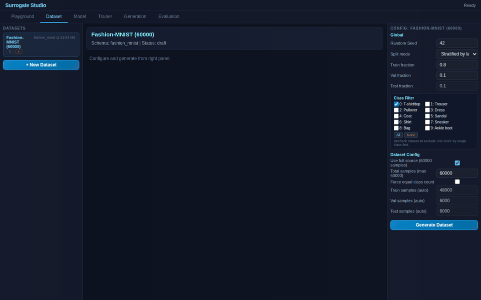

# Fashion-MNIST Diffusion — Surrogate Studio Demo




**Train a denoising model on Fashion-MNIST using diffusion-style noise injection.**

Uses the AddNoise building block to inject Gaussian noise during training. The model learns to denoise — then generation uses iterative Langevin dynamics to sample from the learned distribution.

## Architecture

### Denoising Autoencoder
```
ImageSource(784) → AddNoise(scale=0.3) → Dense(512, relu) → Dense(256, relu) → Dense(784) → Output(xv, MSE)
```

- **Training**: Clean image + noise → model predicts clean image
- **Generation**: Start from pure noise → iterative Langevin denoising → clean image

## Generation Methods

After training the denoiser:

1. **Reconstruct**: Pass noisy test images through denoiser → see denoising quality
2. **Langevin Dynamics**: Start from random noise → iterative updates using denoiser gradient → generates new images
3. **Classifier-Guided**: Combine denoiser with a trained classifier to guide generation toward a specific class (e.g., "generate sneakers")

## How to Use

1. Open `index.html`, generate Fashion-MNIST dataset
2. Train the Denoising Autoencoder (20 epochs)
3. **Generation tab**: select Langevin method → Generate → see denoised images
4. For classifier guidance: train the VAE+Classifier model in the VAE demo first

## Reference

Diffusion models based on:
> **Denoising Diffusion Probabilistic Models** — Ho, Jain, Abbeel, 2020
> [arXiv:2006.11239](https://arxiv.org/abs/2006.11239)

Score-based generation:
> **Generative Modeling by Estimating Gradients of the Data Distribution** — Song, Ermon, 2019
> [arXiv:1907.05600](https://arxiv.org/abs/1907.05600)
