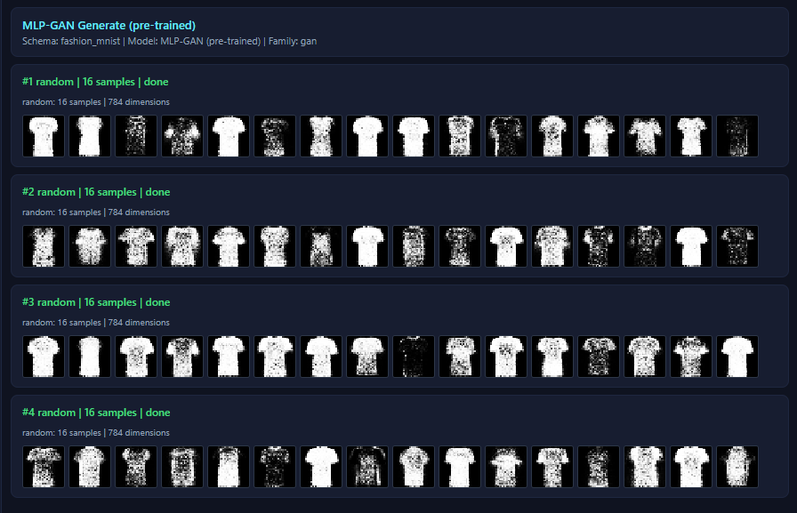
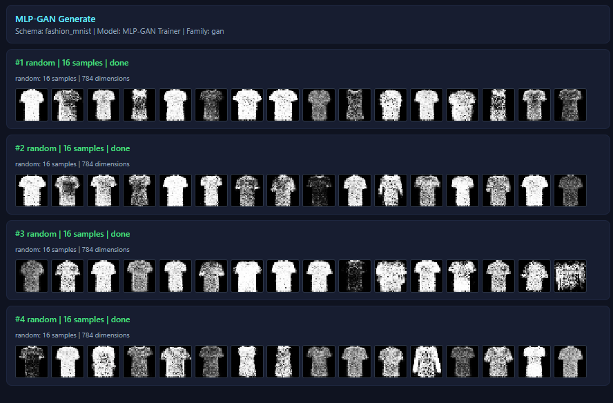
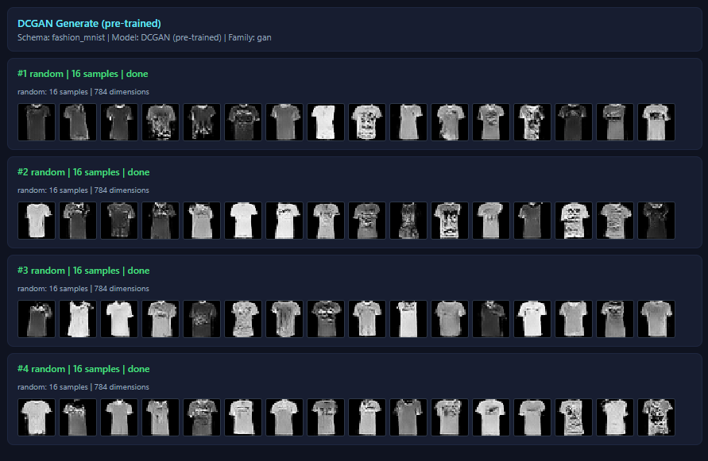
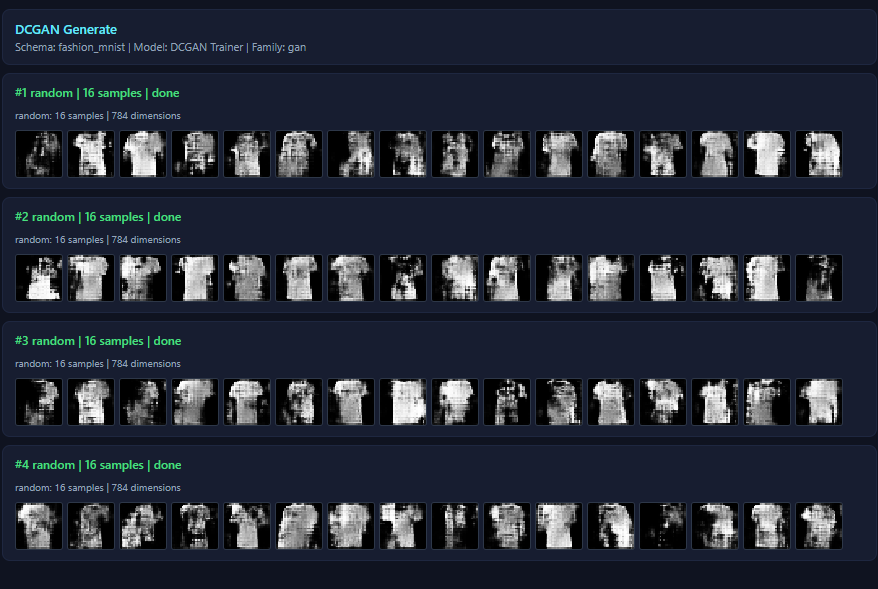
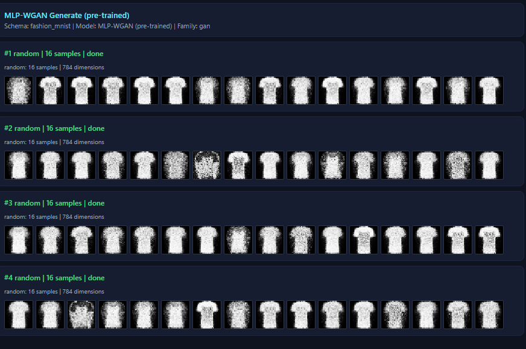
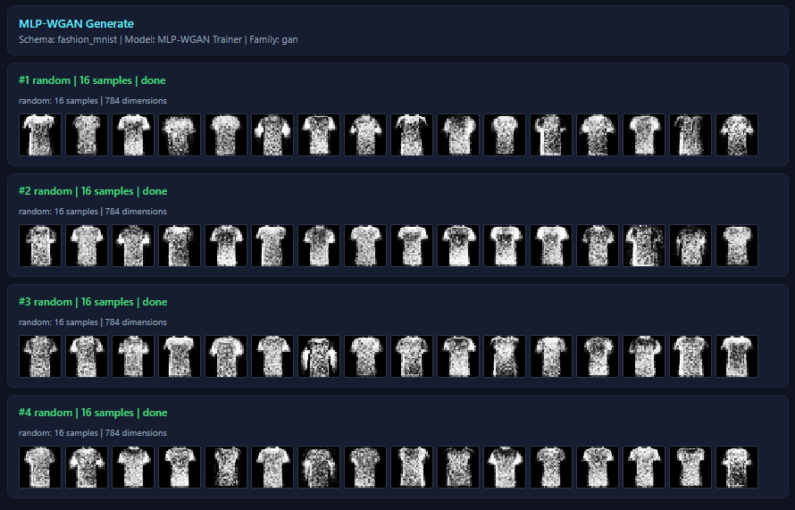

# Fashion-MNIST GAN — Real Adversarial Training

**Train a GAN with real adversarial structure — all defined in the visual graph editor.**

No hardcoded GAN logic in the engine. The graph defines the full adversarial architecture using composable building blocks: ConcatBatch (merge real+fake), PhaseSwitch (label routing by phase), Constant (label values), weight tags (freeze control).

## Generation Results

| | Client (TF.js WebGL) | Server (PyTorch CUDA) |
|:---:|:---:|:---:|
| **MLP-GAN** |  |  |
| **DCGAN** |  |  |
| **WGAN** |  |  |

All three architectures generate recognizable T-shirt images from random noise, trained on Fashion-MNIST class 0 (T-shirt/top, 6000 images). Pre-trained weights are included for all three models, so generation works immediately without retraining.

The demo intentionally includes two kinds of trainer cards:
- `MLP-GAN (pre-trained)`, `DCGAN (pre-trained)`, `MLP-WGAN (pre-trained)` — already have weights and are ready for Generation immediately
- `MLP-GAN Trainer`, `DCGAN Trainer`, `MLP-WGAN Trainer` — blank draft trainers for training from scratch on client or server

## Presets

### 1. MLP-GAN (Goodfellow 2014)

```
Generator:
  SampleZ(128) → Dense(256, relu) → LayerNorm → Dense(512, relu) → LayerNorm
    → Dense(784, sigmoid) → Output(loss=none)

Discriminator:
  ConcatBatch(fake + real) → Dense(512, relu) → Dropout(0.3)
    → Dense(256, relu) → Dropout(0.3) → Dense(1, sigmoid) → Output(loss=BCE)

Labels:
  Constant(0.1) → PhaseSwitch(activePhase=discriminator) ← Constant(0.9)
  ConcatBatch([fake_label, real_label=0.9]) → D Output
    D step: [0.1, 0.9]  — train D to distinguish
    G step: [0.9, 0.9]  — fool D into thinking fake is real
```

- Weight-tag freeze: G layers tagged `generator`, D layers tagged `discriminator`
- Training schedule: D:1 batch, G:1 batch (rotating)
- LR = 0.0005, Adam, batch size 128
- Pre-trained weights included (1000 epochs on T-shirt class)

### 2. DCGAN (Radford 2015)

```
Generator:
  SampleZ(128) → Dense(6272, linear, bias=false) → BatchNorm → ReLU → Reshape(7,7,128)
    → ConvT2D(64, 4, stride=2, same, linear, bias=false) → BatchNorm → ReLU
    → ConvT2D(1, 4, stride=2, same, sigmoid, bias=false) → Flatten → Output(loss=none)

Discriminator:
  ConcatBatch(fake + real) → Reshape(28,28,1)
    → Conv2D(64, 4, stride=2, same, linear) → LeakyReLU(0.2)
    → Conv2D(128, 4, stride=2, same, linear) → BatchNorm → LeakyReLU(0.2)
    → Flatten → Dense(1, sigmoid) → Output(loss=BCE)

Labels:
  Paper-style 0/1 targets via PhaseSwitch + ConcatBatch
    D step: [0, 1]
    G step: [1, 1]
```

- Training schedule: D:1 batch, G:1 batch (rotating)
- LR = 0.0002, Adam(beta1=0.5, beta2=0.999), batch size 128
- Note: DCGAN training is slow on browser WebGL; recommended to train on PyTorch server

### 3. MLP-WGAN (Arjovsky 2017)

```
Generator:
  Same as MLP-GAN (LayerNorm + Dense)

Critic (not "discriminator" — WGAN terminology):
  ConcatBatch(fake + real) → Dense(512, relu) → Dropout(0.3)
    → Dense(256, relu) → Dropout(0.3) → Dense(1, linear) → Output(loss=wasserstein)

Labels:
  Wasserstein uses +1 (real) and -1 (fake) instead of smoothed 0.1/0.9
  Constant(-1) → PhaseSwitch(activePhase=discriminator) ← Constant(1)
  ConcatBatch([fake_label, real_label=1]) → D Output
    D step: [-1, 1]  — maximize mean(D(real)) - mean(D(fake))
    G step: [1, 1]   — minimize -mean(D(fake))
```

- Key difference: D has **linear output** (no sigmoid) — computes Wasserstein distance
- LR = 0.00005, **RMSprop** (paper recommendation, not Adam), batch size 128
- Training schedule: D:5 batches, G:1 batch (critic trains more per the paper)

## Building Blocks Used

| Block | Purpose |
|---|---|
| **SampleZ** | Random noise input for generator |
| **ConcatBatch** | Merges real + fake images (and labels) into one batch for D |
| **PhaseSwitch** | Routes labels by training phase so fake targets change between D step and G step |
| **Constant** | Produces label tensors such as 0.1/0.9 for BCE GANs or -1/+1 for WGAN |
| **Weight tags** | `generator` / `discriminator` tags control which layers are frozen per phase |
| **LayerNorm** | Normalizes G activations (MLP-GAN) — prevents mode collapse |
| **BatchNorm** | Normalizes conv activations (DCGAN) — stabilizes deep conv training |
| **LeakyReLU** | D activation (DCGAN) — allows gradient flow for negative inputs |
| **Dropout** | D regularization (MLP-GAN) — prevents D from overpowering G |

## Training Phases

| Phase | What happens |
|---|---|
| **Discriminator** | D sees real images plus G output with discriminator-phase targets. G weights frozen via tag. |
| **Generator** | PhaseSwitch flips fake targets for the generator phase. D weights frozen while gradient still flows through D to update G. |

## How to Use

1. Open `index.html` in a browser (Chrome/Edge recommended)
2. Generate Fashion-MNIST dataset (T-shirt class, 6000 images)
3. **Immediate generation**: In the Generation tab, select `MLP-GAN Generate (pre-trained)`, `DCGAN Generate (pre-trained)`, or `MLP-WGAN Generate (pre-trained)` and click `Generate`
4. **Train from scratch**: In the Trainer tab, select `MLP-GAN Trainer`, `DCGAN Trainer`, or `MLP-WGAN Trainer` and click `Start Training`
5. **Use your own weights**: After training finishes, or after a graceful `Stop` saves weights, go back to the matching non-pretrained generation card and generate from that trainer
6. **Run benchmark evaluation**: In the Evaluation tab, use `Generative Quality (pre-trained)` to compare pre-trained GAN checkpoints against the best available dataset reference split (`test`, then `val`, then `train`) with standard set metrics such as `MMD`, `NN precision/coverage`, and diversity gaps
7. **Interpret the cards**: cards without `(pre-trained)` are intentionally blank starting points; cards with `(pre-trained)` are ready-to-run demo checkpoints

## References

1. Goodfellow, Pouget-Abadie, Mirza, Xu, Warde-Farley, Ozair, Courville, Bengio. **"Generative Adversarial Nets."** *NeurIPS 2014*. [arXiv:1406.2661](https://arxiv.org/abs/1406.2661)

2. Radford, Metz, Chintala. **"Unsupervised Representation Learning with Deep Convolutional Generative Adversarial Networks."** *ICLR 2016*. [arXiv:1511.06434](https://arxiv.org/abs/1511.06434)

3. Arjovsky, Chintala, Bottou. **"Wasserstein Generative Adversarial Networks."** *ICML 2017*. [arXiv:1701.07875](https://arxiv.org/abs/1701.07875)
