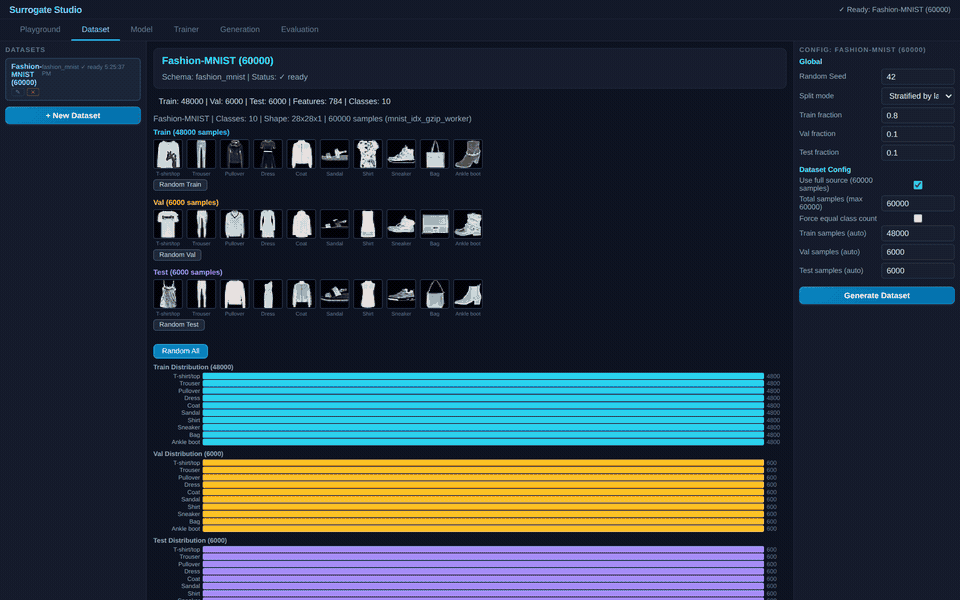

# Fashion-MNIST GAN — Real Adversarial Training




**Train a GAN with real adversarial structure — all defined in the visual graph editor.**

No hardcoded GAN logic. The graph itself defines the adversarial architecture using composable building blocks: Detach (gradient stop), ConcatBatch (merge real+fake), PhaseSwitch (label routing by phase).

## Architecture

```
Generator:     SampleZ(128) → Dense(256) → Dense(512) → Dense(784,σ) → Output(recon)
                                                                              ↓
                                                                           Detach
                                                                              ↓
Discriminator: ImageSource(784) ───────────────────────────→ ConcatBatch(real+fake)
                                                                              ↓
                                                              Dense(512) → Dense(256) → Dense(1,σ)
                                                                              ↓
Labels:        Constant(1) ──→ PhaseSwitch ───────────────→ Output(BCE, discriminator)
               Constant(0) ──→
```

## Training Phases

| Phase | What happens |
|---|---|
| **Discriminator** | D sees real images (label=1) + G output through Detach (label=0). G frozen. |
| **Generator** | PhaseSwitch flips labels to 1. G trains to fool D. D weights included in gradient. |

## Building Blocks Used

| Block | Purpose |
|---|---|
| **SampleZ** | Random noise input for generator |
| **Detach** | Stops gradient — D doesn't update G during D phase |
| **ConcatBatch** | Merges real + fake images into one batch for D |
| **PhaseSwitch** | Routes labels: phase 0 → real/fake labels, phase 1 → all-real (fool D) |
| **Constant** | Produces label tensors (1.0 = real, 0.0 = fake) |

## Reference

> **Generative Adversarial Nets** — Goodfellow et al., NeurIPS 2014. [arXiv:1406.2661](https://arxiv.org/abs/1406.2661)
