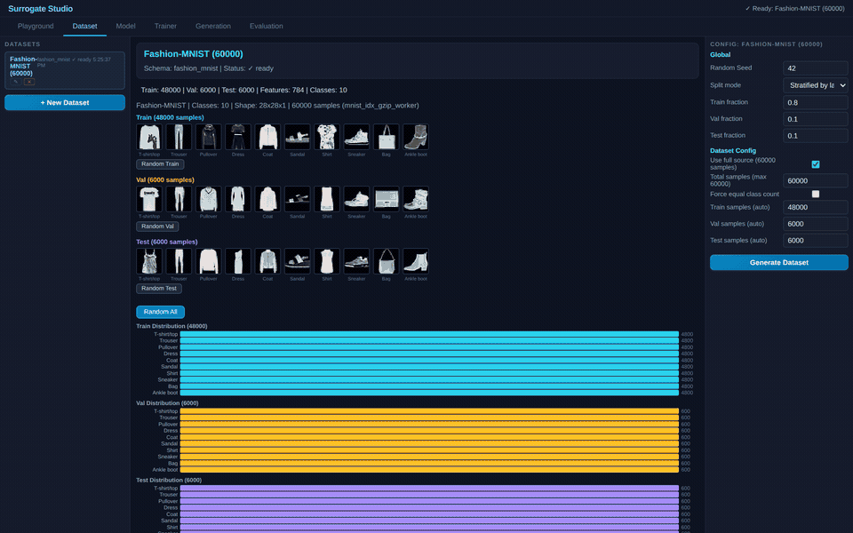
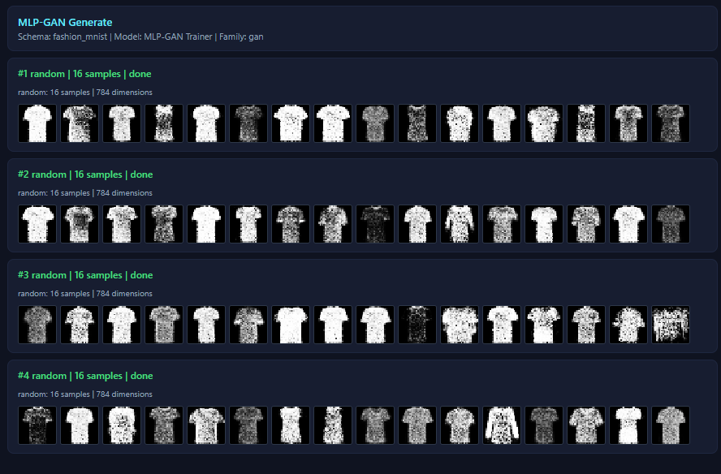
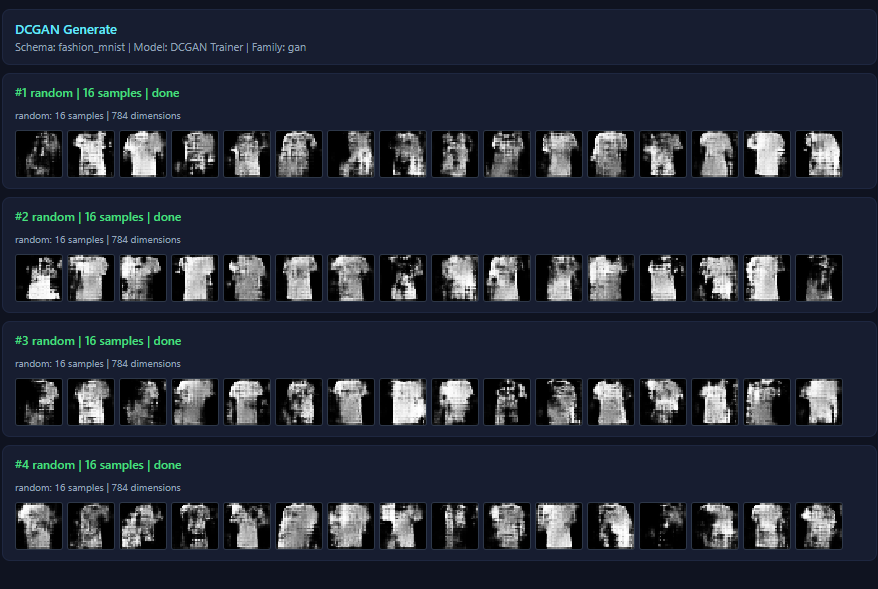
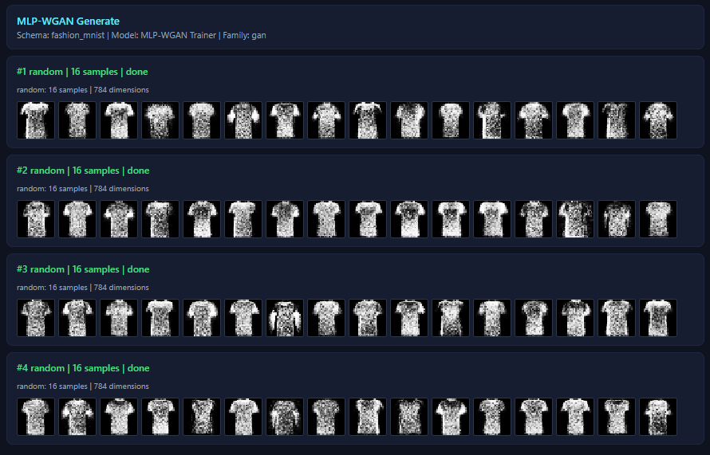
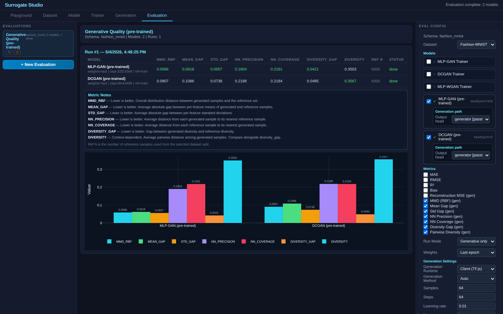

# Fashion-MNIST GAN — Real Adversarial Training



**Train a GAN with real adversarial structure — all defined in the visual graph editor.**

No hardcoded GAN logic in the engine. The graph defines the full adversarial architecture using composable building blocks: ConcatBatch (merge real+fake), PhaseSwitch (label routing by phase), Constant (label values), weight tags (freeze control).

## Generation Results

| | Client (TF.js WebGL) | Server (PyTorch CUDA) |
|:---:|:---:|:---:|
| **MLP-GAN** |  |  |
| **DCGAN** |  |  |
| **WGAN** |  |  |

Three architectures (MLP-GAN, DCGAN, MLP-WGAN) generate Fashion-MNIST T-shirts from random noise, trained on class 0 (T-shirt/top, 6000 images). All three ship as pre-trained cards so generation and side-by-side benchmarking work immediately.

### Generative Quality (in-app evaluation)

Run via the Evaluation tab using the `Generative Quality` recipe — samples 75 generations per pretrained model and compares against the held-out reference T-shirt set with set-level distribution metrics. The eval is wired for all three pretrained checkpoints (`trainerIds: [t-mlp-gan-trained, t-dcgan-trained, t-mlp-wgan-trained]`).



| Model | MMD ↓ | Mean Gap ↓ | Std Gap ↓ | NN Precision ↑ | NN Coverage ↑ | Diversity Gap ↓ | Diversity ↑ |
|---|---|---|---|---|---|---|---|
| MLP-GAN | 0.0586 | 0.0618 | 0.0557 | 0.1904 | 0.2181 | 0.0421 | 0.3503 |
| DCGAN | 0.0546 | 0.0776 | 0.0809 | **0.2575** | **0.2295** | 0.0493 | **0.3575** |
| **MLP-WGAN** | **0.0157** | **0.0325** | **0.0295** | 0.1620 | 0.1843 | **6.97e-3** | 0.3152 |

(Eval recipe: `Generative Quality (pre-trained)` against the 6000-image T-shirt training reference. Generation is stochastic — re-running the recipe produces metric values within ~run-to-run noise of these.)

**The headline split is non-obvious.** MLP-WGAN wins on the *distribution-matching* metrics — MMD (0.0157, 3-4× tighter than the BCE GANs) and the mean/std/diversity gaps — but DCGAN wins on *individual-sample quality* (highest NN Precision = 0.2575) and *coverage* (highest NN Coverage = 0.2295, plus the highest absolute Diversity). MLP-GAN sits in the middle.

This is the classic Wasserstein-vs-BCE-GAN tradeoff playing out cleanly:

- **MLP-WGAN's Wasserstein objective directly minimizes a transport distance** between generator and reference distributions, so the bulk of the generated sample mass lines up with the data manifold mass — giving low MMD/gaps. But the clipped critic produces blurrier per-sample outputs, hence lower NN Precision.
- **DCGAN's convolutional inductive bias** gives the sharpest individual samples (translation equivariance, local feature composition) and the highest coverage of the data distribution — but its BCE saturation can let the generator concentrate on a subset of modes, so MMD trails MLP-WGAN.
- **MLP-GAN** has neither inductive bias and lands in between.

The educational point is **all three architectures train and generate correctly through the same graph editor**, and the metric divergence is exactly what theory predicts from the training objective and architecture combination.

The demo intentionally includes two kinds of trainer cards per architecture:
- `MLP-GAN (pre-trained)`, `DCGAN (pre-trained)`, `MLP-WGAN (pre-trained)` — already have weights and are ready for Generation immediately
- `MLP-GAN Trainer`, `DCGAN Trainer`, `MLP-WGAN Trainer` — blank draft trainers for training from scratch on client or server

### MLP-WGAN training notes

WGAN with the Arjovsky-faithful `clipWeights: 0.01` is volatile — earlier loose clipping (`0.1`) without seed control would land each training run in a different basin (some clean shirt outputs, others noisy textures). The shipped pretrained card was retrained with the paper-faithful clip + 2000 epochs + `seed=42` and converged to a clean basin (final D=-0.010, G=-0.174). To reproduce or compare:

1. Use the `MLP-WGAN Trainer` card on PyTorch CUDA (~10 min)
2. Standard config: 2000 epochs, batchSize 128, RMSprop @ 5e-5, D:5/G:1 schedule, `clipWeights: 0.01`, `seed: 42`
3. Compare against the shipped pretrained generation in the Generation tab

## Presets

### 1. MLP-GAN (Goodfellow 2014)

```
Generator:
  SampleZ(128) → Dense(256, relu) → LayerNorm → Dense(512, relu) → LayerNorm
    → Dense(784, sigmoid) → Output(loss=none)

Discriminator:
  ConcatBatch(fake + real) → Dense(512, relu) → Dropout(0.3)
    → Dense(256, relu) → Dropout(0.3) → Dense(1, sigmoid) → Output(loss=BCE)

Labels:
  Constant(0.1) → PhaseSwitch(activePhase=discriminator) ← Constant(0.9)
  ConcatBatch([fake_label, real_label=0.9]) → D Output
    D step: [0.1, 0.9]  — train D to distinguish
    G step: [0.9, 0.9]  — fool D into thinking fake is real
```

- Weight-tag freeze: G layers tagged `generator`, D layers tagged `discriminator`
- Training schedule: D:1 batch, G:1 batch (rotating)
- LR = 0.0005, Adam, batch size 128
- Pre-trained weights included (1000 epochs on T-shirt class)

### 2. DCGAN (Radford 2016)

```
Generator:
  SampleZ(128) → Dense(6272, linear, bias=false) → BatchNorm → ReLU → Reshape(7,7,128)
    → ConvT2D(64, 4, stride=2, same, linear, bias=false) → BatchNorm → ReLU
    → ConvT2D(1, 4, stride=2, same, sigmoid, bias=false) → Flatten → Output(loss=none)

Discriminator:
  ConcatBatch(fake + real) → Reshape(28,28,1)
    → Conv2D(64, 4, stride=2, same, linear) → LeakyReLU(0.2)
    → Conv2D(128, 4, stride=2, same, linear) → BatchNorm → LeakyReLU(0.2)
    → Flatten → Dense(1, sigmoid) → Output(loss=BCE)

Labels:
  Paper-style 0/1 targets via PhaseSwitch + ConcatBatch
    D step: [0, 1]
    G step: [1, 1]
```

- Training schedule: D:1 batch, G:1 batch (rotating)
- LR = 0.0002, Adam(beta1=0.5, beta2=0.999), batch size 128
- Note: DCGAN training is slow on browser WebGL; recommended to train on PyTorch server

### 3. MLP-WGAN (Arjovsky 2017)

```
Generator:
  Same as MLP-GAN (LayerNorm + Dense)

Critic (not "discriminator" — WGAN terminology):
  ConcatBatch(fake + real) → Dense(512, relu) → Dropout(0.3)
    → Dense(256, relu) → Dropout(0.3) → Dense(1, linear) → Output(loss=wasserstein)

Labels:
  Wasserstein uses +1 (real) and -1 (fake) instead of smoothed 0.1/0.9
  Constant(-1) → PhaseSwitch(activePhase=discriminator) ← Constant(1)
  ConcatBatch([fake_label, real_label=1]) → D Output
    D step: [-1, 1]  — maximize mean(D(real)) - mean(D(fake))
    G step: [1, 1]   — minimize -mean(D(fake))
```

- Key difference: D has **linear output** (no sigmoid) — computes Wasserstein distance
- LR = 0.00005, **RMSprop** (paper recommendation, not Adam), batch size 128
- Training schedule: D:5 batches, G:1 batch (critic trains more per the paper)

## Building Blocks Used

| Block | Purpose |
|---|---|
| **SampleZ** | Random noise input for generator |
| **ConcatBatch** | Merges real + fake images (and labels) into one batch for D |
| **PhaseSwitch** | Routes labels by training phase so fake targets change between D step and G step |
| **Constant** | Produces label tensors such as 0.1/0.9 for BCE GANs or -1/+1 for WGAN |
| **Weight tags** | `generator` / `discriminator` tags control which layers are frozen per phase |
| **LayerNorm** | Normalizes G activations (MLP-GAN) — prevents mode collapse |
| **BatchNorm** | Normalizes conv activations (DCGAN) — stabilizes deep conv training |
| **LeakyReLU** | D activation (DCGAN) — allows gradient flow for negative inputs |
| **Dropout** | D regularization (MLP-GAN) — prevents D from overpowering G |

## Training Phases

| Phase | What happens |
|---|---|
| **Discriminator** | D sees real images plus G output with discriminator-phase targets. G weights frozen via tag. |
| **Generator** | PhaseSwitch flips fake targets for the generator phase. D weights frozen while gradient still flows through D to update G. |

## How to Use

1. Open `index.html` in a browser (Chrome/Edge recommended)
2. Generate Fashion-MNIST dataset (T-shirt class, 6000 images)
3. **Immediate generation**: In the Generation tab, select `MLP-GAN Generate (pre-trained)`, `DCGAN Generate (pre-trained)`, or `MLP-WGAN Generate (pre-trained)` and click `Generate`.
4. **Train from scratch**: In the Trainer tab, select `MLP-GAN Trainer`, `DCGAN Trainer`, or `MLP-WGAN Trainer` and click `Start Training`
5. **Use your own weights**: After training finishes, or after a graceful `Stop` saves weights, go back to the matching non-pretrained generation card and generate from that trainer
6. **Run benchmark evaluation**: In the Evaluation tab, use `Generative Quality (pre-trained)` to compare pre-trained GAN checkpoints against the best available dataset reference split (`test`, then `val`, then `train`) with standard set metrics such as `MMD`, `NN precision/coverage`, and diversity gaps
7. **Interpret the cards**: cards without `(pre-trained)` are intentionally blank starting points; cards with `(pre-trained)` are ready-to-run demo checkpoints

## References

- Goodfellow, I., Pouget-Abadie, J., Mirza, M., Xu, B., Warde-Farley, D., Ozair, S., Courville, A., & Bengio, Y. **"Generative Adversarial Nets."** *NeurIPS 2014.* [arXiv:1406.2661](https://arxiv.org/abs/1406.2661)
- Radford, A., Metz, L., & Chintala, S. **"Unsupervised Representation Learning with Deep Convolutional Generative Adversarial Networks."** *ICLR 2016.* [arXiv:1511.06434](https://arxiv.org/abs/1511.06434)
- Arjovsky, M., Chintala, S., & Bottou, L. **"Wasserstein Generative Adversarial Networks."** *ICML 2017.* [arXiv:1701.07875](https://arxiv.org/abs/1701.07875)
