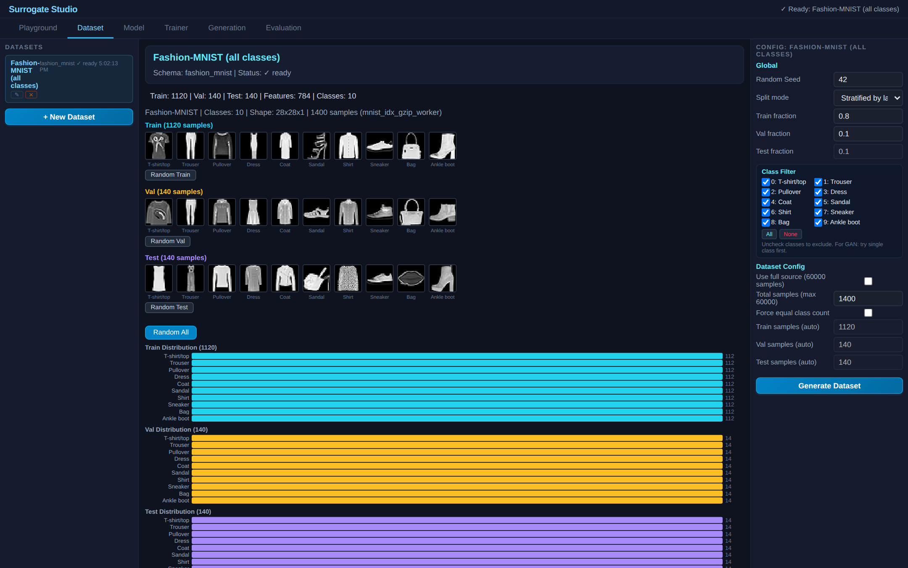
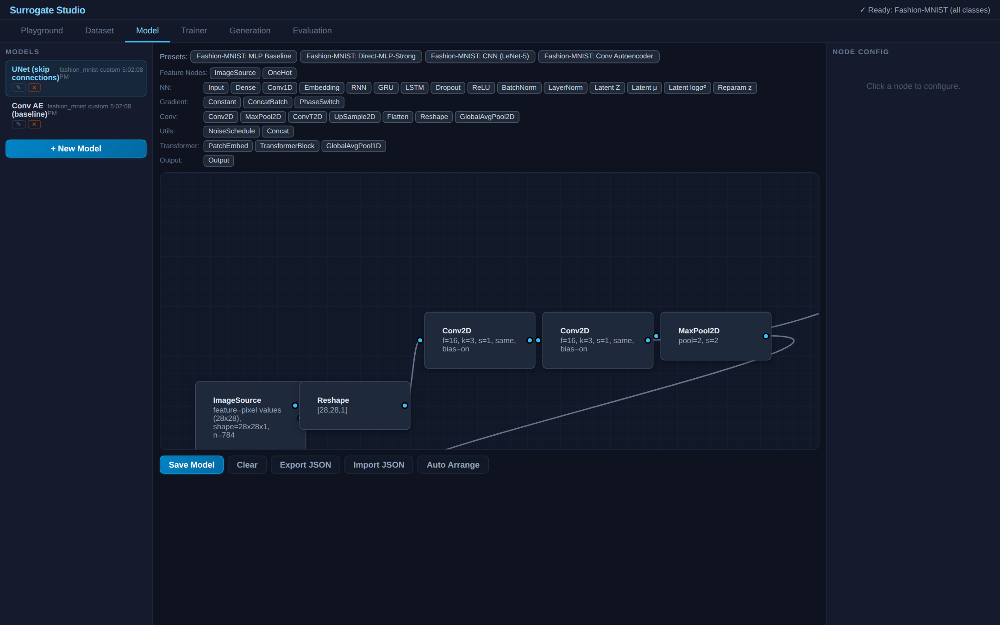
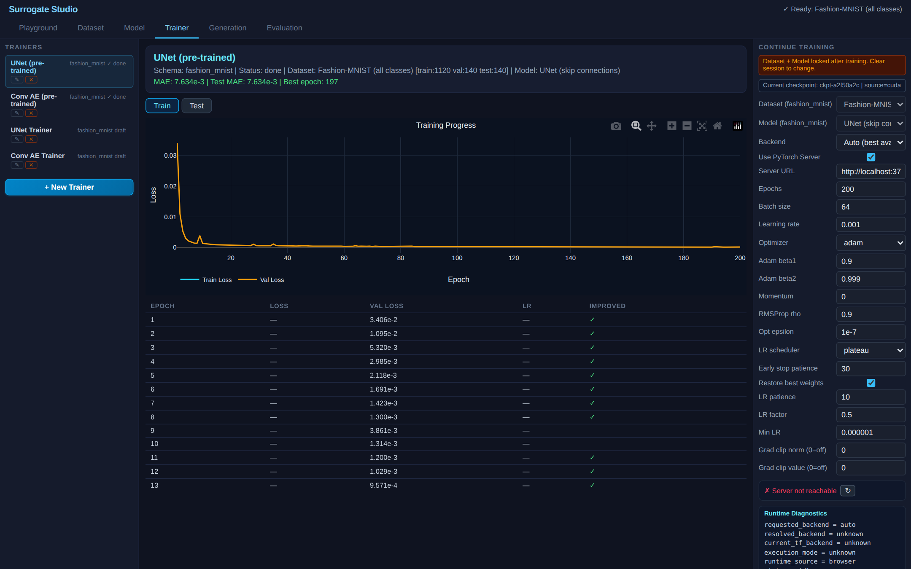

# Fashion-MNIST UNet — Skip Connection Architecture



UNet-style encoder-decoder with skip connections for image reconstruction on Fashion-MNIST. Demonstrates that the visual graph editor supports **branching topologies** — skip connections are standard Concat nodes wired across the encoder-decoder boundary.

| Dataset | Model Graph | Trainer |
|:---:|:---:|:---:|
|  |  |  |

## What This Demo Shows

- **Skip connections as graph wiring**: no special UNet node — just Conv2D, MaxPool2D, UpSample2D, and Concat composed in the graph editor
- **Spatial concat**: Concat node preserves 4D tensor layout (channel-axis concatenation) instead of flattening
- **Comparison**: encoder-decoder with skip connections vs without (plain Conv AE)
- **Same training engine**: no architecture-specific training code — the graph defines everything

## Architecture

This is a **UNet-style** architecture — same structural pattern as the original (encoder + skip connections + decoder) — adapted for image reconstruction instead of segmentation.

### Comparison with Original UNet

| Aspect | Ronneberger et al. 2015 | This Demo |
|--------|------------------------|-----------|
| **Task** | Biomedical image segmentation | Image reconstruction (autoencoder) |
| **Input** | 572x572 microscopy images | 28x28 Fashion-MNIST |
| **Encoder depth** | 4 levels (64-128-256-512-1024) | 2 levels (16-32-64) |
| **Skip connections** | Crop + concatenate | Concatenate (same padding) |
| **Upsampling** | Learned 2x2 up-convolution | Nearest-neighbor UpSample2D |
| **Output** | Per-pixel class probabilities (softmax) | Reconstructed image (sigmoid) |
| **Parameters** | ~31M | ~116K |

The core contribution of the UNet paper — **skip connections that pass spatial detail from encoder to decoder** — is what this demo implements and validates.

## Models

### 1. UNet-style (with skip connections)
```
ImageSource -> Reshape(28,28,1)
  -> Conv(16)x2 -> [skip1] -> MaxPool
  -> Conv(32)x2 -> [skip2] -> MaxPool
  -> Conv(64)x2                           <- bottleneck
  -> UpSample -> Concat(skip2) -> Conv(32)x2
  -> UpSample -> Concat(skip1) -> Conv(16) -> Conv(1,sigmoid)
  -> Flatten -> Output
```
115,665 parameters.

### 2. Conv Autoencoder (baseline, no skip connections)
```
ImageSource -> Reshape(28,28,1)
  -> Conv(16) -> MaxPool -> Conv(32) -> MaxPool
  -> UpSample -> Conv(16) -> UpSample -> Conv(1,sigmoid)
  -> Flatten -> Output
```
9,441 parameters. Same encoder-decoder structure without skip connections.

## Results

Trained on Fashion-MNIST, 200 epochs, PyTorch CUDA:

| Model | Params | Test MAE | Best Epoch |
|-------|:------:|:--------:|:----------:|
| **UNet-style** | 115,665 | **0.0076** | 197 |
| Conv AE (baseline) | 9,441 | 0.027 | 200 |

Skip connections give 3.5x lower reconstruction error.

## Why the UNet Reconstructions Look Identical to Inputs

Reconstruction MAE of 0.0076 means the output is essentially pixel-perfect. That's the point of skip connections — they pass spatial detail directly from encoder to decoder so the bottleneck doesn't have to "remember" pixel positions. The decoder doesn't need to compress and decompress an image; it can route low-level features through skips and let the bottleneck handle abstraction. Net result: a near-identity function on the input distribution.

The Conv AE comparison shows what happens **without** that shortcut: information bottlenecks through `[7×7×32]` and reconstruction is visibly blurrier (sneakers smooth out, edges soften). Same training, 12× fewer parameters, no skips — just a narrower information channel.

## Reconstruction vs Generation, and the Latent-Space Tradeoff

This demo is a **reconstruction** baseline, not a generative model. Both UNet and Conv AE map *real input → reconstructed output*. They cannot generate new shirts from random noise — feeding random latent values to either decoder produces garbage. To actually sample new images you need a **VAE** (with KL regularization on the latent) or a **GAN** (adversarial generator), both shown in other demos.

Why? It's the classic autoencoder tradeoff:

| Bottleneck size | Reconstruction quality | Latent space usefulness |
|---|---|---|
| Small zdim (forced compression) | Blurry — info has been thrown away | Meaningful — encoder must keep abstract features (shape, class), nearby points decode to similar concepts |
| Large zdim (no compression pressure) | Sharp — encoder can copy pixel info through latent | Useless — latent becomes a lookup table, interpolation between two points produces ghost-overlay artifacts, not "in-between" images |
| Skip connections (UNet) | Near-perfect | None — bottleneck is bypassed entirely, no useful latent encoded |

Compression is what *forces* an encoder to learn abstraction — without that pressure, the network just memorizes. UNet's skip connections remove the pressure on purpose, which is why it's a great reconstruction model but a bad generative one.

The fix is **VAEs** — they keep zdim large enough for sharp reconstruction but add a KL divergence penalty that forces the latent distribution to look like a standard Gaussian. That regularizer keeps the latent space meaningful (samplable, interpolable) even when the network has plenty of reconstruction capacity. See the Fashion-MNIST-Benchmark demo for the VAE side-by-side comparison.

## How to Use

1. **Dataset** tab — click Generate Dataset to fetch Fashion-MNIST from CDN
2. **Model** tab — inspect the graph: Concat nodes merge encoder features with decoder features
3. **Trainer** tab — pre-trained weights included, or train from scratch via PyTorch server
4. **Generation** tab — compare reconstructions (requires dataset loaded first)
5. **Evaluation** tab — benchmark reconstruction quality side by side

## References

Ronneberger, O., Fischer, P., & Brox, T. **"U-Net: Convolutional Networks for Biomedical Image Segmentation."** *MICCAI 2015.* [arXiv:1505.04597](https://arxiv.org/abs/1505.04597)

This demo adapts the UNet architecture (encoder + skip connections + decoder) for reconstruction rather than segmentation, to demonstrate skip connection support within the graph editor.
