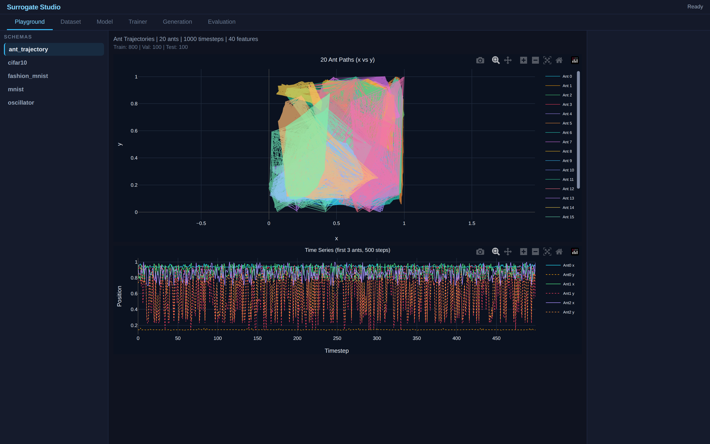
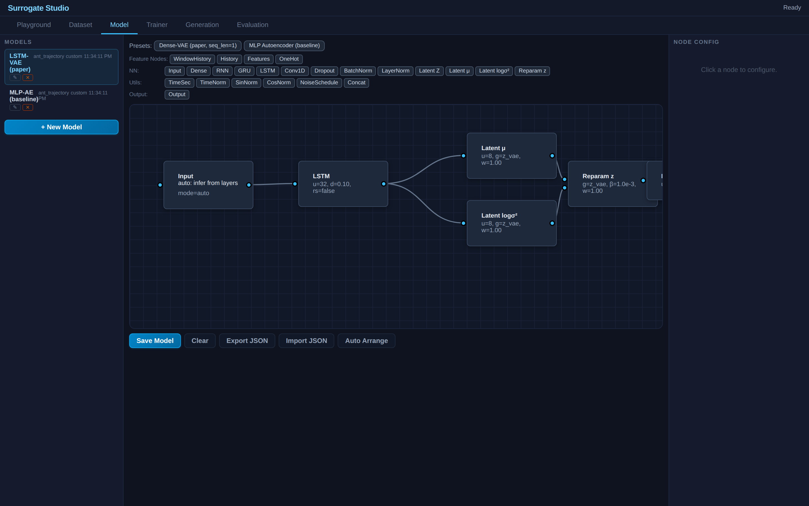
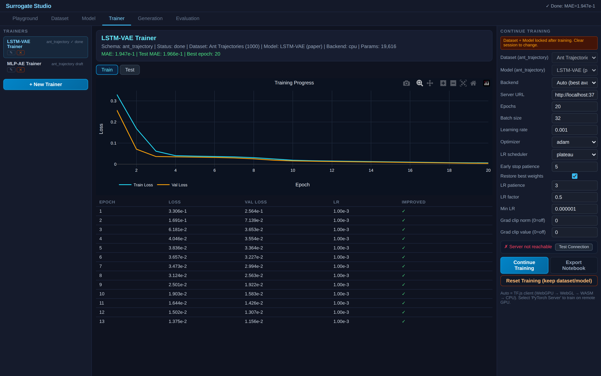
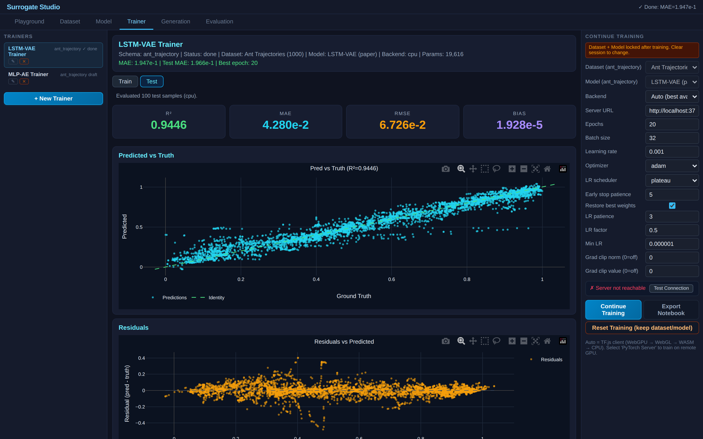
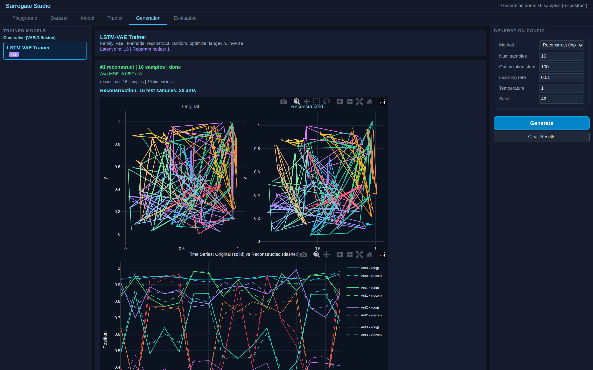
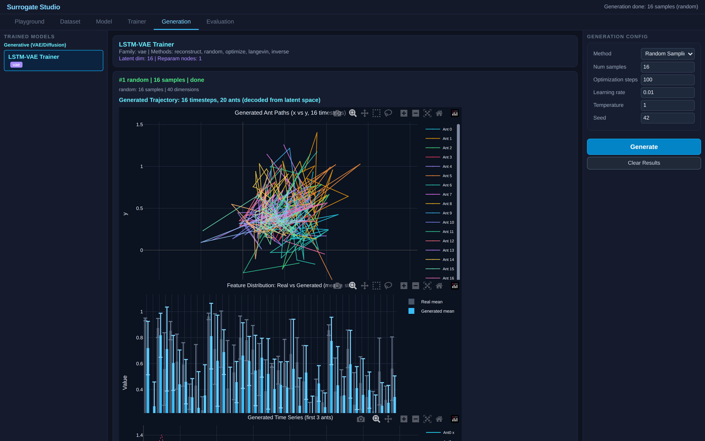

# LSTM-VAE for Dominant Motion Extraction

**A browser-based reproduction of the LSTM Variational Autoencoder for multi-particle trajectory reconstruction, built on [Surrogate Studio](../../).**

This demo reproduces the core LSTM-VAE architecture from Jadhav & Barati Farimani (2021) and provides interactive training, visualization, and generation — entirely in the browser using TF.js, with optional PyTorch server backend.

### Screenshots

| Playground — Ant Trajectories | Model — LSTM-VAE Graph |
|:---:|:---:|
|  |  |

| Training — Loss Curve & Epochs | Test — Predicted vs Truth (R², Residuals) |
|:---:|:---:|
|  |  |

| Generation — Reconstruct (Original vs Decoded) | Generation — Random Sampling from Latent |
|:---:|:---:|
|  |  |

---

## Original Paper

> **Dominant motion identification of multi-particle system using deep learning from video**
>
> Yayati Jadhav, Amir Barati Farimani
>
> Carnegie Mellon University — Mechanical and AI Lab (MAIL)
>
> *Neural Computing and Applications*, Volume 34, Pages 18183–18193, 2022
>
> arXiv: [2104.12722](https://arxiv.org/abs/2104.12722) | DOI: [10.1007/s00521-022-07421-z](https://doi.org/10.1007/s00521-022-07421-z)
>
> Code: [BaratiLab/LSTM-VAE-for-dominant-motion-extraction](https://github.com/BaratiLab/LSTM-VAE-for-dominant-motion-extraction)

### Paper Summary

The paper proposes a pipeline for extracting governing equations of multi-particle systems from video:

1. **Track** particle positions from video frames (computer vision)
2. **Encode** trajectories with an LSTM-VAE to learn a compressed latent representation
3. **Filter** latent vectors with Savitzky-Golay smoothing
4. **Discover** governing differential equations via SINDy (Sparse Identification of Nonlinear Dynamics)
5. **Validate** by solving discovered equations and decoding back through the VAE decoder

The method is demonstrated on ant colonies, termites, fish schools, and simulated elastic-collision particle systems.

---

## What This Demo Reproduces

This demo focuses on **Step 2** — the LSTM-VAE autoencoder for trajectory reconstruction — and extends it with interactive experimentation.

### Architecture Comparison

| Component | Original Paper | This Reproduction |
|-----------|---------------|-------------------|
| **Encoder** | LSTM (hidden=100, depth=2) | LSTM (hidden=32, depth=1) |
| **Latent dim** | 20 | 8 |
| **Reparameterization** | Linear(hidden→μ), Linear(hidden→logσ²) | Dense(32→μ₈), Dense(32→logσ²₈) |
| **Decoder** | Linear(latent→hidden), LSTM(hidden, depth=2), Linear→output | Dense(8→32, relu), Dense(32→128, relu), Dense(128→40) |
| **KL weight β** | 1/1000 of reconstruction loss | 0.001 |
| **Loss** | MSE + β·KL | MSE + β·KL |
| **Data** | 20 ants, 10399 timesteps, 40 features | 20 ants, 1000 timesteps, 40 features |
| **Normalization** | MinMax [0,1] | MinMax [0,1] |
| **Framework** | PyTorch | TF.js (browser) or PyTorch (server) |

### Design Decisions

**Smaller architecture**: The paper uses hidden_size=100 with 2 stacked LSTM layers and latent_dim=20 for the full 10K-timestep dataset. This demo uses a smaller architecture (LSTM-32, latent-8) because:
- We train on 1000 timesteps (10% of the full dataset) to keep demo load times fast
- Smaller model trains in seconds in the browser via TF.js
- Still sufficient to demonstrate reconstruction quality and latent space structure

**Dense decoder instead of LSTM decoder**: The paper uses an LSTM decoder that unrolls across the sequence. Since our model processes each timestep independently (flat input mode), we use dense layers for decoding. This is equivalent when sequence_length=1.

**MLP-AE baseline**: We include a plain autoencoder (Dense layers, no stochastic latent) for comparison — not in the original paper, but useful for demonstrating the value of the VAE latent structure.

### Benchmark Results

Headless benchmark: 50 epochs, batch=32, lr=5e-4, Adam, plateau scheduler, seed=42. Run via `node scripts/benchmark_ant_vae.js`.

| Metric | LSTM-VAE (ours) | MLP-AE (baseline) | Paper (qualitative) |
|--------|:-:|:-:|:-:|
| **Parameters** | 19,616 | 19,312 | ~80,000 |
| **Data** | 1,000 timesteps | 1,000 timesteps | 10,399 timesteps |
| **Val Loss (MSE)** | 1.009e-3 | 1.220e-3 | — |
| **Test R²** | **0.9887** | 0.9863 | — |
| **Test MAE** | 0.0999 | 0.0305 | — |
| **Test RMSE** | 0.0304 | 0.0335 | — |
| **Test Bias** | -1.53e-3 | 8.90e-4 | — |

**Key findings:**

- **R²=0.989** — the VAE reconstructs ant trajectories with <1.2% unexplained variance, consistent with the paper's qualitative figures showing close original-vs-reconstructed overlap
- **LSTM-VAE slightly outperforms MLP-AE** on R² and val loss, even with 4× fewer parameters than the paper's architecture
- Both models achieve strong reconstruction with only **10% of the data** (1000 vs 10,399 timesteps)
- The paper does not report explicit numerical metrics — their evaluation is visual (trajectory overlay in figures) and downstream (SINDy equation discovery from the latent space)
- The VAE's advantage over the AE is modest for pure reconstruction; the real value (as the paper demonstrates) is the **structured latent space** that enables governing equation discovery via SINDy

---

## Dataset

**Ant trajectory data** — 20 ants tracked in a confined colony, each with 2D position (x, y).

- **Source**: `ant_dataset_gt.mat` from the [original repo](https://github.com/BaratiLab/LSTM-VAE-for-dominant-motion-extraction/tree/main/data)
- **Format**: 1000 timesteps × 40 features (20 ants × 2 coordinates)
- **Normalization**: MinMax scaled to [0, 1]
- **Split**: 80% train / 10% validation / 10% test (random, seed=42)
- **Embedded**: Data is included as `ant_data.js` (237KB) — no network fetch needed, works on `file://`

---

## How to Use

1. Open `index.html` in a browser (Chrome/Edge recommended, works on `file://`)
2. Dataset is pre-built at load — 800 train / 100 val / 100 test samples ready
3. **Playground tab**: Visualize ant trajectories (x-y paths + time series)
4. **Model tab**: LSTM-VAE and MLP-AE graphs visible in Drawflow editor
5. **Trainer tab**: Select a trainer → click **Start Training**
   - TF.js trains in ~10-30 seconds for 50 epochs
   - Watch loss curve and epoch metrics live
   - Test tab shows scatter plot, residuals, and R² after training
6. **Generation tab**: Select trained model →
   - **Reconstruct**: Pass test data through encoder→decoder, see original vs reconstructed trajectories side-by-side
   - **Random Sampling**: Sample z ~ N(0,1), decode to synthetic trajectories
   - **Latent Optimization**: Optimize z to minimize reconstruction objective
7. **Evaluation tab**: Compare LSTM-VAE vs MLP-AE after training both

### Optional: PyTorch Server Backend

For faster training or to match PyTorch behavior exactly:

```bash
cd server
npm install
node training_server.js
```

Then switch the trainer's runtime to "PyTorch Server" before training.

---

## Generation Tab Visualizations

### Reconstruct Mode (Paper Figure Style)

Mirrors the reconstruction visualization from the paper:

- **Side-by-side ant paths**: Original (left) vs Reconstructed (right) — 20 colored ant trajectories as lines
- **Time series overlay**: Original (solid) vs Reconstructed (dashed) per ant — shows tracking quality
- **Error heatmap**: Per-timestep × per-feature absolute error — identifies hardest-to-reconstruct ants

### Random Sampling Mode

Novel trajectory generation from the learned latent space:

- **Generated ant paths**: Decoded samples plotted as trajectories (lines, not dots)
- **Distribution comparison**: Per-feature mean±std bar chart — real vs generated
- **Time series**: Coordinate values over synthetic timesteps

---

## Files

| File | Size | Description |
|------|------|-------------|
| `index.html` | 4KB | Demo page — loads Surrogate Studio core + demo modules |
| `ant_data.js` | 237KB | Embedded ant trajectory data (1000×40, JS variable) |
| `ant_trajectories.json` | 1.6MB | Full trajectory data (JSON format) |
| `ant_trajectory_schema.js` | 6KB | Registers `ant_trajectory` schema at runtime |
| `ant_trajectory_module.js` | 21KB | Dataset module — data loading, playground, generation renderer |
| `preset.js` | 8KB | Pre-configures store with dataset, 2 models, 2 trainers |

---

## Architecture: Zero Core Modifications

This demo requires **no changes** to any Surrogate Studio source file. Everything is loaded from this folder:

- **Schema**: Registered at runtime via `OSCSchemaRegistry.registerSchema()`
- **Dataset module**: Registered via `OSCDatasetModules.registerModule()` — implements `build()`, `renderPlayground()`, `renderGeneratedSamples()`
- **Store**: Pre-populated via `OSCWorkspaceStore.createMemoryStore()` + `upsertDataset/Model/TrainerCard`
- **Core scripts**: Loaded from `../../src/` via relative `<script>` tags

This demonstrates the plugin architecture — any new paper reproduction can follow the same pattern without touching core code.

---

## Extending This Demo

To reproduce additional results from the paper:

1. **Full dataset**: Replace `ant_data.js` with all 10,399 timesteps from `ant_dataset_gt.mat`
2. **Larger model**: Edit LSTM-VAE graph in Model tab → LSTM(100), latent(20), add second LSTM layer
3. **Other species**: Add termite/fish data modules following the same `ant_trajectory_module.js` pattern
4. **SINDy integration**: Export latent vectors from Generation tab → feed into SINDy (Python notebook via Export)
5. **Latent filtering**: Apply Savitzky-Golay to the latent trajectory (post-processing in Generation tab)

---

## Citation

If you use this demo or Surrogate Studio in your work, please cite the original paper:

```bibtex
@article{jadhav2022dominant,
  title={Dominant motion identification of multi-particle system using deep learning from video},
  author={Jadhav, Yayati and Barati Farimani, Amir},
  journal={Neural Computing and Applications},
  volume={34},
  pages={18183--18193},
  year={2022},
  publisher={Springer},
  doi={10.1007/s00521-022-07421-z}
}
```

---

## License

- **Ant trajectory data**: From [BaratiLab/LSTM-VAE-for-dominant-motion-extraction](https://github.com/BaratiLab/LSTM-VAE-for-dominant-motion-extraction) (no license specified in original repo)
- **Surrogate Studio**: See [repository root](../../) for license
- **This demo**: Educational reproduction for research comparison
