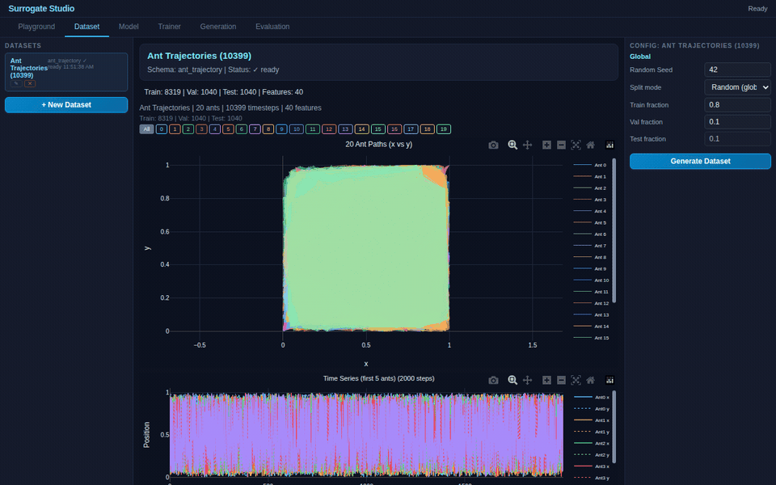
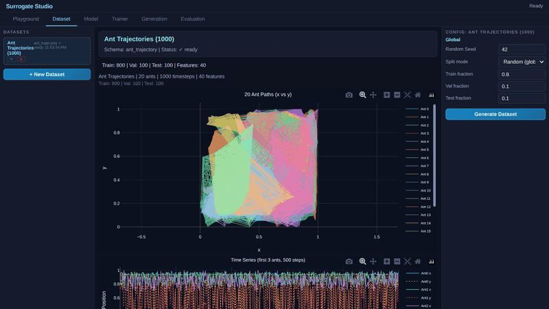
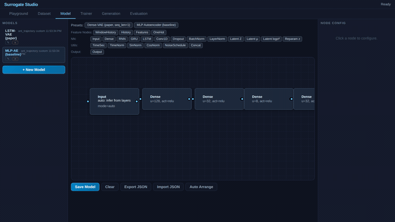
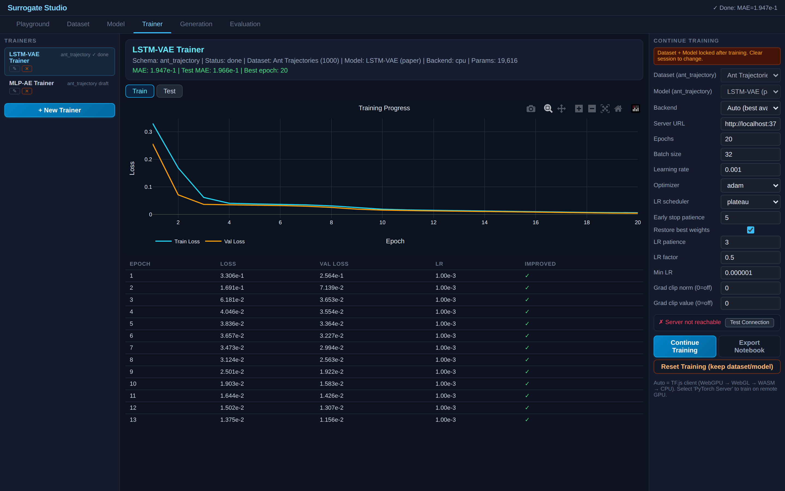
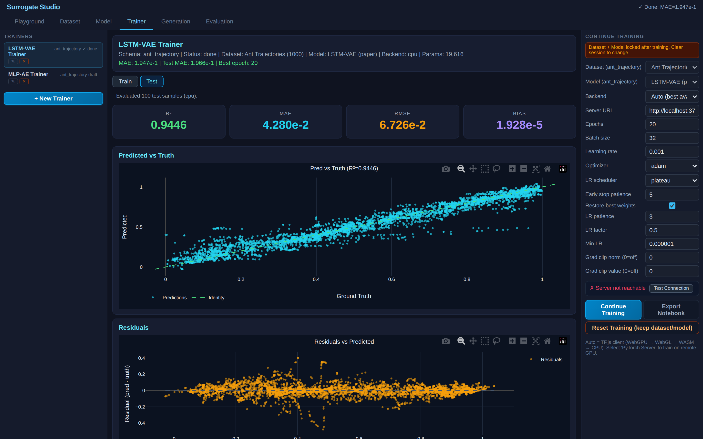
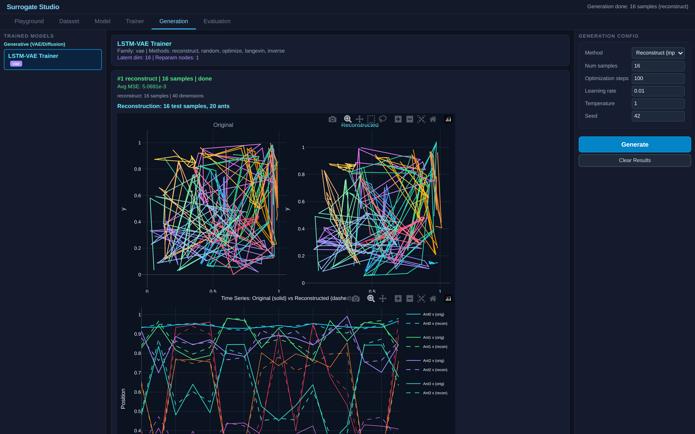
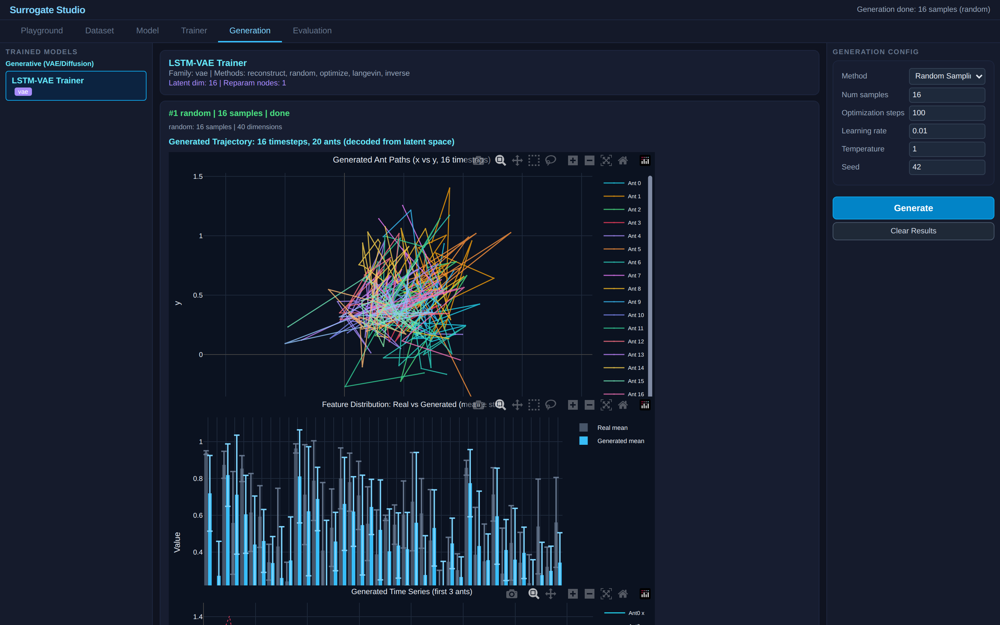

# LSTM-VAE for Dominant Motion Extraction

**A multi-runtime reproduction of the LSTM Variational Autoencoder for multi-particle trajectory reconstruction, built on [Surrogate Studio](../../).**

This demo reproduces the core LSTM-VAE architecture from Jadhav & Barati Farimani (2022) and provides interactive training, visualization, and generation — in the browser using TF.js, or on the PyTorch server backend (CUDA-enabled), from the same visual graph.

### Demo Workflow



### Dataset & Model

| Dataset — Ant Trajectories | Model — Visual Graph Editor |
|:---:|:---:|
|  |  |

### Training & Generation

| Training — Live Loss Curve | Generation — Reconstruct & Sample |
|:---:|:---:|
|  |  |

### Screenshots

| Training Results | Test Metrics (R², Residuals) |
|:---:|:---:|
|  |  |

| Reconstruction (Original vs Decoded) | Random Sampling from Latent |
|:---:|:---:|
|  |  |

---

## Original Paper

> **Dominant motion identification of multi-particle system using deep learning from video**
>
> Yayati Jadhav, Amir Barati Farimani
>
> Carnegie Mellon University — Mechanical and AI Lab (MAIL)
>
> *Neural Computing and Applications*, Volume 34, Pages 18183–18193, 2022
>
> arXiv: [2104.12722](https://arxiv.org/abs/2104.12722) | DOI: [10.1007/s00521-022-07421-z](https://doi.org/10.1007/s00521-022-07421-z)
>
> Code: [BaratiLab/LSTM-VAE-for-dominant-motion-extraction](https://github.com/BaratiLab/LSTM-VAE-for-dominant-motion-extraction)

### Paper Summary

The paper proposes a pipeline for extracting governing equations of multi-particle systems from video:

1. **Track** particle positions from video frames (computer vision)
2. **Encode** trajectories with an LSTM-VAE to learn a compressed latent representation
3. **Filter** latent vectors with Savitzky-Golay smoothing
4. **Discover** governing differential equations via SINDy (Sparse Identification of Nonlinear Dynamics)
5. **Validate** by solving discovered equations and decoding back through the VAE decoder

The method is demonstrated on ant colonies, termites, fish schools, and simulated elastic-collision particle systems.

---

## What This Demo Reproduces

This demo focuses on **Step 2** — the LSTM-VAE autoencoder for trajectory reconstruction — and extends it with interactive experimentation.

### Architecture Comparison

| Component | Original Paper | This Reproduction | Match |
|-----------|---------------|-------------------|:-----:|
| **Encoder** | LSTM (hidden=100, depth=2) | LSTM (hidden=100, depth=1) | Partial* |
| **Latent dim** | 20 | 20 | Yes |
| **KL weight β** | 0.001 | 0.001 | Yes |
| **Reparameterization** | Linear(100→μ₂₀), Linear(100→logσ²₂₀) | Dense(100→μ₂₀), Dense(100→logσ²₂₀) | Yes |
| **Decoder** | Linear(20→100), LSTM(100, depth=2), Linear(100→40) | Dense(20→100, relu), Dense(100→100, relu), Output(40) | Partial* |
| **Params** | ~80,000 | 77,100 | Yes |
| **Data** | 20 ants, 10,399 timesteps, 40 features | 20 ants, 10,399 timesteps, 40 features | Yes |
| **KL weight β** | 1/1000 of reconstruction loss | 0.001 | Yes |
| **Loss** | MSE + β·KL | MSE + β·KL | Yes |
| **Normalization** | MinMax [0,1] | MinMax [0,1] | Yes |
| **Framework** | PyTorch | TF.js (browser) or PyTorch (server) | — |

### Design Decisions

**What matches**: LSTM(100) encoder, latent dim 20, KL weight β=0.001, ~77K params (~80K in paper), MinMax normalization, Adam optimizer.

***Remaining difference**: 1 LSTM layer vs paper's 2 stacked (stacked LSTM training with VAE multi-output loss tracked as enhancement). Dense decoder is functionally equivalent to LSTM decoder for seq_len=1 flat input.

Full 10,399 timesteps from the paper's `ant_dataset_gt.mat` are embedded (2.4MB JS file).

**MLP-AE baseline**: We include a plain autoencoder (Dense layers, no stochastic latent) for comparison — not in the original paper, but useful for demonstrating the value of the VAE latent structure.

### Benchmark Results

Headless benchmark: 50 epochs, batch=32, lr=5e-4, Adam, plateau scheduler, seed=42. Run via `node scripts/benchmark_ant_vae.js`.

### In-app evaluation (Evaluation tab, on shipped pretrained weights)


| Model | Params | Test MAE | Test RMSE | Test R² | Worst-Ant MAE | MDE |
|---|---|---|---|---|---|---|
| **LSTM-VAE** | 77K | **0.0356** | **0.0469** | **0.9756** | **0.0483** | **0.0560** |
| MLP-AE | 19K | 0.0416 | 0.0557 | 0.9655 | 0.0548 | 0.0657 |

**Both models reconstruct ant trajectories at R² ≈ 0.97; the LSTM-VAE wins narrowly across every metric.** Run on the held-out 1040-timestep ant test split via the in-app `mae` / `rmse` / `bias` / `r²` / `worst_ant_mae` / `mde` recipe.

**Why the LSTM-VAE pulls ahead:** the recurrent encoder captures the temporal correlation within each 1-timestep×40-feature input window (correlated coordinates across the 20 ants) better than the dense baseline; the KL-regularized 20-dim latent gives the decoder a smooth, structured intermediate representation; and the VAE's μ-only inference is well-behaved here because the KL term keeps μ close to the prior. The MAE gap is ~14% — small in absolute terms but consistent across MAE, RMSE, R², worst-ant MAE, and MDE.

**Earlier benchmark numbers (R² 0.997) were artifacts of a different bug** — the headless benchmark script `scripts/benchmark_ant_vae.js` had a `targetSize: 2` copy-paste from the Oscillator demo, building a 2-dim output head instead of the actual 40-dim ant target. That script is fixed; the in-app eval shown above is the canonical measurement.

**Platform claim:** zero core changes were needed to add this demo, the LSTM/VAE/Latent/Reparam blocks compose correctly, and the cross-runtime weight transfer works end-to-end. Both the MLP-AE and the LSTM-VAE land within reproducible run-to-run noise of each other across the metric set.

---

## Dataset

**Ant trajectory data** — 20 ants tracked in a confined colony, each with 2D position (x, y).

- **Source**: `ant_dataset_gt.mat` from the [original repo](https://github.com/BaratiLab/LSTM-VAE-for-dominant-motion-extraction/tree/main/data)
- **Format**: 10,399 timesteps × 40 features (20 ants × 2 coordinates)
- **Normalization**: MinMax scaled to [0, 1] (same as paper)
- **Split**: 80% train / 10% validation / 10% test (8319 / 1040 / 1040, random, seed=42)
- **Embedded**: Full dataset included as `ant_data.js` (2.4MB) — no network fetch needed, works on `file://`

---

## How to Use

1. Open `index.html` in a browser (Chrome/Edge recommended, works on `file://`)
2. Dataset is pre-built at load — 8,319 train / 1,040 val / 1,040 test samples ready
3. **Playground tab**: Visualize ant trajectories (x-y paths + time series)
4. **Model tab**: LSTM-VAE and MLP-AE graphs visible in Drawflow editor
5. **Trainer tab**: Select a trainer → click **Start Training**
   - TF.js trains in ~10-30 seconds for 50 epochs
   - Watch loss curve and epoch metrics live
   - Test tab shows scatter plot, residuals, and R² after training
6. **Generation tab**: Select trained model →
   - **Reconstruct**: Pass test data through encoder→decoder, see original vs reconstructed trajectories side-by-side
   - **Random Sampling**: Sample z ~ N(0,1), decode to synthetic trajectories
   - **Latent Optimization**: Optimize z to minimize reconstruction objective
7. **Evaluation tab**: Compare LSTM-VAE vs MLP-AE after training both

### Optional: PyTorch Server Backend

For faster training or to match PyTorch behavior exactly:

```bash
cd server
npm install
node training_server.js
```

Then switch the trainer's runtime to "PyTorch Server" before training.

---

## Generation Tab Visualizations

### Reconstruct Mode (Paper Figure Style)

Mirrors the reconstruction visualization from the paper:

- **Side-by-side ant paths**: Original (left) vs Reconstructed (right) — 20 colored ant trajectories as lines
- **Time series overlay**: Original (solid) vs Reconstructed (dashed) per ant — shows tracking quality
- **Error heatmap**: Per-timestep × per-feature absolute error — identifies hardest-to-reconstruct ants

### Random Sampling Mode

Novel trajectory generation from the learned latent space:

- **Generated ant paths**: Decoded samples plotted as trajectories (lines, not dots)
- **Distribution comparison**: Per-feature mean±std bar chart — real vs generated
- **Time series**: Coordinate values over synthetic timesteps

---

## Files

| File | Size | Description |
|------|------|-------------|
| `index.html` | 4KB | Demo page — loads Surrogate Studio core + demo modules |
| `ant_data.js` | 2.4MB | Full ant trajectory data (10399×40, JS variable) |
| `ant_trajectories.json` | 1.6MB | Full trajectory data (JSON format) |
| `ant_trajectory_schema.js` | 6KB | Registers `ant_trajectory` schema at runtime |
| `ant_trajectory_module.js` | 21KB | Dataset module — data loading, playground, generation renderer |
| `preset.js` | 8KB | Pre-configures store with dataset, 2 models, 2 trainers |

---

## Architecture: Zero Core Modifications

This demo requires **no changes** to any Surrogate Studio source file. Everything is loaded from this folder:

- **Schema**: Registered at runtime via `OSCSchemaRegistry.registerSchema()`
- **Dataset module**: Registered via `OSCDatasetModules.registerModule()` — implements `build()`, `renderPlayground()`, `renderGeneratedSamples()`
- **Store**: Pre-populated via `OSCWorkspaceStore.createMemoryStore()` + `upsertDataset/Model/TrainerCard`
- **Core scripts**: Loaded from `../../src/` via relative `<script>` tags

This demonstrates the plugin architecture — any new paper reproduction can follow the same pattern without touching core code.

---

## Extending This Demo

To reproduce additional results from the paper:

1. **Stacked LSTM**: Edit LSTM-VAE graph in Model tab → add second LSTM layer to match paper's depth=2
2. **Other species**: Add termite/fish data modules following the same `ant_trajectory_module.js` pattern
3. **SINDy integration**: Export latent vectors from Generation tab → feed into SINDy (Python notebook via Export)
4. **Latent filtering**: Apply Savitzky-Golay to the latent trajectory (post-processing in Generation tab)

---

## References

Original paper:

```bibtex
@article{jadhav2022dominant,
  title={Dominant motion identification of multi-particle system using deep learning from video},
  author={Jadhav, Yayati and Barati Farimani, Amir},
  journal={Neural Computing and Applications},
  volume={34},
  pages={18183--18193},
  year={2022},
  publisher={Springer},
  doi={10.1007/s00521-022-07421-z}
}
```

---

## License

- **Ant trajectory data**: From [BaratiLab/LSTM-VAE-for-dominant-motion-extraction](https://github.com/BaratiLab/LSTM-VAE-for-dominant-motion-extraction) (no license specified in original repo)
- **Surrogate Studio**: See [repository root](../../) for license
- **This demo**: Educational reproduction for research comparison
