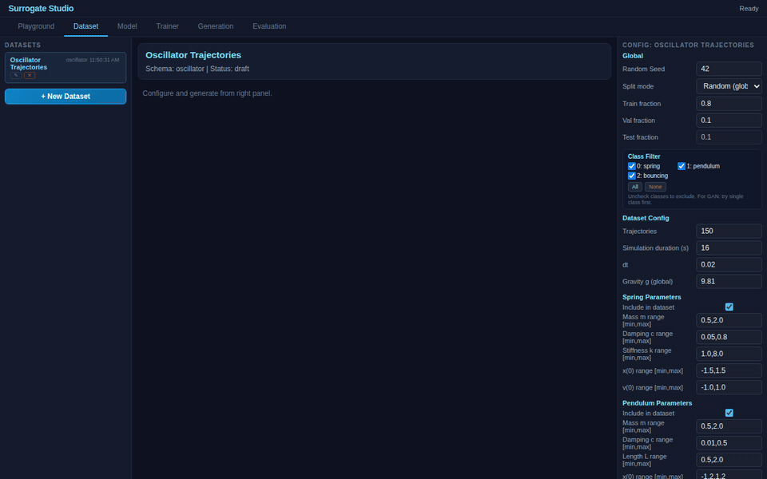

# Oscillator Surrogate — Full Platform Demo

**5 model architectures on physics-based trajectory data. Demonstrates every feature of Surrogate Studio.**

## Models

| # | Model | Architecture | Purpose |
|---|-------|-------------|---------|
| 1 | **Direct-MLP** | Input → Dense(64) → Dense(32) → Output(xv) | Baseline direct prediction |
| 2 | **AR-GRU** | Input → GRU(64) → Dense(32) → Output(xv) | Recurrent autoregressive |
| 3 | **VAE** | Input → Dense(32) → μ(8)/logσ²(8) → Reparam → Dense(32) → Output(xv) | Latent space + generation |
| 4 | **VAE+Classifier** | Shared encoder → reconstruction + scenario classification | Classifier-guided generation |
| 5 | **Denoising AE** | Input → AddNoise(0.2) → Dense(64) → Dense(32) → Dense(64) → Output(xv) | 1D diffusion / Langevin |

## Generation Methods

- **Reconstruct**: Pass test trajectories through model → compare original vs reconstructed
- **Random Sampling**: Sample z ~ N(0,1) → decoder → synthetic trajectories
- **Classifier-Guided**: Optimize z to generate trajectories matching specific physics:
  - Target class 0 = spring, 1 = pendulum, 2 = bouncing ball
  - Control: "generate a heavily damped spring trajectory"
- **Langevin Dynamics**: Iterative denoising from random noise → trajectory

## Evaluation

Pre-configured benchmark: all 5 models compared on MAE, RMSE, R², Bias.

## Dataset

RK4-simulated oscillator trajectories (generated at runtime):
- **Spring**: m·x'' + c·x' + k·x = 0
- **Pendulum**: θ'' + (c/m)·θ' + (g/L)·sin(θ) = 0
- **Bouncing ball**: y'' = -g with impact restitution

## How to Use

1. Open `index.html` in a browser
2. Generate the oscillator dataset in the Dataset tab
3. Train any of the five preset trainers in the Trainer tab
4. Use the Generation tab to compare reconstruct, random sampling, classifier-guided generation, or Langevin generation depending on the selected model
5. Use the Evaluation tab to benchmark all trained models on the same reference split
6. Open the Model tab to inspect how each architecture is built in the graph editor
