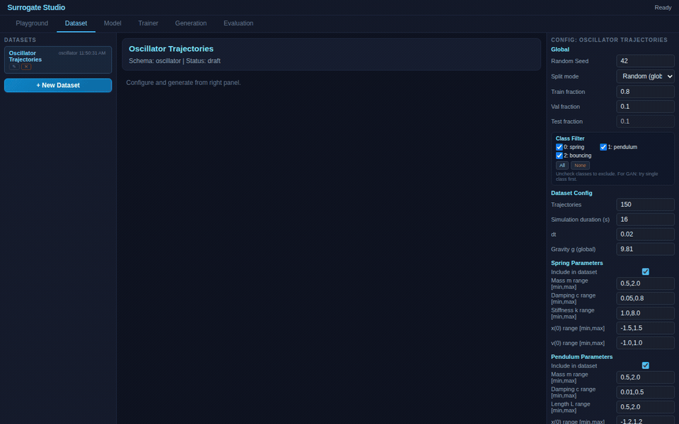
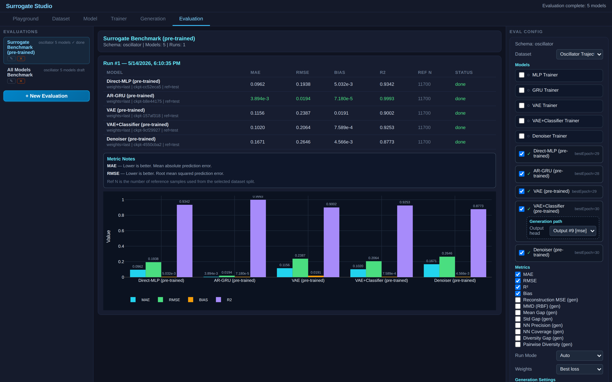

# Oscillator Surrogate — Full Platform Demo



**5 model architectures on physics-based trajectory data. Demonstrates every feature of Surrogate Studio: training, generation, evaluation, and cross-runtime weight parity.**

## Results

Trained 30 epochs on PyTorch CUDA, 300 trajectories. Evaluated on the held-out 1170-sample test split via the in-app `mae` / `rmse` / `bias` / `r2` recipe (per-feature R², averaged across the 2-dim xv target).



| Model | Params | Test MAE | Test RMSE | Test R² |
|---|---|---|---|---|
| Direct-MLP | 4.9K | 0.0962 | 0.1938 | 0.9342 |
| **AR-GRU** | 22.9K | **3.89e-3** | **0.0194** | **0.9993** |
| VAE (8-dim latent) | 2.4K | 0.1156 | 0.2387 | 0.9002 |
| VAE+Classifier | 8.6K | 0.1020 | 0.2064 | 0.9253 |
| Denoising AE | 7.1K | 0.1671 | 0.2646 | 0.8773 |

**AR-GRU dominates after the May 2026 retrain (R² = 0.9993, MAE 25× lower than the next-best).** Direct-MLP, VAE, and VAE+Classifier cluster at R² ≈ 0.90–0.93; the Denoiser trails at 0.88. The educational point is the architectural ordering and what each model trades:

- **AR-GRU wins decisively.** Its recurrent hidden state integrates the 20-step window into a phase-aware representation that captures the oscillator's smoothness across steps. With (m, c, k) parameter conditioning at every step, the GRU's one-step-ahead predictions land within tens of basis points of the true trajectory.
- **Direct-MLP is the parameter-efficient runner-up** at 4.9K params. Concatenating 20 (x, v) history pairs into a flat input still lets the network learn the ODE dynamics directly, but it lacks the GRU's temporal smoothing.
- **VAE matches Direct-MLP** despite a stochastic 8-dim latent and 2.4K params. The bottleneck doesn't hurt because the underlying dynamics are low-dimensional (3 ODE parameters generate the trajectory family).
- **VAE+Classifier** lands 3 R² points above plain VAE — the auxiliary classifier head doesn't cost prediction accuracy on this task and unlocks classifier-guided generation.
- **Denoising AE** trails at R² 0.88 — single-noise-level reconstruction is a less precise one-step predictor than direct regression.

### Why This Matters for Surrogate Modeling

Traditional physics simulation (RK4) is exact but slow for parameter sweeps. A trained surrogate predicts trajectories in milliseconds:

| Aspect | RK4 Simulation | Trained Surrogate |
|---|---|---|
| Speed | ~1ms per trajectory | ~0.01ms per trajectory |
| Accuracy | Exact (to numerical precision) | R² > 0.99 (AR-GRU best model) |
| Use case | Reference data generation | Real-time parameter exploration, optimization |

Surrogate models enable interactive "what-if" analysis: drag a slider to change damping coefficient, instantly see the predicted trajectory — without re-running the ODE solver.

## Models

### 1. Direct-MLP
```
Params(m,c,k) + WindowHistory(x,v) → Input → Dense(64,relu) → Dense(32,relu) → Output(x,v)
```
Flat feedforward baseline. All history concatenated into a single vector.

### 2. AR-GRU (Autoregressive)
```
Params(m,c,k) + WindowHistory(x,v) → Input → GRU(64) → Dense(32,relu) → Output(x,v)
```
Recurrent model processes the window as a sequence. GRU hidden state captures oscillation phase.

### 3. VAE (Variational Autoencoder)
```
Params + WindowHistory → Input → Dense(32) → μ(8)/logσ²(8) → Reparameterize → Dense(32) → Output(x,v)
```
Latent space model (8D). Enables random sampling for trajectory generation.

### 4. VAE+Classifier (Guided Generation)
```
Params + WindowHistory → Input → Dense(64) → Dense(32) → μ(8)/logσ²(8) → Reparameterize → Dense(32) → Dense(64) → Output(x,v)
                                                      └→ Dense(16) → Output(label)
```
Shared encoder with classification head. Enables classifier-guided generation: optimize latent z to produce trajectories matching specific physics (spring vs pendulum vs bouncing ball).

### 5. Denoising AE (1D Diffusion)
```
Params + WindowHistory → Input → AddNoise(0.2) → Dense(64) → Dense(32) → Dense(64) → Output(x,v)
```
Learns to remove noise from trajectories. Enables Langevin dynamics generation from pure noise.

## Generation Methods

| Method | Model(s) | Description |
|--------|----------|-------------|
| **Reconstruct** | VAE, Denoiser | Pass test trajectories through model → compare original vs reconstructed |
| **Random Sampling** | VAE | Sample z ~ N(0,1) → decoder → synthetic trajectories |
| **Classifier-Guided** | VAE+Classifier | Optimize z to generate trajectories matching target physics class |
| **Langevin Dynamics** | Denoiser | Iterative denoising from random noise → clean trajectory |

## Dataset

RK4-simulated oscillator trajectories (generated at runtime):

| Scenario | Equation | Parameters |
|----------|----------|------------|
| **Spring** | m x'' + c x' + k x = 0 | mass, damping, stiffness |
| **Pendulum** | theta'' + (c/m) theta' + (g/L) sin(theta) = 0 | length, damping, gravity |
| **Bouncing Ball** | y'' = -g with impact restitution | mass, restitution, gravity |

300 trajectories, 200 timesteps each, window size 20. Features: position (x), velocity (v), physical parameters (m, c, k).

## How to Use

1. **Dataset** tab — generate oscillator trajectories (300 trajectories, 3 scenarios)
2. **Model** tab — inspect 5 architecture graphs with feature blocks showing data pipeline
3. **Trainer** tab — pre-trained cards show immediate test metrics (R², MAE), or train from scratch
4. **Generation** tab — reconstruct, random sample, classifier-guided, or Langevin dynamics
5. **Evaluation** tab — benchmark all models on same test set with MAE, RMSE, R², Bias

## Context

This demo showcases the full Surrogate Studio pipeline applied to computational physics. Surrogate modeling replaces expensive simulations with learned approximations — a technique widely used in engineering design optimization, uncertainty quantification, and real-time control.

The oscillator system is a canonical test case: simple enough to generate exact reference data, complex enough (3 scenarios, parameter variation, nonlinear dynamics) to challenge different model architectures.

## References

- Kingma, D.P., & Welling, M. **"Auto-Encoding Variational Bayes."** *ICLR 2014.* [arXiv:1312.6114](https://arxiv.org/abs/1312.6114) — VAE architecture used in models 3 and 4.
- Cho, K., et al. **"Learning Phrase Representations using RNN Encoder-Decoder."** *EMNLP 2014.* [arXiv:1406.1078](https://arxiv.org/abs/1406.1078) — GRU architecture used in the AR-GRU model.
- Raissi, M., Perdikaris, P., & Karniadakis, G.E. **"Physics-Informed Neural Networks."** *Journal of Computational Physics,* 2019. [arXiv:1711.10561](https://arxiv.org/abs/1711.10561) — Context for neural network surrogate modeling of physical systems.
