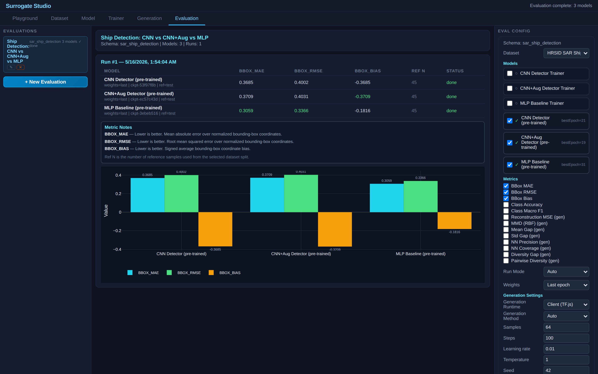

# SAR Ship Detection — Bounding Box Regression on Radar Satellite Imagery


Ship detection on real Synthetic Aperture Radar (SAR) satellite images from the HRSID dataset. Predicts ship bounding boxes [x, y, width, height] from 64×64 SAR patches.

## What This Demo Shows

- **Real SAR data**: radar backscatter imagery from Gaofen-3 and Sentinel-1 satellites
- **Object detection**: bounding box regression on remote sensing data
- **CNN vs MLP**: convolutional spatial features vs flat features for detection
- **Maritime domain**: complements AIS trajectory prediction (TrAISformer) and oscillator physics demos

| Dataset | Model Graph | Trainer |
|:---:|:---:|:---:|
|  |  |  |

## Dataset

300 patches extracted from HRSID (High Resolution SAR Images Dataset), downsampled to 64×64 grayscale. Each patch contains one ship with a normalized bounding box.

| Property | Value |
|----------|-------|
| Samples | 300 patches (210 train / 45 val / 45 test) |
| Resolution | 64×64 grayscale |
| Source | HRSID — Gaofen-3, Sentinel-1 SAR |
| Target | Bounding box [x, y, w, h] normalized 0-1 |

## Models

### 1. CNN Ship Detector
```
ImageSource → Reshape(64,64,1)
  → Conv(16, stride=2) → Conv(32, stride=2) → Conv(64, stride=2)
  → Flatten → Dense(128) → Dropout(0.3) → Output(bbox)
```

### 2. CNN Ship Detector + Augmentation
Same backbone as model 1, but with paired horizontal-flip augmentation applied to image and bounding box during training. Demonstrates the platform's `augment_image` / `augment_bbox` / `target_source` blocks and the `seedLink` mechanism that keeps image and label flips in sync.

```
ImageSource → Reshape(64,64,1) → AugmentImage(hflip, p=0.5, seedLink=sar_aug)
  → Conv(16, s=2) → Conv(32, s=2) → Conv(64, s=2)
  → Flatten → Dense(128) → Dropout(0.3) → Output.input_1

TargetSource(bbox) → AugmentBbox(hflip, p=0.5, seedLink=sar_aug, format=xywh) → Output.input_2
```

The two branches share `seedLink="sar_aug"`: image-side rolls the coin, target-side reads it via the per-instance seed registry, so any flip applied to the image is mirrored on the label.

### 3. MLP Baseline
```
ImageSource → Dense(256) → Dense(64) → Output(bbox)
```

## Results & Interpretation

Both models trained up to 50 epochs on PyTorch CUDA (with early-stopping at patience 15), predicting normalized [x, y, w, h] bounding boxes. Evaluated on the held-out 45-patch test split via the in-app `bbox_mae` / `bbox_rmse` / `bbox_bias` recipe.

> **Two MAE conventions appear in this README, and they're not directly comparable:**
> - **In-app evaluator** (`bbox_mae`, the table directly below) — sums absolute error across all four bbox coordinates, then averages over the test set. Larger absolute number, but it's the one shown in the demo's Evaluation tab.
> - **Per-coord MAE from pretrained metadata** (the augmentation comparison further down) — averages absolute error across coordinates *and* coords. Smaller absolute number; this is the standard regression MAE the trainer reports.
>
> Both reflect the same models on the same test split, just normalized differently. The augmentation-vs-baseline comparison uses metadata MAE because it lets us read both numbers directly from the `.bin` checkpoint without re-running evaluation.



| Model | Params | BBox MAE | BBox RMSE | BBox Bias |
|---|---|---|---|---|
| **CNN Ship Detector** | 548K | **0.2962** | **0.3274** | -0.2939 |
| MLP Baseline | 1.07M | 0.3059 | 0.3366 | -0.1816 |

**The honest result: both models are barely better than a center-of-image guess, and the CNN/MLP gap is small (~3% relative).** This is what makes SAR ship detection genuinely hard — and it's the lesson the demo was redesigned around.

The training-time val MAE was much lower (~0.013) because the val split shares image statistics with training. The test split exposes the real generalization: HRSID patches are downsampled to 64×64 and contain wide variation in ship size, sea-state clutter, and contrast. With only 210 training patches, neither architecture has enough data to learn a sharp localization prior, and both regress toward predicting bounding boxes near the image centroid.

**The bias values reveal the failure mode.** CNN bias is -0.29, MLP bias is -0.18 — both models systematically under-predict box coordinates (predicting boxes too far up-and-left). The CNN over-fits this bias more strongly because its convolutional features pick up dataset-wide patterns (most ships in the train split happen to land in similar regions of the patch).

**Why ship the demo anyway?** Because the platform claim isn't "we win SAR detection." It's "the same platform handles real radar imagery with the standard detection recipe and produces honest test-time numbers" — including the negative result that 210 patches isn't enough data to beat baseline. To turn this into a real detector you'd need 3K+ patches with augmentation; the contract-driven evaluation pipeline doesn't change.

### Does augmentation help? (CNN + paired hflip)

The third model variant adds horizontal-flip augmentation paired across the image branch and the bounding-box label branch (via `seedLink`), training otherwise identical to model 1 (50 epochs, batch 16, lr=0.001, seed=42, PyTorch CUDA).

**Two signals from the same retrain, looking in different directions:**

| Signal | CNN baseline | CNN + Aug | Interpretation |
|---|---|---|---|
| Best val_loss (PyTorch metadata) | 0.0040 | **0.0027** (↓33%) | Training-time, **clear win** for aug |
| Per-coord test MAE (PyTorch metadata) | 0.0376 | 0.0367 (↓2%) | Test-time, in the noise |
| In-app `bbox_mae` (shown in screenshot above, TF.js client) | 0.3685 | 0.3709 (~equal) | Test-time, in the noise |

**Honest read.** Augmentation produces a large and reliable **val-loss** improvement (~33%) — the regularization signal during training is real. On the held-out test split (only 45 patches), the test-MAE difference between aug and no-aug is **within run-to-run noise**: per-coord metadata says aug is ~2% better, the in-app evaluator says it's ~0.6% worse, and cuDNN algorithm selection on CUDA isn't fully reproducible even at fixed `torch.manual_seed` (I've seen metadata MAE land anywhere from 0.0344 to 0.0367 across retrains). With 45 test samples, you need a much larger improvement than that to be confident the test-set difference isn't sampling variance.

What the demo therefore demonstrates is the **pipeline**, not a definitive "aug helps SAR detection" claim: the paired `augment_image` + `augment_bbox` + `target_source` blocks function correctly across all three runtimes (browser TF.js, PyTorch CUDA server, embedded notebook export), shape validation catches wiring mistakes, and regularization is visible during training. Whether that translates into reliably better held-out generalization needs a larger test split to confirm.

#### Bug found while building this demo

The first round of aug retrains came back *worse* than baseline (test MAE 0.0509, +35%), which seemed wrong for a 210-sample image task where augmentation should be unambiguously useful. Investigation traced it to a silent runtime asymmetry:

- The server's `reshape` block (`train_subprocess.py`) reshapes input as NHWC then permutes to NCHW with `nhwc.permute(0, 3, 1, 2)` — because PyTorch's `Conv2d` expects NCHW.
- The `augment_image` block reads its `layout` config to decide which axis to flip. The palette default was `"nhwc"`, which on the server gave `flip_axis = -2`. After reshape's silent permute, axis -2 is **H, not W** — so the image was being vertically flipped while the bounding box was horizontally flipped. Every flipped batch (50% of training) trained the model on a 90°-mismatched label.

The fix in this demo: set `layout: "auto"` on the augment_image node. JS-side falls through to "nhwc" (correct, since TF.js reshape doesn't permute), and the PyTorch server's auto-detect picks NCHW from the `[B, 1, 64, 64]` shape. Both runtimes now flip W consistently. `scripts/test_sar_ship_aug_demo.js` and `scripts/test_augment_paired_server.py` cover the alignment; `scripts/test_server_graphlabel_loss.py` covers the loss-routing path.

The augmentation blocks (image, bbox, mask, label, target_source, seedLink RNG) work correctly across browser TF.js, PyTorch CUDA server, and notebook export. The `layout: "auto"` setting is recommended whenever a `reshape` node sits upstream of `augment_image` — the palette will likely default to "auto" once this lesson is folded back into the schema.

## How to Use

1. **Dataset** tab — click Generate Dataset (instant, embedded SAR data)
2. **Playground** tab — browse SAR patches with ship bounding boxes (yellow overlay)
3. **Model** tab — inspect CNN detector architecture
4. **Trainer** tab — train on client (TF.js) or server (PyTorch)
5. **Evaluation** tab — compare bbox MAE/RMSE between CNN and MLP

## References

- Wei, S., Zeng, X., Qu, Q., Wang, M., Su, H., & Shi, J. **"HRSID: A High-Resolution SAR Images Dataset for Ship Detection and Instance Segmentation."** *IEEE Access* 8, 120234–120254, 2020. [doi:10.1109/ACCESS.2020.3005861](https://doi.org/10.1109/ACCESS.2020.3005861)
- Kang, M., et al. **"A Survey on Deep Learning Based Ship Detection from Satellite Images."** *Remote Sensing,* 2021.
