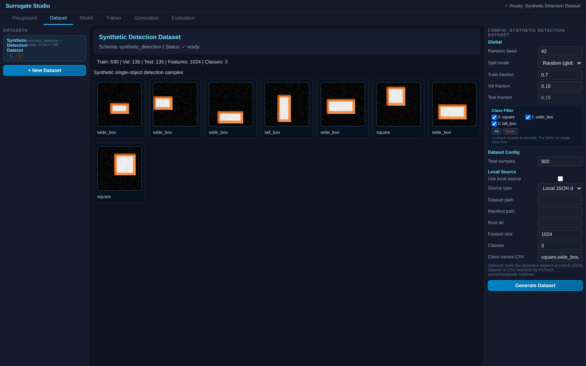
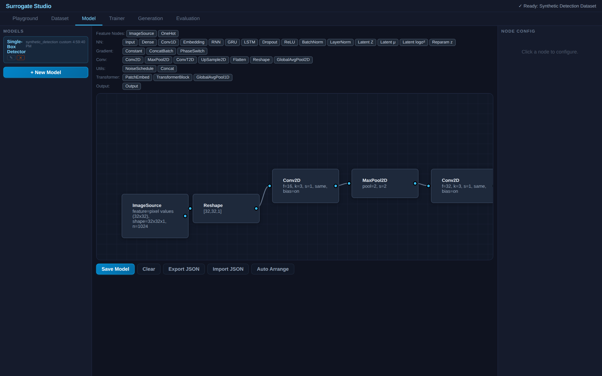
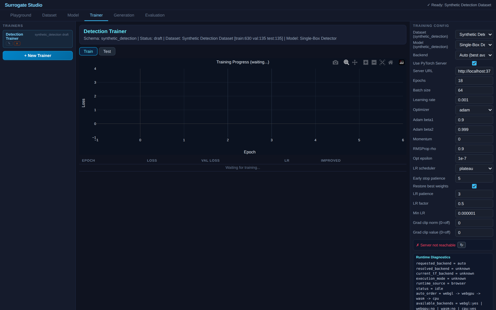

# Synthetic Detection — Single-Object Detection Baseline



Single-object detection on synthetic grayscale images. Demonstrates the `detection_single_box` task recipe with bounding box regression and optional classification heads.

## What This Demo Shows

- **Detection task recipe**: bounding box prediction driven by the `detection_single_box` recipe — no detection-specific logic in core tabs
- **Multi-head output**: bbox regression + class label from the same model
- **Anchor-free detection**: direct regression to [x, y, w, h] coordinates

| Dataset | Model Graph | Trainer |
|:---:|:---:|:---:|
|  |  |  |

## Dataset

Synthetically generated 32×32 grayscale images with one shape (square, wide box, or tall box) per image. Target: normalized bounding box [x, y, w, h] + class label.

| Class | Shape |
|-------|-------|
| 0 | Square |
| 1 | Wide Box |
| 2 | Tall Box |

## Model

### Single-Box CNN Detector (multi-head)
```
ImageSource → Reshape(32,32,1)
  → Conv(16,3x3,relu) → MaxPool(2) → Conv(32,3x3,relu) → MaxPool(2)
  → Flatten → Dense(96,relu)
    ├→ Dense(32,relu) → Output(bbox, MSE)         [regression head]
    └→ Dense(32,relu) → Output(label, CrossEntropy) [classification head]
```

Two output heads from the same backbone: bbox regression predicts [x, y, w, h] coordinates, classification predicts shape class (square / wide box / tall box).

## Results & Interpretation

The Single-Box Detector trained 18 epochs on PyTorch CUDA (early-stopped at epoch 7) with multi-head loss: bbox MSE + classification cross-entropy. Evaluated on the test split via the in-app `bbox_mae` / `class_accuracy` / `iou_mean` recipe.


| Metric | Value | What it means |
|---|---|---|
| **BBox MAE** | **0.0464** | Mean absolute error on normalized 0-1 box coords (~1.5 pixels on 32×32) |
| **Class Accuracy** | 0.6741 | Right shape category (square / wide / tall) on ~67% of test samples |
| **IoU Mean** | **0.5871** | Mean intersection-over-union of predicted vs. true box |

**Two distinct stories in one model.** The bbox regression is excellent (MAE = 1.5 pixels, IoU 0.59) — the model finds *where* the shape is with high accuracy. The classification accuracy of 0.67 is much weaker, because the three shape classes are deliberately ambiguous: a wide-box and a square become indistinguishable when the aspect ratio is near 1:1, and the class-label head receives the same backbone features regardless of geometry.

**The educational point is the multi-head pattern itself.** One shared CNN backbone splits into a bbox regression head and a class-label head. Both heads train jointly with weighted losses through the standard graph editor — no detection-specific code paths in the training engine. The same model could be re-targeted to different detection schemas (different class counts, additional heads for confidence/keypoints) by editing the graph, not the engine. That's the platform claim this demo is here to make.

**To improve class accuracy** you'd either separate the class-head representation (deeper class branch) or sharpen the dataset (less ambiguous class boundaries). The point of the synthetic data is to keep the demo small enough to train in seconds, not to win a detection benchmark.

### Does augmentation help here? (paired hflip)

The second variant **Single-Box Detector + Augmentation** adds `augment_image` on the image branch and `target_source(bbox) → augment_bbox(x0y0x1y1)` on the target branch — both sharing `seedLink="synthdet_aug"` so the bbox flips in lockstep with the image. The classification head doesn't need augmenting (a square stays a square when mirrored), so its supervision continues to use raw labels.

Both variants retrained at the same code rev, same seed=42, 18 epochs on PyTorch CUDA:

| Variant (from pretrained metadata) | best epoch | best val_loss | bbox MAE |
|---|---|---|---|
| Single-Box Detector | 17 | 0.00115 | 0.0220 |
| **Single-Box Detector + Augmentation** | 18 | **0.00105** ↓8.7% | **0.0203** ↓7.9% |

Aug gives a small but consistent improvement on bbox regression. The synthetic dataset is easy enough that both models train close to the floor; the gap closes further if you push to more epochs (val_loss is still decreasing on the +Aug variant at epoch 18 while the baseline plateaus around epoch 17, consistent with augmentation as a regularizer that defers the overfitting point).

The educational point is that the same `augment_image` + `target_source` + `augment_bbox` triad works equally on:
- Real radar imagery (SAR-Ship demo, `format="xywh"`)
- Synthetic shapes here (`format="x0y0x1y1"`)
- Microscopy masks (Cell-Nuclei demo with `augment_mask` instead)

Same blocks, same `seedLink` mechanism, different `format`/`layout` configs. The contract is data-shape driven, not task-specific.

## How to Use

1. **Dataset** tab — click Generate Dataset (instant, synthetic)
2. **Playground** tab — browse images with orange bounding boxes
3. **Model** tab — inspect detection network
4. **Trainer** tab — train on client (TF.js) or server (PyTorch)
5. **Evaluation** tab — bbox MAE, mean IoU, class accuracy

## References

This demo uses synthetic data with no external dataset. The detection approach follows the standard single-shot regression paradigm:

- Redmon, J., et al. **"You Only Look Once: Unified, Real-Time Object Detection."** *CVPR 2016.* [arXiv:1506.02640](https://arxiv.org/abs/1506.02640) — Inspired the direct bbox regression approach.
