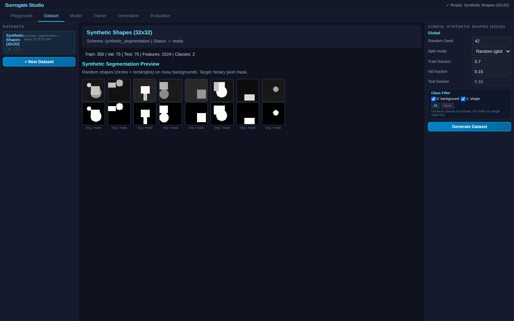
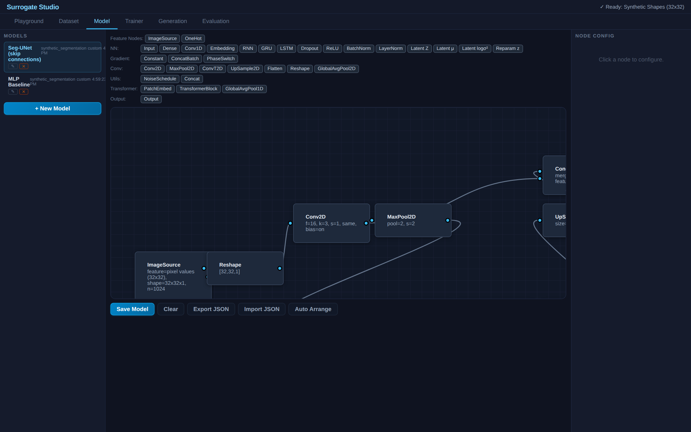
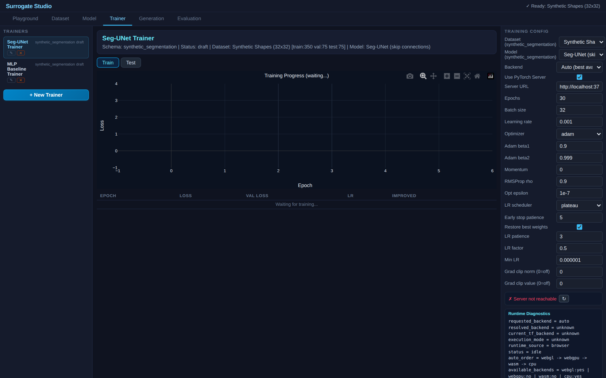

# Synthetic Segmentation — Binary Pixel Mask Prediction



Pixel-wise binary segmentation on synthetic shape images. Demonstrates the `segmentation_mask` task recipe with mask-specific evaluation metrics (IoU, Dice, pixel accuracy).

## What This Demo Shows

- **Task recipe architecture**: segmentation is a recipe, not hardcoded logic — the schema declares `taskRecipeId: "segmentation_mask"` and evaluation reads mask metrics from the recipe contract
- **Mask as target**: model predicts a flat array of 0-1 values per pixel, compared against ground truth mask
- **UNet skip connections vs MLP**: same segmentation task, different architectures

| Dataset | Model Graph | Trainer |
|:---:|:---:|:---:|
|  |  |  |

## Dataset

Synthetically generated 32×32 grayscale images with 1-3 random shapes (circles, rectangles) on noisy backgrounds. Target: binary mask (1 = shape pixel, 0 = background).

## Models

### 1. Seg-UNet (skip connections)
```
ImageSource → Reshape(32,32,1) → Conv(16) → MaxPool
  → Conv(32) → MaxPool → Conv(64) [bottleneck]
  → UpSample → Concat(skip2) → Conv(32)
  → UpSample → Concat(skip1) → Conv(16) → Conv(1,sigmoid)
  → Flatten → Output(mask, BCE)
```

### 2. MLP Baseline
```
ImageSource → Dense(256,relu) → Dense(1024,sigmoid) → Output(mask, BCE)
```

## Evaluation Metrics

| Metric | Description |
|--------|-------------|
| **Mask IoU** | Intersection over union between predicted and target binary masks |
| **Dice Score** | F1 at pixel level: 2×intersection / (pred_sum + truth_sum) |
| **Pixel Accuracy** | Fraction of correctly classified pixels |

## How to Use

1. **Dataset** tab — click Generate Dataset (instant, synthetic)
2. **Playground** tab — browse images alongside their ground truth masks
3. **Model** tab — inspect UNet graph with skip connections
4. **Trainer** tab — train on client (TF.js) or server (PyTorch)
5. **Evaluation** tab — compare IoU/Dice between UNet and MLP

## References

- Ronneberger, O., Fischer, P., & Brox, T. **"U-Net: Convolutional Networks for Biomedical Image Segmentation."** *MICCAI 2015.* [arXiv:1505.04597](https://arxiv.org/abs/1505.04597) — The UNet architecture used in the skip-connection model.
- Long, J., Shelhamer, E., & Darrell, T. **"Fully Convolutional Networks for Semantic Segmentation."** *CVPR 2015.* [arXiv:1411.4038](https://arxiv.org/abs/1411.4038) — Foundational work on pixel-wise prediction.
