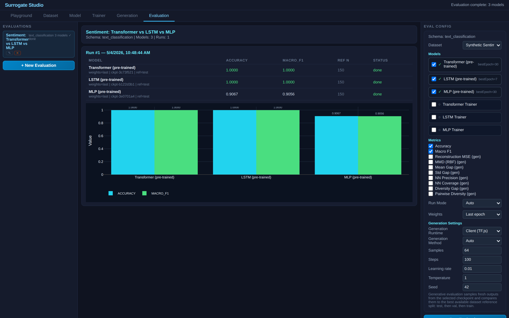

# Text Sentiment Transformer — NLP Classification


Transformer-based text classification on synthetic sentiment data. Demonstrates the standard NLP pipeline — tokenize, embed, self-attention, pool, classify — built entirely from graph editor nodes.

## What This Demo Shows

- **NLP in the same platform**: text classification uses the same graph editor, training engine, and evaluation as image/trajectory tasks
- **Embedding + Transformer**: token sequences → learned embeddings → multi-head self-attention → classification
- **Three architectures compared**: Transformer vs LSTM vs MLP on the same text data

| Dataset | Model Graph | Trainer |
|:---:|:---:|:---:|
|  |  |  |

## Dataset

Synthetically generated sentences with ~120-word vocabulary. Each sentence is 3-8 words, labeled positive or negative based on sentiment word presence. Tokenized to fixed 12-token sequences (padded with 0).

## Models

### 1. Transformer Classifier
```
Input(12 tokens) → Embedding(120→32) → TransformerBlock(4 heads, ffn=64)
  → GlobalAvgPool1D → Dense(32,relu) → Dropout(0.2) → Output(classification)
```

### 2. LSTM Classifier
```
Input(12 tokens) → Embedding(120→16) → LSTM(32) → Dense(16,relu)
  → Output(classification)
```

### 3. MLP Baseline
```
Input(12 tokens) → Dense(64,relu) → Dense(32,relu) → Dropout(0.2)
  → Output(classification)
```

## Results & Interpretation

All three models trained 30 epochs on PyTorch CUDA on the same 12-token synthetic sentiment dataset. Evaluated on a 150-sample test split via the `accuracy` / `macro_f1` recipe.



| Model | Params | Accuracy | Macro F1 |
|---|---|---|---|
| **Transformer Classifier** | ~24K | **1.0000** | **1.0000** |
| **LSTM Classifier** | ~10K | **1.0000** | **1.0000** |
| MLP Baseline | ~6K | 0.9067 | 0.9056 |

**Transformer and LSTM both hit 100%; MLP plateaus at ~91%.** This is the honest result on synthetic sentiment data and it tells the educational story directly:

1. **Order matters → MLP loses.** Sentiment depends on which words appear and in this synthetic dataset sometimes on local word combinations. The MLP receives token IDs as a flat 12-dim vector with no embedding lookup — it can't learn that `token=42` means the same thing whether it's at position 1 or position 7. The 9-point gap is the cost of throwing away sequence information.

2. **Transformer ≡ LSTM on this dataset.** Both architectures give the model a way to look across the sequence. Self-attention does it in parallel, LSTM does it sequentially. On synthetic 3-8 word sentences with single-keyword sentiment cues, both architectures find the cue cleanly and saturate at perfect accuracy. Transformers pull ahead on real text where context windows and long-range dependencies matter — that gap doesn't show up here because the dataset doesn't require it.

The point of this demo is **NLP works in the same platform as vision and trajectory tasks** — same graph editor, same training engine, same evaluation contract. The number ratio (Transformer/LSTM tied at the ceiling, MLP lagging by ~9 points) is exactly what you'd predict from architectural priors, which is itself the validation that the platform isn't doing anything weird to NLP.

## How to Use

1. **Dataset** tab — click Generate Dataset (instant, synthetic)
2. **Playground** tab — browse sample sentences with sentiment labels
3. **Model** tab — inspect Transformer graph: Embedding → TransformerBlock → classify
4. **Trainer** tab — train all 3 models on client (TF.js)
5. **Evaluation** tab — compare accuracy/F1: Transformer vs LSTM vs MLP

## References

- Vaswani, A., et al. **"Attention Is All You Need."** *NeurIPS 2017.* [arXiv:1706.03762](https://arxiv.org/abs/1706.03762)
- Devlin, J., et al. **"BERT: Pre-training of Deep Bidirectional Transformers for Language Understanding."** *NAACL 2019.* [arXiv:1810.04805](https://arxiv.org/abs/1810.04805)

This demo uses a simplified single-layer transformer on synthetic data to demonstrate that the platform handles NLP tasks through the same graph editor and training engine as vision tasks.
