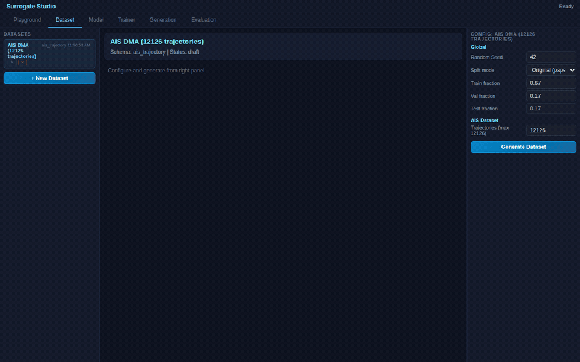

# TrAISformer Demo — Transformer-based AIS Trajectory Prediction



Predict future vessel positions from historical AIS (Automatic Identification System) data using attention-based models built entirely in the Surrogate Studio visual graph editor — no code required.


## What This Demo Shows

- **Schema-driven architecture**: same platform, same training engine, same graph editor — applied to maritime trajectory prediction instead of oscillators or image classification
- **Transformer blocks as composable nodes**: drag-and-drop Reshape, Dense projection, TransformerBlock, GlobalAvgPool1D — the graph IS the model specification
- **Cross-runtime parity**: train on PyTorch CUDA server, evaluate on TF.js in browser — weights transfer correctly via universal checkpoint format
- **Interactive geospatial visualization**: Leaflet map with satellite tiles, speed-colored trajectories, course-heading markers, click popups with normalized + real coordinates

## Results

Trained on 2,000 trajectories (89K training samples), 20 epochs, PyTorch CUDA:

| Model | Params | Test MAE | Test RMSE | Test R² | Best Epoch |
|-------|--------|----------|-----------|---------|------------|
| **MLP Baseline** | 16,836 | **0.0225** | **0.0741** | **0.924** | 20 |
| Tiny TrAISformer (1 block) | 10,884 | 0.0382 | 0.0884 | 0.891 | 18 |
| Small TrAISformer (2 blocks) | 21,476 | 0.0400 | 0.0893 | 0.889 | 17 |


### Comparison with Original Paper

| Aspect | Original TrAISformer (Nguyen et al.) | Our Simplified Version |
|--------|--------------------------------------|----------------------|
| **Architecture** | 8 transformer layers, 8 heads | 1-2 layers, 4 heads |
| **Embedding dim** | 768 | 32 |
| **Parameters** | ~47M | 10K-21K |
| **Prediction type** | Discrete tokenization (250 lat bins x 270 lon bins = 612 tokens) | Continuous regression (4 floats: lat, lon, sog, cog) |
| **Training data** | Full Danish Maritime Authority dataset | 2,000 trajectories subset |
| **Training** | Multi-GPU, days | Single GPU, ~2 minutes |
| **Context window** | Variable-length with learned positional encoding | Fixed 16 timesteps |

### Why the MLP Baseline Wins Here

The MLP baseline outperforms our simplified transformers — this is expected and instructive:

1. **Embedding dimension too small**: Attention needs higher dimensions to be effective. Our 32-dim embeddings compress 4 features into a space where multi-head attention (4 heads = 8 dims per head) can't form meaningful query-key patterns. The original paper uses 768-dim.

2. **Discrete vs continuous**: The original paper tokenizes coordinates into 612 discrete bins and treats prediction as classification over a vocabulary — attention excels at learning token relationships. Our continuous regression doesn't benefit from attention the same way.

3. **Scale mismatch**: With only 10K-21K parameters, the transformer overhead (Q/K/V projections, layer norms, FFN) leaves very few effective parameters for learning. The MLP puts all parameters directly into the prediction task.

4. **The demo proves the infrastructure**: The point isn't to match the paper's results — it's that transformer blocks, cross-runtime training, weight export, and evaluation all work correctly through the visual graph editor.

## Models

### 1. MLP Baseline
```
WindowHistory(lat,lon,sog,cog) → Input → Dense(128,relu) → Dense(64,relu) → Dense(4,linear) → Output
```
Standard feedforward network. 16 timesteps × 4 features = 64-dim flat input.

### 2. Tiny TrAISformer (1 block)
```
WindowHistory → Input → Reshape[16,4] → Dense(32,relu) → TransformerBlock(4 heads, ffn=64) → GlobalAvgPool1D → Dense(4) → Output
```
One transformer block processes the 16-step sequence. Each timestep's 4 features are projected to 32-dim embeddings.

### 3. Small TrAISformer (2 blocks)
```
WindowHistory → Input → Reshape[16,4] → Dense(32,relu) → TransformerBlock × 2 → GlobalAvgPool1D → Dense(4) → Output
```
Two stacked transformer blocks for deeper cross-timestep reasoning.

## Data

**Source:** Danish Maritime Authority (DMA) — 12,126 cleaned trajectories from the Baltic Sea (55.5°N–58.0°N, 10.3°E–13.0°E).

| Split | Trajectories | Samples (window=16) |
|-------|-------------|---------------------|
| Train | 9,327 | ~566K |
| Val | 1,318 | ~83K |
| Test | 1,481 | ~97K |

Pre-processed per the paper: min 36 steps, max 120 steps, normalized [0,1], no NaN.


## How to Use

1. **Dataset** tab — explore vessel trajectories on interactive Leaflet map (satellite + speed coloring), toggle train/val/test splits, click points for coordinates
2. **Model** tab — view graph: `WindowHistory → Input → ... → Output` with feature blocks showing the data pipeline
3. **Trainer** tab — use pre-trained cards for immediate test metrics, or train from scratch via PyTorch server
4. **Evaluation** tab — benchmark all 3 models side-by-side on test set with MAE, RMSE, R² metrics


## Reference

Nguyen, D., Vadaine, R., Hajduch, G., Garber, R., & Fablet, R. **"TrAISformer — A generative transformer for AIS trajectory prediction."** *arXiv:2109.03958*, 2021. [Paper](https://arxiv.org/abs/2109.03958)

This demo reproduces a simplified version to validate the platform's transformer support. The original uses 8 layers, 768-dim, discrete tokenization (612 bins) — a fundamentally different modeling approach that requires significantly more compute.
